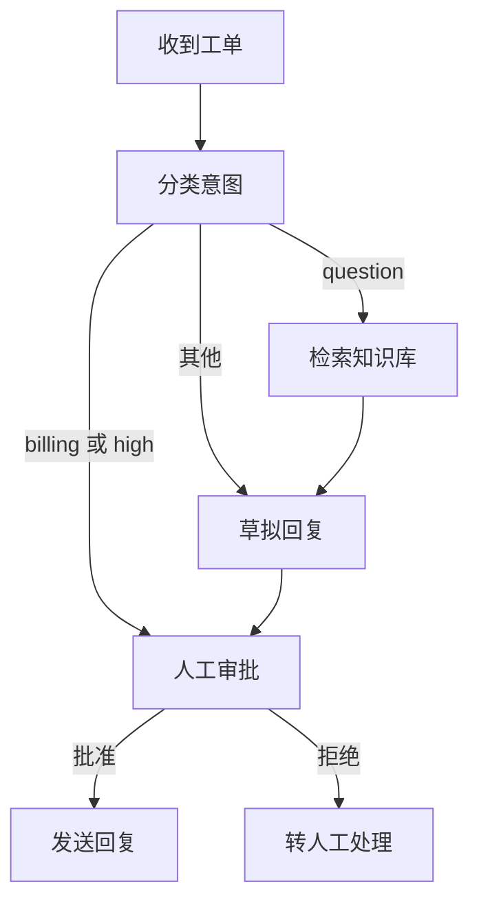
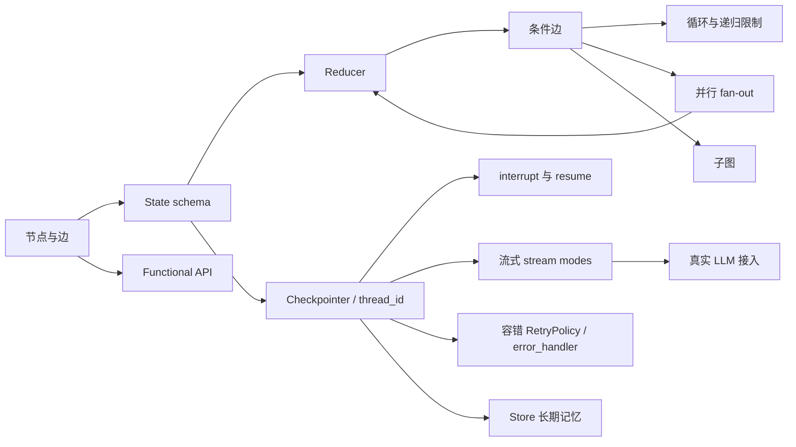

# 00 · 学习地图与知识依赖图

本地图不是官方文档目录的复读，而是按照"概念在解决问题时被迫出现"的顺序重排后的课程蓝图。

## 演进项目：客服工单处理智能体

需求原型来自官方 "Thinking in LangGraph" 的客服邮件案例，改造为确定性可测试版本：

每一章只实现这张图的一个碎片——先能跑一步，再传数据，再分支，再恢复，再流式。

## 知识依赖图

| 知识域 | 官方页面 | 落点章节 |
|---|---|---|
| 图原语（StateGraph/node/edge/START/END/compile/invoke） | `graph-api`、`use-graph-api`、`quickstart` | 01 |
| State schema 与 reducer（`Annotated`、`operator.add`、`add_messages`） | `graph-api`（Reducers 一节） | 02 |
| 条件边与路由 | `graph-api`（Conditional edges） | 03 |
| 循环、`GRAPH_RECURSION_LIMIT` | `errors/GRAPH_RECURSION_LIMIT` | 04 |
| 并行分支、superstep、`INVALID_CONCURRENT_GRAPH_UPDATE` | `graph-api`、`errors/INVALID_CONCURRENT_GRAPH_UPDATE` | 05 |
| Persistence：checkpointer、`thread_id`、`get_state` | `persistence`、`checkpointers` | 06 |
| Interrupts：`interrupt()`、`Command(resume=...)`、节点重放规则、静态断点 | `interrupts` | 07 |
| Streaming：stream modes、`version="v2"` StreamPart、`get_stream_writer` | `streaming`、`event-streaming` | 08 |
| 测试模式：`graph.nodes`、`update_state(as_node=)`、`interrupt_after` | `test` | 09 |
| 容错：`RetryPolicy`、`timeout`、`error_handler`、`set_node_defaults` | `fault-tolerance`、`thinking-in-langgraph`（错误处理表） | 10 |
| 子图：state 共享、`subgraphs=True`、namespace | `use-subgraphs` | 11 |
| Store：跨 thread 长期记忆 | `stores`、`persistence` | 12 |
| Time travel（`get_state_history`、`update_state` 分支重放） | `use-time-travel` | 06/09 内提及 + 12 后扩展 |
| Functional API：`@entrypoint`、`@task` | `functional-api`、`use-functional-api`、`choosing-apis` | 13（可选） |
| 真实 LLM、tool calling 循环、workflows vs agents | `quickstart`、`workflows-agents`、`sql-agent`/`agentic-rag` | 14（可选） |
| 本地 server / Studio / 可观测性 | `local-server`、`studio`、`observability` | 14（可选） |

## 验证机制分配

| 章 | 验证机制 | 理由 |
|---|---|---|
| 01–05 | pytest 单元测试 | 状态变换完全确定，无需外部依赖 |
| 06 | 集成测试（同进程两次 invoke + SqliteSaver 跨进程） | 持久化只有跨调用才可观察 |
| 07 | 测试驱动 invoke → 断言 `__interrupt__` → resume → 断言终态；副作用计数器证明节点重放 | interrupt 是行为契约，不是内部实现 |
| 08 | 测试收集 stream 块序列并断言 | 流的顺序与内容即外部行为 |
| 09 | 官方 Test 指南的三种模式各写一条 | 本章主题是测试手法本身 |
| 10 | flaky fake 服务 + 调用计数断言重试次数 | 重试行为可确定复现，无需真挂网络 |
| 11 | 子图独立 invoke 一条 + 嵌入父图一条 | 复用性是子图的契约 |
| 12 | thread A 写入、thread B 读取的集成测试 | 跨 thread 是 Store 的定义性特征 |
| 13 | 同一套测试跑 Graph / Functional 两种实现 | 行为等价是重写的安全网 |
| 14 | 手动验收 + trace 观察 | 真实 LLM 不确定，不适合放进快速测试 |

## 教学简化声明（与官方行为的边界）

- fake 分类器/fake LLM 是**课程项目的设计选择**，官方示例使用真实模型；两者在 14 章汇合。
- 前半程统一使用 `InMemorySaver`（及 06 章末的 `SqliteSaver`）；生产持久化官方推荐 Postgres 系。
- 流式章节以 `streaming`（stream-mode API，`version="v2"`）为主，`event-streaming`（`stream_events(..., version="v3")`）是官方推荐的新 API，在 08 章末对照介绍。
- 07 章按官方规则强调：resume 时**整个节点从头重跑**，`interrupt()` 之前的副作用必须幂等——这是易错点，用测试证明而不是口头声明。
