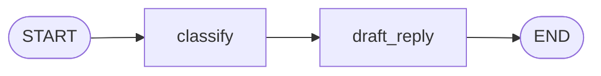

# 02 · 节点之间传数据

## 学习目标

让客服工单依次经过“分类”和“草拟回复”两个节点：第二个节点能读到第一个节点产生的 `category`，并且两个节点都能把自己的处理记录保留下来。

本章会从一个简单的共享 state 开始，再让一个具体问题逼出 reducer：**同一个 state 字段被多个节点更新时，旧值应该被覆盖，还是应该被合并？**

## 当前状态

第 01 章已经有一个可以运行的 `classify` 节点。它接收 `ticket`，返回一个分类结果。现在把需求向前推进一步：

> 分类完成后，`draft_reply` 节点要读取分类结果，为工单生成一段确定性的草稿。

本章仍然不接入 LLM。fake 分类器和 fake 草稿器是课程项目的教学选择，用来让每次测试快速、稳定、可重复。



先从上一章复制两个文件到本章目录：

```text
docs/01-first-graph/graph.py       -> docs/02-passing-data/graph.py
docs/01-first-graph/test_graph.py  -> docs/02-passing-data/test_graph.py
```

后续所有命令都在 `docs/02-passing-data/` 下执行。你需要自己创建和修改这些代码文件；本教程只提供代码片段，不会替你创建它们。

## 先写验证：后续节点要看到前一个节点的结果

修改 `docs/02-passing-data/test_graph.py`，先保留上一章的分类测试，再添加一个关于最终行为的测试：

```python
from graph import build_graph


def test_draft_node_uses_category_from_classify_node():
    graph = build_graph()

    result = graph.invoke({"ticket": "How do I reset my password?"})

    assert result["category"] == "question"
    assert result["draft"] == "We will answer this question."
```

这条测试只关心用户最后能观察到什么：分类存在，而且草稿与分类一致。它不要求节点必须叫 `classify` 或 `draft_reply`，也不检查节点之间具体调用了几次。

先预测：复制上一章后，这条测试最可能在哪一层失败？是环境层、图结构层，还是业务断言层？关键失败应该与缺少 `draft` 有关。

## 运行验证

```bash
cd docs/02-passing-data
python -m pytest -q
```

如果你只是复制了上一章，预期会看到类似失败：

```text
FAILED test_graph.py::test_draft_node_uses_category_from_classify_node
E   KeyError: 'draft'
```

这是**业务断言层失败**：环境和旧图结构已经可用，失败证据很具体——旧图确实能产生 `category`，但没有任何节点产生 `draft`。下一步只增加产生 `draft` 所需的节点和连接。

## 让代码可以运行：先把数据放进共享 state

修改 `docs/02-passing-data/graph.py`。先扩充 schema，并加入最小的草稿节点：

```python
from typing import Literal, TypedDict

from langgraph.graph import END, START, StateGraph


class State(TypedDict):
    ticket: str
    category: Literal["question", "feedback"]
    draft: str


def classify(state: State) -> dict:
    if "?" in state["ticket"]:
        return {"category": "question"}
    return {"category": "feedback"}


def draft_reply(state: State) -> dict:
    if state["category"] == "question":
        return {"draft": "We will answer this question."}
    return {"draft": "We will review this feedback."}


def build_graph():
    builder = StateGraph(State)
    builder.add_node(classify)
    builder.add_node(draft_reply)
    builder.add_edge(START, "classify")
    builder.add_edge("classify", "draft_reply")
    builder.add_edge("draft_reply", END)
    return builder.compile()
```

再次运行：

```bash
python -m pytest -q
```

预期绿色：

```text
2 passed
```

现在数据传递的路径是：

```text
输入 ticket
  -> classify 返回 category
  -> LangGraph 将更新合并进 state
  -> draft_reply 读取 category 并返回 draft
```

关键点是：节点不需要返回完整的 `State`，只返回本次要更新的字段。`draft_reply` 能读取 `category`，是因为前一个节点的更新已经进入了共享 state。

## 刚刚学到了什么：共享 state 与部分更新

### 是什么

官方 Graph API 把 LangGraph 的核心拆成 `State`、`Nodes` 和 `Edges`：`State` 是应用当前快照，节点接收当前 state 并返回更新，边决定接下来运行哪些节点。[Graph API 官方文档](https://docs.langchain.com/oss/python/langgraph/graph-api)

在 Python 图中，我们用 `TypedDict` 描述 state 的字段：

```python
class State(TypedDict):
    ticket: str
    category: Literal["question", "feedback"]
    draft: str
```

### 为什么

如果每个节点都自己保存结果，`draft_reply` 就必须知道 `classify` 的局部变量，节点之间会互相耦合。共享 state 提供了一个明确的协作边界：节点只通过字段交换数据。

### 怎么工作

对于没有显式 reducer 的字段，默认规则是“新值覆盖旧值”。因此：

```python
classify(state)      # {"category": "question"}
draft_reply(state)   # {"draft": "We will answer this question."}
```

不会把第二个返回值当成全新的 state；它只是对 state 的更新。更新后的 state 会包含输入字段和两个节点分别写入的字段。官方将 reducer 描述为接收两个参数的二元函数：左边是当前值，右边是节点返回的新值；默认 reducer 保留右边的新值。[Reducers 官方说明](https://docs.langchain.com/oss/python/langgraph/graph-api#reducers)

### 什么时候使用

共享 state 适合表达步骤之间确实需要交换的数据。字段应尽量表达业务事实，例如 `category`、`draft`、`events`；不要把临时局部变量全部塞进 state。

如果一个节点只需要一个很小的中间值，仍然可以放进内部 state；第 11 章再讨论 private state 和子图。现在先保持一张图、一个清晰 schema。

## 第二个需求：保留每个节点的处理记录

草稿已经生成，但客服调试时还需要知道工单经过了哪些步骤：

> 最终 state 中的 `events` 应该是 `['classified:question', 'drafted']`。

先在 `test_graph.py` 中添加测试：

```python
def test_graph_keeps_processing_events():
    graph = build_graph()

    result = graph.invoke({"ticket": "How do I reset my password?"})

    assert result["events"] == ["classified:question", "drafted"]
```

先预测：当前图虽然已经能生成 `draft`，但还没有 `events`。这次更可能是业务断言层的 `KeyError`，还是 state 合并层的列表不一致？然后运行它。此时预期失败可能是：

```text
E   KeyError: 'events'
```

这是**业务断言层失败**：schema 和节点都还没有声明或写入 `events`。先让字段出现，再观察更有意义的 state 合并失败。

### 让字段出现，但故意使用默认覆盖规则

在 `State` 中加入字段，并让两个节点都返回一条记录：

```python
class State(TypedDict):
    ticket: str
    category: Literal["question", "feedback"]
    draft: str
    events: list[str]


def classify(state: State) -> dict:
    category = "question" if "?" in state["ticket"] else "feedback"
    return {"category": category, "events": [f"classified:{category}"]}


def draft_reply(state: State) -> dict:
    if state["category"] == "question":
        draft = "We will answer this question."
    else:
        draft = "We will review this feedback."
    return {"draft": draft, "events": ["drafted"]}
```

再运行：

```bash
python -m pytest -q
```

运行前预测：两个节点都会返回 `events`，但 `State` 还没有 reducer。最终列表会包含两条记录，还是只保留最后一条？

现在预期会看到：

```text
E   AssertionError: assert ['drafted'] == ['classified:question', 'drafted']
```

这是**state 合并层失败**，不是节点没有运行：默认 reducer 正在按规则工作，`draft_reply` 对 `events` 写入新列表，于是覆盖了 `classify` 写入的列表。失败把“我们想累积”与“框架默认覆盖”之间的差异暴露出来了。

## 让验证通过：为 `events` 选择 reducer

我们需要的规则不是覆盖，而是把旧列表和新列表相加。Python 的 `operator.add` 正好是一个符合要求的二元函数：

```python
from operator import add
from typing import Annotated, Literal, TypedDict


class State(TypedDict):
    ticket: str
    category: Literal["question", "feedback"]
    draft: str
    events: Annotated[list[str], add]
```

`Annotated[list[str], add]` 的含义是：字段的值仍然是 `list[str]`，额外告诉 LangGraph，更新这个字段时使用 `add` 作为 reducer。于是：

```text
旧值：['classified:question']
新值：['drafted']
合并：['classified:question', 'drafted']
```

现在预测：只改变 `events` 的 schema 标注，不改变两个节点的业务代码，测试应当恢复绿色。

再次运行：

```bash
python -m pytest -q
```

预期绿色：

```text
3 passed
```

这与官方示例中的 `Annotated[list[str], operator.add]` 用法一致：没有 reducer 的字段覆盖旧值；使用 `operator.add` 的列表字段把两次更新连接起来。[Graph API：Custom reducers](https://docs.langchain.com/oss/python/langgraph/graph-api#custom-reducers)

## 用一个命令观察完整 state

测试验证的是契约，打印可以帮助你建立执行模型。运行：

```bash
python -c "from graph import build_graph; print(build_graph().invoke({'ticket': 'How do I reset my password?'}))"
```

预期输出的字段和值类似：

```text
{'ticket': 'How do I reset my password?', 'category': 'question', 'draft': 'We will answer this question.', 'events': ['classified:question', 'drafted']}
```

字典显示顺序可能因版本或实现细节不同而变化；本章真正验证的是字段和值，而不是打印顺序。

## 重构：抽出分类规则，减少节点里的分支噪声

测试已经绿色。现在做一个不改变行为的重构：给节点返回值补上更准确的类型，并把分类规则抽成小函数，减少节点里的分支噪声。

```python
def category_for(ticket: str) -> Literal["question", "feedback"]:
    return "question" if "?" in ticket else "feedback"


def classify(state: State) -> dict:
    category = category_for(state["ticket"])
    return {
        "category": category,
        "events": [f"classified:{category}"],
    }


def draft_reply(state: State) -> dict:
    templates = {
        "question": "We will answer this question.",
        "feedback": "We will review this feedback.",
    }
    return {
        "draft": templates[state["category"]],
        "events": ["drafted"],
    }
```

这里的 `dict` 是“本节点返回部分更新”的教学表达。若你使用类型检查器，可以进一步定义更精确的 update 类型；本章重点仍是运行时 state 合并，而不是引入额外类型工具。

只要你没有改动 `build_graph` 的边关系和 state 的 reducer，就应再次确认：

```bash
python -m pytest -q
```

预期仍为：

```text
3 passed
```

重构必须从绿色开始，并且用同一组行为测试证明没有改变外部契约。

## 亲自尝试

先不要看答案，完成下面的小变化：

1. 添加一个测试，输入 `"Please add dark mode to the app."`。
2. 预测最终的 `category`、`draft` 和 `events`。
3. 让测试通过。

预期行为应为：

```python
{
    "category": "feedback",
    "draft": "We will review this feedback.",
    "events": ["classified:feedback", "drafted"],
}
```

注意：你只需要修改测试输入和断言。分类节点已经能处理这两种输入，reducer 也不应该因为分类值变化而变化。

## 一个重要边界：累积不等于清空

`add` reducer 的直觉是“把新列表追加到旧列表”，但这也意味着返回空列表不会清空旧值：空列表仍会参与合并。官方文档专门提醒了这一点；需要覆盖 reducer 时，应使用 `Overwrite`。[Graph API：Overwrite](https://docs.langchain.com/oss/python/langgraph/graph-api#overwrite)

本章暂时不引入 `Overwrite`，因为当前需求只有追加事件。等到后续章节出现“清除错误记录”或“人工修改已有值”的真实需求时，再用测试驱动它出现。

## 下一个需求

现在分类结果已经能从 `classify` 传给 `draft_reply`，事件也能累积。但所有工单仍然走同一条路径：

```text
START -> classify -> draft_reply -> END
```

下一章的新需求是：**问题工单先检索知识库，反馈工单直接进入草稿流程**。这会暴露当前图的限制：普通边只能表达固定跳转，不能根据 state 选择下一个节点。第 03 章将用 `add_conditional_edges` 驱动这个变化。

## 本章小结

- `State` 是节点协作的数据边界，通常用 `TypedDict` 声明。
- 节点返回的是部分更新，不必返回完整 state。
- 没有 reducer 的字段默认由新值覆盖旧值。
- `Annotated[list[str], operator.add]` 可让列表更新累积。
- `StateGraph` 通过边把一个节点的更新交给后续节点。
- 验证命令是 `python -m pytest -q`；直接观察可使用 `python -c`。
- reducer 是字段级规则：应根据业务语义选择覆盖、累积或其他合并方式。

## 思考题

1. 如果把 `events` 改回普通的 `list[str]`，为什么三个测试中只有事件测试失败？请从默认 reducer 的行为解释。
2. 如果 `draft_reply` 返回 `{"category": "feedback"}`，它会追加、忽略，还是覆盖之前的 `category`？如何写一条测试验证你的预测？
3. 为什么 `events` 适合使用 `operator.add`，而 `category` 不适合？如果两个节点都在同一个 super-step 写 `category`，你认为应该先定义什么业务规则，再决定 reducer？

## 官方资料

- [LangGraph Graph API overview](https://docs.langchain.com/oss/python/langgraph/graph-api)
- [LangGraph Overview](https://docs.langchain.com/oss/python/langgraph/overview)

下一章：[03 · 按数据选择分支 →](../03-conditional-routing/README.md)（待生成）
