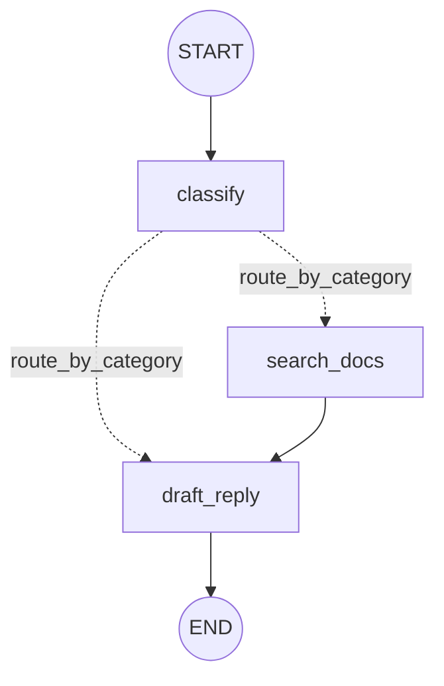

# 03 · 按数据选择分支

## 学习目标

让工单流程学会"看数据下菜"：**问题工单先检索知识库再草拟回复，反馈工单跳过检索直接草拟**。你将经历两个 red-green 循环：第一个循环给图加一步（顺带体验"行为变化如何合法地弄坏旧测试"）；第二个循环用 `add_conditional_edges` 解决静态边根本无法表达"按 state 分流"的限制。

## 当前状态

第 02 章结束时，我们的图是：


`events` 用 `operator.add` 累积记录，`category` 能传给 `draft_reply`。但现在**每条工单都走完全相同的路径**——不管问题还是反馈，都是分类 → 草拟。真实需求是问题类工单在草拟前要先查知识库。

本章唯一的敌人：**边是静态的，它不认识 state。**

## 本章循环地图

| | 第一循环 | 第二循环 |
|---|---|---|
| 需求 | question 工单要经过 `search_docs` 节点 | feedback 工单**不能**经过 `search_docs` |
| 先手验证 | 新测试：断言 question 路径的完整 `events` | 新测试：断言 feedback 路径的 `events` 里没有 `searched` |
| 预测 | 图能跑，但 `events` 少一项（业务断言层） | 图能跑，但 `events` 多了一项（执行层，由断言暴露） |
| 最小修复 | 加 `search_docs` 节点 + 重接静态边 | 路由函数 + `add_conditional_edges` |
| 绿色证据 | question 测试通过 + 旧测试按新契约更新 | 全部测试通过 |
| 下一步痛点 | — | 两类工单混在两条测试里 → 用 `parametrize` 重构测试 |

先复制上一章的两个文件到本章目录：

```text
docs/02-passing-data/graph.py      -> docs/03-conditional-routing/graph.py
docs/02-passing-data/test_graph.py -> docs/03-conditional-routing/test_graph.py
```

以下命令都在 `docs/03-conditional-routing/` 下执行。

---

## 第一循环：question 工单要经过检索节点

### 先写验证

在 `test_graph.py` 里添加：

```python
def test_question_ticket_searches_docs():
    graph = build_graph()

    result = graph.invoke({"ticket": "How do I reset my password?"})

    assert result["events"] == ["classified:question", "searched", "drafted"]
    assert result["search_results"]
```

这条测试只承诺调用者能观察到的东西：question 工单的完整处理轨迹，以及检索结果存在。它不关心检索节点叫什么、内部怎么实现。

### 先预测，再运行

> **问题 1**：现在运行这条测试，你认为失败会发生在哪一层——图结构层（compile 报错）、执行层（节点没跑）、还是业务断言层（图能跑但结果不对）？实际的 `events` 值会是什么？

把你的预测写在纸上，然后运行：

```bash
python -m pytest -q test_graph.py::test_question_ticket_searches_docs
```

### 观察失败

预期失败：

```text
E   AssertionError: assert ['classified:question', 'drafted'] ==
E   ['classified:question', 'searched', 'drafted']
```

**失败层次：业务断言层。** 图完全正常运行了——这排除了图结构和执行层的问题；缺的只是没有任何东西写入 `searched` 和 `search_results`。证据指向唯一的下一步：**给图加一个会写这两个字段的节点**。

### 最小修复

第一步先判断一件事：`search_results` 需要 reducer 吗？

> **问题 2**：回忆第 02 章的教训——`events` 需要 `operator.add` 是因为**两个节点先后写同一个字段**。`search_results` 预计由几个节点写？它需要 `Annotated` 吗？（先回答，再写代码。）

只有 `search_docs` 一个节点写它，所以默认覆盖规则就够了。修改 `graph.py`，只加这三处：

```python
class State(TypedDict):
    ticket: str
    category: Literal["question", "feedback"]
    draft: str
    events: Annotated[list[str], add]
    search_results: list[str]          # 新增：默认 reducer 即可


KNOWLEDGE_BASE = [
    "Reset password via Settings > Security > Change Password.",
    "Passwords must be at least 12 characters.",
]


def search_docs(state: State) -> dict:
    return {"search_results": KNOWLEDGE_BASE, "events": ["searched"]}
```

然后在 `build_graph` 里**把原来那条 `classify -> draft_reply` 边换成经过 `search_docs` 的两条边**：

```python
def build_graph():
    builder = StateGraph(State)
    builder.add_node(classify)
    builder.add_node(search_docs)
    builder.add_node(draft_reply)
    builder.add_edge(START, "classify")
    builder.add_edge("classify", "search_docs")      # 替换了原来的边
    builder.add_edge("search_docs", "draft_reply")
    builder.add_edge("draft_reply", END)
    return builder.compile()
```

注意是**替换**，不是追加。为什么？现在暂时记住"一条链"的直觉，本章末尾会正式解释并实验多出的那条边会发生什么。

### 处理被"弄坏"的旧测试

再运行整个测试文件：

```bash
python -m pytest -q
```

预期：新测试绿了，但第 02 章的 `test_graph_keeps_processing_events` **红了**——它断言的 `events` 还是两项。

这是 TDD 里一个必须会面对的时刻：**旧测试断的是旧契约，而契约被合法地改变了。** 判别方法：

- 如果新行为正是产品要的需求 → 更新旧测试的期望值，让它反映新契约；
- 如果新行为是意外副作用 → 修复代码而不是修复测试。

这里 question 工单多走一步检索正是需求本身，所以把旧测试的期望更新为三项：

```python
assert result["events"] == ["classified:question", "searched", "drafted"]
```

（新测试与它现在断言相同的东西，暂时保留重复没关系——第二个循环之后我们会一起重构掉。）

### 绿色证据

```bash
python -m pytest -q
```

```text
4 passed
```

### 刚刚学到了什么：给图加一步的成本

这一循环没有引入新 API，它教的是**演进成本**：在已有图里插入一个节点，需要同时改 schema、注册节点、重接边，并同步所有断言旧路径的测试。三处改动都跟着失败走，一处都不多余。

---

## 第二循环：feedback 工单不能经过检索

现在所有工单都会检索知识库——对 feedback 来说这是多余甚至有害的（反馈不需要 KB 答案，还可能检索到无关内容）。

### 先写验证

在 `test_graph.py` 里添加：

```python
def test_feedback_ticket_skips_search():
    graph = build_graph()

    result = graph.invoke({"ticket": "Please add dark mode to the app."})

    assert result["events"] == ["classified:feedback", "drafted"]
    assert "search_results" not in result
```

（如果你做了第 02 章"亲自尝试"并把它带进本章，它现在应该正好是红的——不必重复添加。）

### 先预测，再运行

> **问题 3**：这次的失败和上一次有什么本质不同？`events` 会多一项还是少一项？这个失败发生在哪一层？

```bash
python -m pytest -q test_graph.py::test_feedback_ticket_skips_search
```

### 观察失败

```text
E   AssertionError: assert ['classified:feedback', 'searched', 'drafted'] ==
E   ['classified:feedback', 'drafted']
```

**失败层次：执行层的问题，由业务断言暴露。** 和第一循环"图能跑但少数据"相反，这次是**跑了一个不该跑的节点**。

停下来想三秒钟：有没有办法用**静态边**做到这一点？

- `classify -> search_docs`：feedback 也会走到检索。❌
- `classify -> draft_reply`：question 到不了检索。❌
- 同时连两条？官方规则：一个节点的多条输出边，**目标节点会在同一个 superstep 里全部执行**——feedback 照样被检索。❌

静态边只有"永远走"和"永远不走"两种语义，没有"看 state 决定"。这就是本循环要解决的框架限制。

### 最小修复：条件边

官方为这种需求提供 `add_conditional_edges`：在**一个节点执行完之后**调用一个路由函数，由它的返回值决定下一个节点。

先在 `graph.py` 里加路由函数——它和节点一样接收 state，但**不写数据，只返回下一站的名字**：

```python
def route_by_category(state: State) -> Literal["search_docs", "draft_reply"]:
    if state["category"] == "question":
        return "search_docs"
    return "draft_reply"
```

再修改 `build_graph`：把那条**静态的** `classify -> search_docs` 边**替换**为条件边：

```python
def build_graph():
    builder = StateGraph(State)
    builder.add_node(classify)
    builder.add_node(search_docs)
    builder.add_node(draft_reply)
    builder.add_edge(START, "classify")
    builder.add_conditional_edges("classify", route_by_category)
    builder.add_edge("search_docs", "draft_reply")
    builder.add_edge("draft_reply", END)
    return builder.compile()
```

再次运行整个文件：

```bash
python -m pytest -q
```

预期绿色：

```text
5 passed
```

现在图长这样：



### 刚刚学到了什么：条件边

**是什么**——对照 [官方 Graph API · Conditional edges](https://docs.langchain.com/oss/python/langgraph/graph-api#conditional-edges)：`add_conditional_edges(source, routing_function)` 在 `source` 节点完成后调用路由函数；路由函数接收当前 state，**返回值默认被直接当作下一节点的名字**（也可以是节点名列表）。还可以传第三个参数——一个把路由返回值映射到节点名的 dict，适合路由函数不想关心节点名的场景。

**为什么**——第二循环证明了静态边表达不了"依赖数据的选择"。路由函数把"下一站是谁"从**图的拓扑**挪到了**每次运行的 state**上。

**怎么工作**——superstep 模型里，`classify` 完成后，运行时调用路由函数拿到字符串，激活对应节点进入下一个 superstep。返回类型标注 `Literal["search_docs", "draft_reply"]` 不只是文档装饰：它告诉 LangGraph 这个节点可能去往哪里，图绘制与结构检查都依赖它。

**什么时候使用 / 一条官方警告**——同一个节点**只选一种路由机制**：要么静态边，要么条件边/`Command`，不要混用。官方明确说混用时"两条路径都可能执行"，行为难以推理。这不是建议而是语义——想知道它有多真实，做自测题 2。

## 重构：把重复的路径测试合成参数化表格

现在有两条测试的结构只差输入和期望值。这正是表格驱动（pytest 里叫 `parametrize`）的形状——对应 Go 课程里的 table-driven tests。**重构测试和重构实现一样，要从绿色开始、以绿色结束。**

把 `test_question_ticket_searches_docs`、`test_graph_keeps_processing_events`（question 版）和 `test_feedback_ticket_skips_search` 合并为：

```python
import pytest


@pytest.mark.parametrize(
    ("ticket", "expected_events"),
    [
        (
            "How do I reset my password?",
            ["classified:question", "searched", "drafted"],
        ),
        (
            "Please add dark mode to the app.",
            ["classified:feedback", "drafted"],
        ),
    ],
)
def test_routing_events_by_ticket(ticket, expected_events):
    graph = build_graph()

    result = graph.invoke({"ticket": ticket})

    assert result["events"] == expected_events
```

其余断言 `draft` 内容的测试保留不动。运行：

```bash
python -m pytest -q
```

预期：参数化会展开成两条用例行，

```text
4 passed
```

以后添加第三类工单只需要往表格里加一行——需求扩展和数据扩展第一次对齐了。

## 亲自尝试

加一条新行为（先测试，后实现）：

> question 工单的 `draft` 应该引用检索结果的第一条，形如：`We will answer this question. (KB: Reset password via ...)`；feedback 的草稿不变。

提示：`draft_reply` 里 `state.get("search_results")` 是否存在，就是"我刚没刚检索过"的信号。做完这一问，你会自然发现 feedback 路径根本不需要关心这个字段——路由把语义差异留在了 state 里。

## 一个重要边界：条件边 vs Command

官方文档说：当你在**一个函数里既想更新 state 又想决定去哪**时，用 `Command(goto=...)` 从节点直接返回，代替"节点 + 独立路由函数"两件套。本章的 classify 和路由确实各自只干一件事，所以条件边是对的。等后面出现"审批节点根据结果跳转"的需求时（第 07 章），`Command` 会正式登场。

## 下一个需求

现在图会分岔了，但所有路径都是**单向走完**的。新需求：分类节点对某些工单会说"我不确定"（`category` 可能暂时是 `"uncertain"`），此时应该**回到分类节点重试**。这会让 `draft_reply` 收到过 `"uncertain"`，也会逼出一个新问题：**图里第一次出现环——它会永远转下去吗？** 第 04 章用 `GRAPH_RECURSION_LIMIT` 这个官方错误来回答它。

## 本章小结

- **概念**：条件边与路由函数；"多条输出边 = 同 superstep 全部执行"；每个节点只用一种路由机制；静态边只有永远/永远不走两种语义；行为契约合法变更时要更新测试而非代码。
- **API**：`add_conditional_edges(source, router)`、路由函数的 `Literal` 返回标注、`pytest.mark.parametrize`。
- **命令**：`python -m pytest -q test_graph.py::test_name`（单测定位）。
- **工程经验**：一次"少数据"断言失败（业务层）和一次"多执行"断言失败（执行层）是两种不同的诊断；重构测试同样从绿开始到绿结束。

## 自测题

按"先预测 → 再实验 → 后解释"作答。

1. **预测题**：输入 `{"ticket": "Where is my order?"}`，写出你预测的完整 `events` 列表和 `result` 里存在的字段集合，然后运行对照。你的依据分别落在哪个节点/哪条边？

2. **实验题（本章核心警告的实证）**：在 `build_graph` 里**保留** `builder.add_edge("classify", "search_docs")` 的同时**也保留**那条 `add_conditional_edges("classify", route_by_category)`（即两个路由机制并存）。先预测：feedback 工单会被检索吗？question 工单会被检索几次？`events` 会是什么？运行实验并解释观察到的行为。做完记得删掉多余的那条边。

3. **扩展题（标注：需要下一章知识也能答）**：把 `route_by_category` 的返回值改成一个既不是 `"search_docs"` 也不是 `"draft_reply"` 的字符串（例如 `"nope"`），预测失败会出现在 compile 时还是 invoke 时、属于哪一层。运行验证。（官方对此类"路由到不存在的目标"有专门的结构检查，下一章我们会正面撞上运行时层的另一类错误。）

## 官方资料

- [Graph API overview — Edges / Conditional edges](https://docs.langchain.com/oss/python/langgraph/graph-api#conditional-edges)
- [Use the graph API](https://docs.langchain.com/oss/python/langgraph/use-graph-api)

---

下一章：[04 · 循环与递归限制 →](../04-loops-and-recursion/README.md)（待生成）
