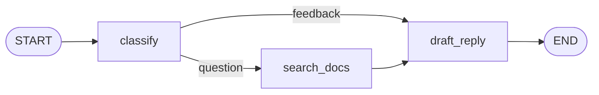

# 04 · 循环与递归限制

## 学习目标

让"不确定"的工单**回到分类节点重试**——图里第一次出现环。你将依次遭遇三种不同的失败：一个断言失败暴露 fallback 路由吞掉了未知值；一个官方运行时错误 `GraphRecursionError` 教你读懂"死循环保护"；最后一个受控的失败测试教你用 `recursion_limit` 快速止损。

## 当前状态

第 03 章结束时，`classify` 只会给出 `question` 或 `feedback`，路由函数负责分流。但真实分类器会说"我不确定"。本章的 fake 分类器也要学会示弱：

> **需求**：含 `maybe` 的工单第一轮分类为 `uncertain`；`uncertain` 不能流入草拟，必须回到 `classify` 重试（第二轮(fake 世界里)变得自信）。



⚠️ 本章代码依赖第 03 章"亲自尝试"的完成形态：`draft_reply` 读取 `state.get("search_results")`。如果你的草稿节点还停留在第 03 章正文的中间状态（`if "search_results" in state:`），feedback 测试会在本章结束时被一个执行层错误弄红——修复方法见本章末尾的"收尾排查"。

从上一章复制文件：

```text
docs/03-conditional-routing/graph.py      -> docs/04-loops-and-recursion/graph.py
docs/03-conditional-routing/test_graph.py -> docs/04-loops-and-recursion/test_graph.py
```

以下命令都在 `docs/04-loops-and-recursion/` 下执行。

## 本章循环地图

| | 循环 1 | 循环 2 | 循环 3 |
|---|---|---|---|
| 需求 | `maybe` 工单要经历"先 uncertain 后 question" | uncertain 要**回到 classify** | 真·不确定要**快速止损**，不许把默认预算转完 |
| 先手验证 | 新测试：断言 `events` 含两个 classified | 同一条测试变绿即可 | 新测试：`pytest.raises` + `recursion_limit=5` |
| 预测 | question 行会被弄红？还是只有新测试红？ | 修完路由后是 green 还是新错误？ | 错误属于哪一层？ |
| 预期失败 | 业务断言层（uncertain 泄漏进草稿） | 运行时层：`GraphRecursionError`（死循环保护） | 无——错误是被期望的 |
| 最小修复 | 分类器示弱 + 路由 `uncertain -> classify` | 给循环加**终止信息**：`attempts` | `config={"recursion_limit": 5}` |
| 绿色证据 | 重试测试通过，其余绿 | 重试测试通过 | `1 passed`（raises 断言兑现） |
| 下一步痛点 | — | — | 表格缺 uncertain 行 → 重构 |

---

## 循环 1：分类器示弱，fallback 露馅

### 先写验证

在 `test_graph.py` 添加：

```python
def test_maybe_ticket_gets_reclassified():
    graph = build_graph()

    result = graph.invoke({"ticket": "maybe the app is slow?"})

    assert result["category"] == "question"
    assert result["events"] == [
        "classified:uncertain",
        "classified:question",
        "searched",
        "drafted",
    ]
```

### 先预测，再运行

> **问题 1**：现在图里还没有"uncertain"这个概念。这条测试会红在哪个断言上？第 03 章的三条已有测试，会有被弄红的吗？

```bash
python -m pytest -q test_graph.py::test_maybe_ticket_gets_reclassified
```

### 观察失败（一）

```text
E   AssertionError: assert ['classified:question', 'searched', 'drafted'] ==
E   ['classified:uncertain', 'classified:question', 'searched', 'drafted']
```

**业务断言层。** 因为工单包含问号 `?`，第 03 章的现有分类逻辑直接把它当成了 `question`，缺少了预期的示弱过程。这排除了图结构错误；缺的是分类器在面对含糊词汇时的示弱机制。

给分类器示弱，同时把循环需要的 `attempts` 字段一起声明进 schema（第 02 章教训：schema 只是声明，先加无害）：

```python
class State(TypedDict):
    ticket: str
    category: Literal["question", "feedback", "uncertain"]
    draft: str
    events: Annotated[list[str], add]
    search_results: list[str]
    attempts: int
```

```python
def category_for(ticket: str) -> Literal["question", "feedback", "uncertain"]:
    if "maybe" in ticket.lower():
        return "uncertain"
    return "question" if "?" in ticket else "feedback"
```

再运行：

```bash
python -m pytest -q
```

### 观察失败（二）：fallback 露馅

运行后已有老测试依然通过（老工单不含 `maybe`），但新测试红了：要么红在 `assert result["category"] == "question"`（图最终输出 `category: "uncertain"`），要么在草稿节点抛出 `KeyError: 'uncertain'`。

**业务断言/执行层。** 观察流转：`maybe` 工单被分类器标记为 `uncertain`，但既没有去检索，也没有去重试，而是被**静默地**送进了草稿节点。凶手是路由函数的 `else`：

```python
return "draft_reply"   # else 兜底——uncertain 也被它吞了
```

这是本章第一个正式教训：**fallback 分支会把"未知"伪装成"已知"**。它对 `feedback` 正确，对 `uncertain` 是灾难，而且测试之外没有任何信号。

### 最小修复：让 uncertain 回到 classify

路由函数现在可能去四个地方，更新它和它的 `Literal`：

```python
def route_by_category(
    state: State,
) -> Literal["classify", "search_docs", "draft_reply"]:
    category = state["category"]
    if category == "uncertain":
        return "classify"
    if category == "question":
        return "search_docs"
    return "draft_reply"
```

builder 里只有那一条 `add_conditional_edges`，不用改。运行：

```bash
python -m pytest -q
```

### 观察失败（三）：一个没见过的新错误

```text
E   langgraph.errors.GraphRecursionError: Recursion limit of 10007 reached
E   without hitting a stop condition. You can increase the limit by setting
E   the `recursion_limit` config key.
E   For troubleshooting, visit: .../GRAPH_RECURSION_LIMIT
```

（措辞与默认数字随版本变化，关键词 `Recursion limit ... reached`；数字以你实际报错为准，本项目 1.2.11 实测为 10007。）

**运行时层保护。** 这不是断言不对——是图**真的在转圈**：`uncertain -> classify -> uncertain -> ...` 把默认预算（一万多步）转完后被框架掐断。官方错误页 [GRAPH_RECURSION_LIMIT](https://docs.langchain.com/oss/python/langgraph/errors/GRAPH_RECURSION_LIMIT) 的排查建议是两条：不预期转很多圈 → 检查你的环；复杂图 → 调高 `recursion_limit`。我们属于前者。

循环 1 至此撞上了一个无法靠"再改一行路由"解决的问题。先停下回答：

> **问题 2**：为什么这个环不会自己停？`classify` 第二次运行时，输入和第一次有什么差别？

## 循环 2：死循环的根因——重试没有新信息

### 推理

`classify` 的输入是 state。第一轮之后 state 里唯一的变化是 `category: "uncertain"` 和一条 event——分类逻辑 `("maybe" in ticket.lower())` 根本不读它们。所以**第二次运行必然返回一模一样的结果**。环上的节点如果没有从 state 读到"我已经重试过"的信号，重试就是重放。

（如果你答"每次超步都会写 checkpoint 所以第二次能读到"：没有 checkpointer 的图不写任何 checkpoint——checkpoint 是第 06 章的主题；而且就算写了，`classify` 也读不到——节点只能读 state 里**已有的字段**，这正是我们下一步要加的。）

### 最小修复：attempts 计数器

只改 `classify`——第一次遇到 `maybe` 示弱并计数；计数已存在时**直接走终审规则按 `?` 表态**。

注意这里不能图省事回用 `category_for`：它是只看文本的纯函数，`maybe → uncertain` 的规则在第 100 次调用也照样生效——第二轮拿到的还是 `uncertain`，路由又送回 `classify`，重试就成了死循环。**读到 `attempts` 还不够，必须用 `attempts` 改变输出**，这才是循环 2 推理段说的"终止信息"：

```python
def classify(state: State) -> dict:
    attempts = state.get("attempts", 0)
    if "maybe" in state["ticket"].lower() and attempts == 0:
        return {
            "category": "uncertain",
            "attempts": attempts + 1,
            "events": ["classified:uncertain"],
        }
    # 第二轮起直接终审：不再经过 category_for（它对 maybe 永远示弱）
    category = "question" if "?" in state["ticket"] else "feedback"
    return {"category": category, "events": [f"classified:{category}"]}
```

### 绿色证据

```bash
python -m pytest -q
```

预期：`test_maybe_ticket_gets_reclassified` 顺利通过（events 包含四项，两次 classified 顺序确定，因为是串行重试链路）；第 03 章的已有测试（包括 question 和 feedback）全部保持绿色，因为常规工单不含 `maybe`，直接首轮判定，不受重试逻辑影响。

### 刚刚学到了什么：环、超步与保护

**是什么**——环（cycle）：路径能回到已执行的节点。超步（superstep）：`recursion_limit` 数的单位。官方默认上限随版本浮动（旧文档写 25、后写 1000，本项目 langgraph 1.2.11 实测默认 **10007**，定义在 `langgraph/_internal/_config.py`，可用环境变量 `LANGGRAPH_DEFAULT_RECURSION_LIMIT` 覆盖），超限抛 `GraphRecursionError`。

**为什么**——LangGraph 无法静态判定你的环是否有终止条件（那是停机问题），所以它用**预算制**兜底：宁可误杀也不无限跑。这是编排框架的核心职责之一。

**怎么工作**——每次 `invoke` 传 input 进入 `__start__`，每个超步执行被激活的节点、按 reducer 合并更新、沿边激活下一批；`classify` 回到自身就是下一超步再次执行它。终止条件必须在**图逻辑内部**构造（我们的 `attempts`），或在预算耗尽时由框架强停。

**什么时候使用**——重试、审批打回、agent"想第二轮"都需要环；但每个环都要回答"第二圈和第一圈的差别从哪来"。答案要么来自 state 里新增的信息（本章），要么来自真实 LLM 的随机性（不可靠，生产上仍要有终止条件——第 07 章人在回路的"打回重填"就是这个模式）。

## 循环 3：受控的失败——recursion_limit 快速止损

有些工单是真的无法分类（fake 世界：含 `who knows`）。让这种工单转完默认预算（1.2.11 实测 10007 步）再报错是浪费——把预算调小，让失败**快速且便宜**，并且**把期望失败写进测试**：

```python
import pytest
from langgraph.errors import GraphRecursionError


def test_unknown_ticket_stops_quickly():
    graph = build_graph()

    with pytest.raises(GraphRecursionError):
        graph.invoke(
            {"ticket": "who knows what this means?"},
            config={"recursion_limit": 5},
        )
```

分类器需要为它真的永远 uncertain——在 `classify` 里给 `who knows` 单开一条**不带计数、不写 `attempts`** 的示弱分支，它就成了图上合法的无限环：

```python
def classify(state: State) -> dict:
    attempts = state.get("attempts", 0)
    lowered = state["ticket"].lower()
    if "maybe" in lowered and attempts == 0:
        return {
            "category": "uncertain",
            "attempts": attempts + 1,
            "events": ["classified:uncertain"],
        }
    if "who knows" in lowered:
        return {"category": "uncertain", "events": ["classified:uncertain"]}
    category = "question" if "?" in state["ticket"] else "feedback"
    return {"category": category, "events": [f"classified:{category}"]}
```

（至此 `category_for` 在代码里已无任何调用方，可以删掉——"示弱"规则归 `classify` 的两个分支，"终审"规则就是 `?` 判断。注意分支顺序：`who knows` 分支必须在终审之前，否则永远含 `?` 的 `"who knows what this means?"` 会被终审判成 question，死循环消失、循环 3 的测试就红了。）

> **问题 3（先预测再运行）**：默认上限是 10007（见上文实测）；`limit=5` 意味着最多执行 5 个超步。我们这条测试**为什么必须**显式传 `recursion_limit=5` 而不是等默认的 10007？

```bash
python -m pytest -q test_graph.py::test_unknown_ticket_stops_quickly
```

`1 passed`——这次"失败"本身就是被断言的行为。**期望失败写进测试**是框架课程里第一次出现的正式手法，第 07 章（interrupt）和第 10 章（容错）会反复用它。

注意官方警告：`recursion_limit` 是 config 的**独立顶层键**，不要塞进 `configurable`。

## 重构：把重试路径并入表格

给 `test_routing_events_by_ticket` 的表格加一行，并删掉循环 1 的独立重试测试（断言已被表格覆盖）：

```python
(
    "maybe the app is slow?",
    ["classified:uncertain", "classified:question", "searched", "drafted"],
),
```

（feedback 与 question 行不变。）

> **问题 4（先思考再动手）**：`test_maybe_ticket_gets_reclassified` 还断言了一件事是表格表达不了的，是什么？删之前要不要处理？
> （答案：它断言了 `category == "question"`——表格只比 events。两种事件序列可能对应不同的最终 category。保留它、或把表格断言升级为 `(events, category)` 二元组，任选其一。这也是第 09 章"测什么"的预演。）

绿色基线检查：

```bash
python -m pytest -q
```

预期：**`7 passed`**。清单核对：
- 3 条第 03 章继承的单测（分类 question、分类 feedback、草稿使用分类结果）；
- 1 条循环 3 新增的止损测试 `test_unknown_ticket_stops_quickly`；
- 3 条参数化表格展开的用例（question、feedback、maybe 包含重试）。
（若你保留了循环 1 的独立测试 `test_maybe_ticket_gets_reclassified`，则为 `8 passed`。）

## 亲自尝试

给图一个真实的"自愈"需求，完整走一遍红→绿：

> 工单 `maybe how do I export a PDF?` 应当重试**两次**才收敛：第一次、第二次返回 `uncertain`，第三次给出 `question`。（提示：fake 规则改成"`maybe` 且 `attempts < 2` 时 uncertain"；`attempts` 每轮都要 +1。）

做完检查一件事：你的终止条件依赖的是**谁写的** `attempts`？（如果答"路由函数写的"——回去看循环 2，路由函数不写 state。）

## 收尾排查

如果你的 feedback 测试红在 `AttributeError: 'list' object has no attribute 'split'` 之类的执行层错误：你的 `draft_reply` 还写着第 03 章正文的 `if "search_results" in state:`。feedback 路径**从不写** `search_results`，但这个 key 一旦被任何一次运行加进 state，之后每轮 `in state` 都为真，节点就拿着空列表 `[]` 去 `split` 了。第 03 章"亲自尝试"提示的 `state.get(...)` 就是防这个坑：

```python
def draft_reply(state: State) -> dict:
    templates = {
        "question": "We will answer this question.",
        "feedback": "We will review this feedback.",
    }
    draft = templates[state["category"]]
    kb = (state.get("search_results") or [""])[0]
    if kb:
        draft = f"{draft} (KB: {kb.split('.')[0]})"
    return {"draft": draft, "events": ["drafted"]}
```

## 下一个需求

现在 question 工单在检索知识库后才草拟。产品提出：回复前还需要**客户档案**（称呼、等级），它和知识库检索**互不依赖**——那为什么要排队串行执行？第 05 章把图第一次劈成两路并行，并且你会撞上另一种失败：两个节点同时写同一个 state 字段。

## 本章小结

- **概念**：环与超步计数；`GraphRecursionError` / `GRAPH_RECURSION_LIMIT`；fallback 路由吞未知值；重试需要新信息（终止条件）；期望失败可以写进测试；`recursion_limit` 是 config 顶层键。
- **API**：`add_conditional_edges` 返回自身节点名；`pytest.raises`；`config={"recursion_limit": 5}`；`Literal` 返回标注扩展。
- **命令**：`python -m pytest -q test_graph.py::test_name`。
- **工程经验**：三种红各不相同——缺行为、静默错值、框架强停；读懂错误属于哪一层，比修得快更重要。

## 自测题

1. **预测题**：`who knows` 工单在 `recursion_limit=5` 下，`GraphRecursionError` 的消息里会显示 limit 数字几？把错误打出来对照你的数法。（超步怎么数：START 进入后第一次 `classify` 是第几个超步？）
2. **失败分层题**：本章出现了"业务断言层 / 运行时层 / 被期望的失败"三种红，各举一例，并说明它们分别排除了哪些原因。
3. **扩展题（标注：答案用到下一章知识也没关系）**：官方提供 `RemainingSteps` 管理值让节点**主动**感知剩余步数（见 [graph-api · Recursion limit](https://docs.langchain.com/oss/python/langgraph/graph-api#recursion-limit) 的 proactive 示例）。设想：当 `remaining_steps <= 2` 时路由到一个 `escalate` 节点转人工而不是抛错。这个方案属于"proactive 优雅降级"还是"reactive 捕获异常"？第 10 章的 `error_handler` 又属于哪种？

## 官方资料

- [GRAPH_RECURSION_LIMIT](https://docs.langchain.com/oss/python/langgraph/errors/GRAPH_RECURSION_LIMIT)
- [Graph API · Recursion limit / RemainingSteps](https://docs.langchain.com/oss/python/langgraph/graph-api#recursion-limit)

---

下一章：[05 · 并行 fan-out 与并发写冲突 →](../05-parallel-fanout/README.md)
