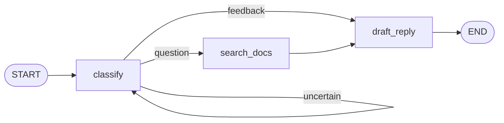

# 05 · 并行 fan-out 与并发写冲突

## 学习目标

让 question 工单的两步上下文收集（知识库检索、客户档案查询）**并行执行**，并在两者写同一个 `priority` 字段时撞上官方错误 `INVALID_CONCURRENT_GRAPH_UPDATE`，用一个自定义 reducer 定义冲突合并语义。本章你将获得对 reducer 的完整理解：它不只是"累积"，而是"**同一超步里多个更新如何合成一个值**"的显式契约。

## 当前状态

第 04 章结束时：



产品新需求：回复前还需要**客户档案**（称呼、等级）。关键事实：`lookup_customer`（查 CRM）和 `search_docs`（查知识库）**互不依赖**——都不需要对方的输出。

本章的敌人：**图目前只会排队，不会分叉再汇合。**

## 本章循环地图

| | 循环 1 | 循环 2 | 循环 3 |
|---|---|---|---|
| 需求 | question 草稿要基于客户档案 | 两个独立 I/O 步骤不该排队（时间预算） | 两个节点都想提议 `priority` |
| 先手验证 | 新测试：断言 `customer` 字段与 `profile_loaded` 事件 | 新测试：question 路径总耗时 < 0.35s | 新测试：vip 客户工单 `priority == "high"` |
| 预期失败 | 业务断言层：`KeyError: 'customer'` | 业务断言层：`0.4s < 0.35` 不成立 | state 合并层：`INVALID_CONCURRENT_GRAPH_UPDATE` |
| 最小修复 | 串行插入 `lookup_customer` | 路由返回**节点名列表** + join 边 | 自定义 reducer `keep_higher` |
| 绿色证据 | 档案测试通过（慢但正确） | 计时测试通过（并行生效） | 全部通过 |
| 下一步痛点 | 串行慢 | 并行段 events 顺序不稳定 → 表格断言要重构 | reducer 是并发语义声明，不只是追加 |

从上一章复制文件（以第 04 章完成态为准）：

```text
docs/04-loops-and-recursion/graph.py      -> docs/05-parallel-fanout/graph.py
docs/04-loops-and-recursion/test_graph.py -> docs/05-parallel-fanout/test_graph.py
```

以下命令都在 `docs/05-parallel-fanout/` 下执行。

---

## 循环 1：档案节点先串行接入

### 先写验证

```python
def test_question_ticket_loads_customer_profile():
    graph = build_graph()

    result = graph.invoke({
        "ticket": "How do I reset my password?",
        "customer_id": "cust-7",
    })

    assert result["customer"] == "Acme Corp (tier: vip)"
    assert "profile_loaded" in result["events"]
```

### 先预测，再运行

> **问题 1**：输入里多了一个 `customer_id`，但第 04 章的 `State` 里没有这个字段。图会拒绝这个输入、忽略它，还是别的？预测后运行：

```bash
python -m pytest -q test_graph.py::test_question_ticket_loads_customer_profile
```

失败会是 `KeyError: 'customer'`（读结果时）——**业务断言层**：图正常跑完了，没有任何节点写 `customer`。（如果你预测"图会拒绝多余的输入字段"，注意这次实验：schema 是**声明可有哪些 key**，不是**校验输入必须只有这些 key**——和第 02 章自测题 2 同源。要让 `customer_id` 正式成为图的数据，把它加进 schema。）

### 最小修复：串行版本（先求对，再求快）

schema 加两个字段、一个假 CRM、一个新节点；`search_docs -> draft_reply` 这条边改为穿过新节点，feedback 分支从直接进草稿改为先进档案查询：

```python
CUSTOMERS = {
    "cust-7": {"name": "Acme Corp", "tier": "vip"},
}


def lookup_customer(state: State) -> dict:
    cust = CUSTOMERS[state["customer_id"]]
    return {
        "customer": f"{cust['name']} (tier: {cust['tier']})",
        "events": ["profile_loaded"],
    }
```

```python
class State(TypedDict):
    ticket: str
    customer_id: str
    category: Literal["question", "feedback", "uncertain"]
    customer: str
    draft: str
    events: Annotated[list[str], add]
    search_results: list[str]
    attempts: int
```

```python
def route_by_category(
    state: State,
) -> Literal["classify", "search_docs", "lookup_customer"]:
    category = state["category"]
    if category == "uncertain":
        return "classify"
    if category == "question":
        return "search_docs"
    return "lookup_customer"
```

```python
builder.add_edge(START, "classify")
builder.add_conditional_edges("classify", route_by_category)
builder.add_edge("search_docs", "lookup_customer")   # 串行链
builder.add_edge("lookup_customer", "draft_reply")
builder.add_edge("draft_reply", END)
```

### 同步被合法弄坏的契约

feedback 路径现在多走一步：表格里的 feedback 行期望 `["classified:feedback", "drafted"]` 会红。这又是第 04 章学过的"契约合法变更"——新行为正是需求（feedback 也需要档案来称呼客户），更新表格行：

```python
(
    "Please add dark mode to the app.",
    ["classified:feedback", "profile_loaded", "drafted"],
),
```

### 绿色证据

```bash
python -m pytest -q
```

预期 `6 passed`（第 04 章完成态 5 + 本循环新测试 1；若你保留了第 04 章的重试独立测试或做过其"亲自尝试"，在此基础上各 +1）。question 路径 events：`classified:question → searched → profile_loaded → drafted`——每一步都串行推进，正确，但两个 200ms 的 I/O 在排队。

### 刚刚学到了什么：join 之前的串行链

`add_edge` 链就是最朴素的依赖表达：A 写完 B 才读。它永远是"正确"的默认选项——本章先要一个**对的**实现，因为下一循环要证明"快"需要改结构，而不是改参数。

---

## 循环 2：时间预算逼出并行

`search_docs` 和 `lookup_customer` 在真实世界都是网络调用。给两个 fake 节点加上模拟延迟（教学简化：`time.sleep` 模拟 I/O，阈值 0.35s 是课程项目的预算设定，慢机器上可调大）：

```python
import time


def search_docs(state: State) -> dict:
    time.sleep(0.2)  # 模拟知识库 API 调用
    return {"search_results": KNOWLEDGE_BASE, "events": ["searched"]}


def lookup_customer(state: State) -> dict:
    time.sleep(0.2)  # 模拟 CRM 调用
    ...
```

### 先写验证

```python
import time


def test_question_context_gathering_is_parallel():
    graph = build_graph()

    started = time.perf_counter()
    graph.invoke({
        "ticket": "How do I reset my password?",
        "customer_id": "cust-7",
    })
    elapsed = time.perf_counter() - started

    assert elapsed < 0.35
```

### 先预测，再运行

> **问题 2**：串行版本里这两个 sleep 加起来 0.4s，加上其余节点开销只会更多。这条断言验证的是**行为**还是**性能**？还是说性能测试不算行为测试？给出你的判断和理由。

```bash
python -m pytest -q test_graph.py::test_question_context_gathering_is_parallel
```

```text
E   assert 0.42... < 0.35
```

### 最小修复：路由函数返回一个列表

官方规则（[Conditional edges](https://docs.langchain.com/oss/python/langgraph/graph-api#conditional-edges)）：路由函数的返回值**也可以是节点名列表**——列表里的所有节点"作为下一个 superstep 的一部分**并行**执行"。

把 question 分支改为一次返回两个目的地：

```python
def route_by_category(state: State):
    category = state["category"]
    if category == "uncertain":
        return "classify"
    if category == "question":
        return ["search_docs", "lookup_customer"]   # 并行 fan-out
    return "lookup_customer"
```

再把静态边从"串联"改成"汇聚"——`search_docs` 不再通往 `lookup_customer`，而是和它一起通往 `draft_reply`：

```python
builder.add_edge("search_docs", "draft_reply")      # 替换 search_docs -> lookup_customer
builder.add_edge("lookup_customer", "draft_reply")
```

> **问题 3（动手前先想）**：现在两条边都通向 `draft_reply`。question 路径的并行超步里，`search_docs` 和 `lookup_customer` 都完成后，`draft_reply` 会运行**两次**（每个上游触发一次）还是一次？为什么？

### 绿色证据

```bash
python -m pytest -q test_graph.py::test_question_context_gathering_is_parallel
```

耗时 ≈ 0.2s，测试通过。**并行的执行层证据到手**：两个 sleep 的重叠不是断言出来的，是计时计出来的。

`draft_reply` 只运行一次——这正是 Pregel 超步语义：同一超步内被激活的节点全部完成后，更新按 reducer 合并进 state，**下一超步** `draft_reply` 看到完整合并结果才开始跑。两条入边 = 一次 join，不需要任何"等待"代码。

### 刚刚学到了什么：fan-out 与 join

**是什么**——一个路由点激活多个并行节点叫 fan-out；多个并行节点汇聚到同一下游叫 join。官方明确：一个节点的多条输出边（含列表路由）的目标会在同一 superstep 并行执行。

**为什么**——第 8 条因果链规则的 LangGraph 版："sequential work is slow -> concurrency"。触发它的不是"文档有并行"，而是时间预算测试。

**怎么工作**——并行只发生在**同一超步**；超步之间永远串行（classify → {search ∥ lookup} → draft）。节点内 `time.sleep(0.2)` 重叠，说明 LangGraph 用并发执行同一超步的任务。

**什么时候使用**——互不依赖的取数步骤。反过来，一旦两个并行步骤要**写同一个字段**，你就不再拥有"随便并行"的自由——这正是下一个循环。

### 并行副作用：events 顺序不再可靠

跑全量测试，表格的 question 行大概率**红**了：

```text
E   assert ['classified:question', 'profile_loaded', 'searched', ...] ==
E   ['classified:question', 'searched', 'profile_loaded', ...]
```

`operator.add` 合并两个并行更新时按实现决定的顺序落账，**调度顺序不是业务契约**。把表格断言改为不比中间顺序：

```python
def test_routing_events_by_ticket(ticket, expected_events):
    graph = build_graph()

    result = graph.invoke({"ticket": ticket, "customer_id": "cust-7"})

    assert sorted(result["events"]) == sorted(expected_events)
    assert result["events"][-1] == "drafted"
```

第一条保证"发生了哪些步骤"，第二条保证"草稿仍然收尾"。question 行的期望值不变（内容相同，顺序不再要紧）。

**这是本章最重要的工程教训之一：测试要按依赖强度断言——对确定性的部分（首尾、内容）强断言，对调度的偶然性弱断言。** 全量回到 green。

---

## 循环 3：并发写同一个字段——reducer 的第二副面孔

新需求（产品文档原文式）：

> 检索命中的问题类型决定**基础处理优先级**：知识库类问题 `low`。客户等级决定**升级优先级**：vip 客户 `high`。最终优先级取**更高者**。

`search_docs` 和 `lookup_customer` 恰好是并行节点——它们要写**同一个 key**。

### 先写验证

```python
def test_vip_question_ticket_gets_high_priority():
    graph = build_graph()

    result = graph.invoke({
        "ticket": "How do I reset my password?",
        "customer_id": "cust-7",
    })

    assert result["priority"] == "high"
```

节点侧先各加一行返回值（schema 也加 `priority: str`——先按你已有直觉声明）：

```python
def search_docs(state: State) -> dict:
    ...
    return {"search_results": KNOWLEDGE_BASE, "events": ["searched"], "priority": "low"}


def lookup_customer(state: State) -> dict:
    ...
    cust = CUSTOMERS[state["customer_id"]]
    ...
    return {
        "customer": customer_str,
        "events": ["profile_loaded"],
        "priority": "high" if "(tier: vip)" in customer_str else "normal",
    }
```

### 先预测，再运行

> **问题 4**：第 02 章你学过"没有 reducer 的字段，新值覆盖旧值"。两个节点在同一超步各写一次 `priority`，按"覆盖"直觉结果应该至少能给出一个值。那么现在：测试会以什么方式失败——断言不对，还是别的？

```bash
python -m pytest -q test_graph.py::test_vip_question_ticket_gets_high_priority
```

### 观察失败：框架拒绝猜测

```text
E   INVALID_CONCURRENT_GRAPH_UPDATE
E   Multiple nodes update 'priority', but it does not have a reducer. ...
```

（措辞随版本变化，关键词 `INVALID_CONCURRENT_GRAPH_UPDATE` 与字段名。）

**失败层次：state 合并层**——本章第一次出现。注意它和第 02 章"覆盖"失败的本质区别：顺序更新同一字段，框架**默认替你选了覆盖**（静默，测试能跑、结果错了）；同一超步并发更新，"谁后写"取决于调度，连模拟一个确定性语义都做不到——框架**拒绝执行并报错**。

[官方错误页](https://docs.langchain.com/oss/python/langgraph/errors/INVALID_CONCURRENT_GRAPH_UPDATE) 的解释与解法正是如此：fan-out 或多个节点在同一 step 返回同一个 key，而该 key 没有 reducer → 抛错；解法是"定义一个能合并多个值的 reducer"。

### 最小修复：把合并语义写成一个二元函数

官方 reducer 模型：左参数 = 当前累积值，右参数 = 最新更新。我们要的规则不是相加，而是**取更高优先级**：

```python
PRIORITY_RANK = {"low": 0, "normal": 1, "high": 2}


def keep_higher(left: str, right: str) -> str:
    # langgraph 1.2.x 实测：reducer 在第一次写入时也会被调用，
    # 此时 left 是通道的类型初始值（str → ""）。用 .get(x, -1)
    # 把非法/空初始值排到最低档，使首次写入总能胜出。
    return left if PRIORITY_RANK.get(left, -1) >= PRIORITY_RANK.get(right, -1) else right
```

```python
class State(TypedDict):
    ...
    priority: Annotated[str, keep_higher]
```

### 绿色证据

```bash
python -m pytest -q
```

全部通过。回头检验 feedback 路径：只有一个写入者，但实测表明 reducer 仍会被调用，只是 `left` 是通道的初始空值——`get("", -1)` 让唯一写入者的提议直接胜出。两个坑一起记：第一，写自定义 reducer 时必须容忍初始值；第二，reducer 的本质职责仍然是“定义多个更新如何合成”，只是“多个”可以是“初始值 + 一个更新”。

### 刚刚学到了什么：reducer = 合并语义（完整版）

第 02 章得到的答案是"累积"（`operator.add`），那只是特例。本章的完整版：

- 每个 state key 独立挂一个 reducer；缺省语义是覆盖。
- reducer 是二元函数：`新值 = reducer(左=已累积, 右=本次更新)`。
- **并行写同一 key 是合法的，前提是你显式声明了怎么合并。** 框架用报错强迫你回答这个问题——这不是缺陷，是设计：静默的非确定覆盖是最难查的 bug。
- 合并规则由**业务语义**决定：事件轨迹用追加、优先级用取高、（未来的）错误缓冲可能用清空——第 07 章的 `Overwrite` 会补上最后一块。

## 亲自尝试

先写测试再动代码：

> question 与 feedback 路径的草稿都应以客户称呼开头：`Dear Acme Corp — <原草稿>`。`draft_reply` 需要读 `state["customer"]`。

提示：此时两条路径都必经 `lookup_customer`，`customer` 字段总是存在——上一轮的串行→并行重构已经悄悄让"哪个字段何时可得"成为图结构保证的一部分。做完后想一句：如果你的某条新路由**跳过** `lookup_customer` 直达草稿，哪个失败会最先出现？

## 下一个需求

图现在会分支、循环、并行。但所有节点都假设彼此的数据"恰好格式合适"。真实系统里检索 API 会超时、CRM 会限流——第 10 章正面处理失败。在那之前，我们需要先解决"跑完就忘"：连续两次 `invoke`，第二次不记得第一次（第 01 章自测题的实验结论），对话根本没法继续。第 06 章给图装上**持久化**：checkpointer 与 `thread_id`。

（第 06 章起进入持久化/人在回路/流式板块；本章的 `attempts`/`priority` 将在第 06 章的 checkpoint 检查里派上用场。）

## 本章小结

- **概念**：fan-out（列表路由/多静态边）、join（多入边汇聚，自动等待）、超步内并行+超步间串行、`INVALID_CONCURRENT_GRAPH_UPDATE`、reducer 作为并发合并契约、按依赖强度选择断言方式。
- **API**：路由函数返回 `list[str]`、`add_edge` 汇聚、`Annotated[str, keep_higher]` 自定义 reducer、`time.perf_counter` 计时验证。
- **命令**：同前；计时测试可用 `-k parallel` 单跑。
- **工程经验**：先串行求对，再并行求快，并用时间预算让"快"成为可验证行为；并发冲突报错比静默覆盖值钱。

## 自测题

1. **预测题**：循环 2 结尾，question 路径在同一超步并行跑 `search_docs` 与 `lookup_customer`。把 `sorted(...)` 断言暂时改回精确顺序断言，连跑 5 次全量测试，观察失败/通过模式。并行段事件的相对顺序稳定吗？你的观察对"测试编码了什么契约"意味着什么？
2. **实验题**：删掉 `priority` 的 `Annotated[str, keep_higher]`（改回 `priority: str`），预测：question 测试和 feedback 测试分别发生什么？运行对照，解释为什么"只有一个写入者的路径"完全不受影响。
3. **扩展题（标注：官方主题，本课后续展开）**：官方 `Send` API 支持**运行时决定并行任务数**的 map-reduce（例：一个节点生成 N 个主题，路由动态 `Send("generate_joke", {...})` 次，见 [graph-api · Send](https://docs.langchain.com/oss/python/langgraph/graph-api#send)）。阅读后回答：本章的列表路由为什么无法表达"每个工单要查几条相似知识、条数由数据决定"的场景？静态 fan-out 和动态 `Send` 的分界线是什么？

## 官方资料

- [INVALID_CONCURRENT_GRAPH_UPDATE](https://docs.langchain.com/oss/python/langgraph/errors/INVALID_CONCURRENT_GRAPH_UPDATE)
- [Graph API · Edges / Reducers / Send](https://docs.langchain.com/oss/python/langgraph/graph-api)

---

下一章：[06 · 持久化：让对话记得住 →](../06-persistence/README.md)（待生成）
