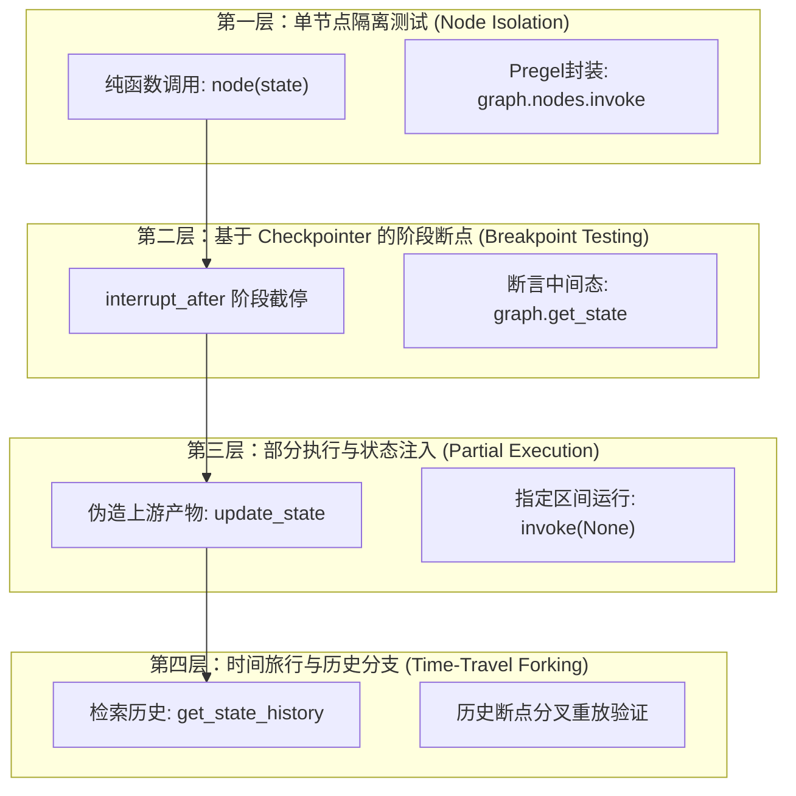
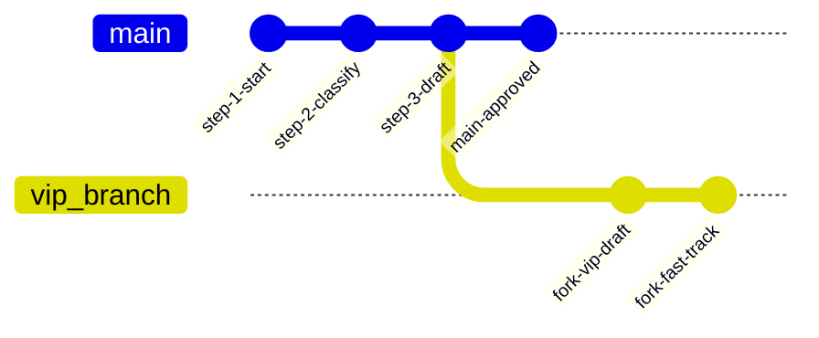

# 第 09 章：图怎么写测试：单节点隔离、断点切片与时间旅行

> 来源：[LangGraph Official Docs: Test](https://docs.langchain.com/oss/python/langgraph/test) · [Use Time-Travel](https://docs.langchain.com/oss/python/langgraph/use-time-travel) · [Checkpointers: Update State](https://docs.langchain.com/oss/python/langgraph/checkpointers#update-state)  
> 适用版本：Python 3.10+ · `langgraph >= 0.2.0`（实测 `0.6.11`）· `langgraph-checkpoint >= 2.0.0`  
> 验证环境：macOS (Darwin arm64) · Python 3.12.12 · `langgraph 0.6.11` · `pytest 8.4.2`

---

在前面的章节中，我们的**客服工单处理智能体（Support Ticket Agent）**已经逐渐演进为一个具备意图分类、知识检索、草拟回复、人工审核等多节点的复杂系统。

但随着图的规模膨胀，工程团队立刻遭遇了严峻的**测试危机**：
1. **端到端（E2E）测试极其缓慢且脆弱**：每次跑测试都从 `START` 一路执行到 `END`。一旦下游的“人工审批”或“工单关闭”逻辑报了 bug，我们必须构造包含完整用户输入、前置分类和知识库检索的全量上下文才能触发该分支，耗时冗长且极易因前置偶发异常而中断；
2. **中间状态难以精准断言**：整图 `invoke()` 只能拿到最终结果。如果分类器在第 1 步把意图算错了，但下游草拟节点恰好蒙对了一个通用兜底话术，测试就会假绿（False Positive）；
3. **深层边缘分支构造困难**：为了测试“当草拟回复带有敏感词或 VIP 标识时走快速通道”，测试人员往往需要绞尽脑汁去编造一段特殊的输入文字，祈祷上游的节点能“恰好”生成那段特定文本；
4. **外部依赖耦合**：前置节点可能涉及真实的大模型调用或外部知识库 API，若无法随心所欲地伪造中间状态，单测就会退化成昂贵的集成测试。

在《Learn Go with Tests》的哲学中，**可观察的反馈、由小到大、分层测试**是软件工程的基石。在 LangGraph 中，我们不必把图当成一个不可分割的“黑盒”，而是拥有一整套不同粒度的测试武器：



本章将通过测试驱动开发（TDD）的方式，从最微小的纯函数单测起步，一步步攻克 LangGraph 官方推荐的核心测试模式。

---

## 来源契约

本章测试模式基于 LangGraph 官方指南与 Pregel 状态机规范：

1. **单节点隔离契约（Node Isolation）**：
   - 节点本质就是纯 Python 函数（`Callable[[State], dict]`），无需编译整图，传入字典即可独立执行和断言；
   - 编译后的图对象暴露 `graph.nodes` 字典，可通过 `graph.nodes["node_name"].invoke(state)` 触发，此调用会走节点包装逻辑但绕过 Checkpointer。
2. **断点状态检查契约（Breakpoint Inspection）**：
   - 使用内存持久化 `InMemorySaver` 编译图，在 `graph.invoke(input, config=config, interrupt_after=[...])` 中传入静态断点；
   - 中断发生后，通过 `graph.get_state(config)` 获取 `StateSnapshot`，检查 `state.values` 和 `state.next` 指针。
3. **部分执行与状态注入契约（Partial Execution via `update_state`）**：
   - 在测试跳过前置节点时，必须调用 `graph.update_state(config, values={...}, as_node="prev_node")`；
   - **`as_node` 核心契约**：明确告知图该状态由 `prev_node` 产出，LangGraph 路由引擎会据此计算后继节点，使 `state.next` 正确指向待测目标节点；
   - 唤醒执行必须传入 `None`（`graph.invoke(None, config=config)`），表示从当前断点状态继续流转。
4. **时间旅行分叉契约（Time-Travel Forking）**：
   - Checkpointer 保存的是由父子指针构成的**版本树（Tree of Checkpoints）**，而非扁平覆盖的数组；
   - 通过 `graph.get_state_history(config)` 遍历历史，使用目标历史快照的 `checkpoint.config` 调用 `update_state`，将派生出一条全新的执行分支，原有历史记录毫发无损。

---

## 迭代一：单个节点的隔离单元测试（Node Isolation）

### 1. 先写测试

我们首先需要一个意图分类节点 `classify_intent_node`：
- 当用户消息中包含“退款”字样时，将工单类别判定为 `billing`；
- 其他情况判定为 `technical`。

从调用者视角看，节点就是一个接收 `state` 字典并返回局部更新字典的纯函数。我们无需调用 `StateGraph`，直接写测试：

```python
# test_graph.py
from graph import classify_intent_node


def test_classify_intent_node_direct_call():
    # 场景 1：用户提到退款，断言类别更新为 billing
    state_refund = {
        "ticket_id": "T-001",
        "category": "",
        "messages": ["我想申请退款，昨天购买的软件无法激活"],
        "draft": None,
        "needs_review": False,
        "status": "new",
    }
    output_refund = classify_intent_node(state_refund)
    assert output_refund == {"category": "billing"}

    # 场景 2：普通设备故障，断言类别更新为 technical
    state_tech = {
        "ticket_id": "T-002",
        "category": "",
        "messages": ["系统提示连接超时，请问如何配置代理？"],
        "draft": None,
        "needs_review": False,
        "status": "new",
    }
    output_tech = classify_intent_node(state_tech)
    assert output_tech == {"category": "technical"}
```

同时，LangGraph 官方文档提到，编译后的图对象暴露了 `graph.nodes` 映射，我们也可以通过 `graph.nodes["node_name"].invoke(state)` 进行测试。我们为草拟回复节点 `draft_response_node` 编写这个测试：

```python
from graph import create_ticket_graph


def test_draft_response_via_graph_nodes():
    graph = create_ticket_graph()
    
    # 直接调用 compiled_graph 暴露的内部节点
    output = graph.nodes["draft_response"].invoke({
        "category": "billing",
        "messages": [],
    })
    
    # 断言节点输出了退款专属回复，且标记需要人工审核
    assert output["needs_review"] is True
    assert "退款申请已收到" in output["draft"]
```

### 2. 运行测试（红灯）

在终端中执行测试：

```console
$ pytest -q test_graph.py
=================================== FAILURES ===================================
_________________________________ test_classify_intent_node_direct_call __________________________________
ImportError: cannot import name 'classify_intent_node' from 'graph'
```

测试如期变红：我们尚未在 `graph.py` 中声明状态结构、节点函数与构图工厂。

### 3. 编写最小实现变绿

创建 `graph.py`，编写最小业务逻辑：

```python
# graph.py
from typing import TypedDict, Annotated, Optional
import operator
from langgraph.graph import StateGraph, START, END


class TicketState(TypedDict):
    ticket_id: str
    category: str
    messages: Annotated[list[str], operator.add]
    draft: Optional[str]
    needs_review: bool
    status: str


def classify_intent_node(state: TicketState):
    msgs = "".join(state.get("messages", []))
    if "退款" in msgs or state.get("category") == "billing":
        cat = "billing"
    else:
        cat = "technical"
    return {"category": cat}


def draft_response_node(state: TicketState):
    cat = state.get("category", "technical")
    if cat == "billing":
        return {
            "draft": "您的退款申请已收到，我们将为您核实处理。",
            "needs_review": True,
        }
    return {
        "draft": "请尝试重启设备，如仍有问题请回复本工单。",
        "needs_review": False,
    }


def human_review_node(state: TicketState):
    draft = state.get("draft", "")
    if "VIP" in draft:
        return {"status": "fast_tracked", "messages": ["[优先通道] 审批通过"]}
    if state.get("needs_review"):
        return {"status": "approved_by_reviewer", "messages": ["[人工审批] 审批通过"]}
    return {"status": "auto_resolved", "messages": ["[系统自动完结]"]}


def create_ticket_graph(checkpointer=None):
    builder = StateGraph(TicketState)
    builder.add_node("classify_intent", classify_intent_node)
    builder.add_node("draft_response", draft_response_node)
    builder.add_node("human_review", human_review_node)

    builder.add_edge(START, "classify_intent")
    builder.add_edge("classify_intent", "draft_response")
    builder.add_edge("draft_response", "human_review")
    builder.add_edge("human_review", END)

    return builder.compile(checkpointer=checkpointer)
```

再次运行测试：

```console
$ pytest -v test_graph.py
test_graph.py::test_classify_intent_node_direct_call PASSED              [ 50%]
test_graph.py::test_draft_response_via_graph_nodes PASSED                [100%]

============================== 2 passed in 0.08s ===============================
```

### 4. 深度复盘：两种单节点测试姿势的取舍

| 测试方式 | 核心调用语法 | 是否需要编译图 | 优势 | 注意事项 |
|---|---|---|---|---|
| **纯函数直调** | `node_fn(state_dict)` | **否** | 零开销，运行最快；输入输出即纯 Python 字典 | 无法测试图中配置（如 schema 校验、重试策略） |
| **`graph.nodes` 调用** | `graph.nodes["name"].invoke(state)` | **是** | 走 Pregel 节点的包装与通道过滤机制 | 官方明确声明：此调用会**绕过 Checkpointer**，不产生持久化检查点 |

---

## 迭代二：基于 Checkpointer 的阶段断点检查（Breakpoint Testing）

### 1. 先写测试

纯函数测试能保证每个车轮是圆的，但无法验证车轮拼装成整车后的**传动状态**。  
我们希望发起一次完整的 `invoke()`，但要求图在执行完 `classify_intent` 节点后**立刻停下**，让我们检查：
1. 此时中间检查点里的 `category` 是否已正确写入；
2. 此时下游的 `draft` 字段是否尚未被计算；
3. 最关键的是：图的指针 `state.next` 是否精准锁定了下一步待执行的节点 `("draft_response",)`。

在 `test_graph.py` 中添加测试用例：

```python
# test_graph.py
from langgraph.checkpoint.memory import InMemorySaver


def test_breakpoint_inspection_with_interrupt_after():
    checkpointer = InMemorySaver()
    graph = create_ticket_graph(checkpointer=checkpointer)
    config = {"configurable": {"thread_id": "thread-breakpoint-01"}}

    # 使用 interrupt_after 让图在 classify_intent 完成后暂停
    graph.invoke(
        {"ticket_id": "T-101", "messages": ["设备黑屏打不开"]},
        config=config,
        interrupt_after=["classify_intent"],
    )

    # 从 checkpointer 读取当前线程的最新快照
    state_snapshot = graph.get_state(config)

    # 1. 验证本节点产生的数据已生效
    assert state_snapshot.values["category"] == "technical"

    # 2. 验证后续节点尚未执行（draft 尚未初始化）
    assert state_snapshot.values.get("draft") is None

    # 3. 核心契约：检查点记录的待运行节点是 draft_response
    assert state_snapshot.next == ("draft_response",)
```

### 2. 运行测试（观察断言与通过）

```console
$ pytest -v test_graph.py -k test_breakpoint_inspection_with_interrupt_after
test_graph.py::test_breakpoint_inspection_with_interrupt_after PASSED    [100%]

============================== 1 passed in 0.09s ===============================
```

测试顺利变绿！

### 3. 踩坑点警示：TypedDict 中的未初始化 Key

如果我们将第 2 条断言写成：
```python
assert state_snapshot.values["draft"] is None
```
会发生什么？运行会直接抛出：
```text
KeyError: 'draft'
```
这是因为在 LangGraph 中，状态字典 `state_snapshot.values` 只保存**当前超步已被写入或初始化过的通道**。下游节点尚未执行时，该 key 根本不存在于字典中！因此断言阶段性状态时，务必使用 `values.get("field") is None`。

---

## 迭代三：部分执行（Partial Execution）与状态伪造注入

### 1. 现实痛点与测试需求

现在我们要测试中间的 `draft_response` 节点：
假设在上游真实生产环境中，`classify_intent` 需要调用耗时的大模型或外部规则引擎；我们现在只想对 `draft_response` 施加压力测试，验证它面对 `billing` 类别时能否正确输出审批标记和文案。

我们**绝对不想**跑上游的 `classify_intent`。我们想要：
1. 直接向持久化检查点中“注入”伪造的上游结果 `{"category": "billing"}`；
2. 让图从 `draft_response` 启动，并在其执行完毕后停住；
3. 断言 `draft_response` 的输出，且整场测试中 `classify_intent` 根本不参与运行！

### 2. 先写测试

LangGraph 提供了 `update_state` 方法支持这种场景。写下测试：

```python
# test_graph.py
def test_partial_execution_skipping_upstream():
    checkpointer = InMemorySaver()
    graph = create_ticket_graph(checkpointer=checkpointer)
    config = {"configurable": {"thread_id": "thread-partial-01"}}

    # 核心：使用 update_state 模拟已执行完上游节点
    # as_node='classify_intent' 声明：这笔状态是 classify_intent 的输出
    graph.update_state(
        config,
        values={"category": "billing", "messages": ["[测试注入] 退款工单"]},
        as_node="classify_intent",
    )

    # 验证：检查点的 next 是否已经自动路由到了 draft_response
    state_before_run = graph.get_state(config)
    assert state_before_run.next == ("draft_response",)

    # 恢复执行：传入 None，并通过 interrupt_after 控制停在 draft_response 之后
    result = graph.invoke(
        None,
        config=config,
        interrupt_after=["draft_response"],
    )

    # 断言 draft_response 的输出
    assert result["draft"] == "您的退款申请已收到，我们将为您核实处理。"
    assert result["needs_review"] is True

    # 断言图的状态指针已经推移到了下一个节点 human_review
    assert graph.get_state(config).next == ("human_review",)
```

### 3. 运行测试（绿灯）

```console
$ pytest -v test_graph.py -k test_partial_execution_skipping_upstream
test_graph.py::test_partial_execution_skipping_upstream PASSED           [100%]

============================== 1 passed in 0.09s ===============================
```

### 4. 致命 Gotcha：如果漏掉了 `as_node` 会怎样？

这是所有 LangGraph 开发者在编写部分执行测试时最容易掉入的深坑！

假设我们漏传了 `as_node`：
```python
# 错误示范：没有指定 as_node
graph.update_state(
    config,
    values={"category": "billing", "messages": ["[测试注入] 退款工单"]},
)
```

我们在终端中用单行脚本实测对比它的行为：

```python
# 运行实测
config_bad = {"configurable": {"thread_id": "test-bad"}}
graph.update_state(config_bad, {"category": "billing"})
print("next without as_node:", graph.get_state(config_bad).next)
```

实测输出：
```text
next without as_node: ('classify_intent',)
```

**发生了什么？**
- 因为这是一个全新的 `thread_id`，没有任何历史记录。
- 当你不指定 `as_node` 时，LangGraph 认为这是一笔来自图外部的全局输入！
- 外部输入进入空线程，图的调度器只能判定为：**从起点开始执行（`START` 的后继）**，即 `next` 依然是 `('classify_intent',)`！
- 当你调用 `graph.invoke(None, config)` 时，`classify_intent` **会被再次执行**，不仅没有跳过前置节点，甚至还会用它的实际计算结果把你刚刚注入的 `category` 覆盖掉！

**只有显式传入 `as_node="classify_intent"`**：
LangGraph 才会将这笔写入记录为“由 `classify_intent` 节点发出的写操作（Writers）”，然后触发图的边路由引擎，顺理成章地将 `next` 指向它的下一个节点 `draft_response`！

---

## 迭代四：测试状态回溯与历史快照（Time-Travel Testing）

### 1. 业务场景与测试期望

在真实的复杂业务中，许多 bug 发生于特定分支路径的汇合点。  
例如：一张退款工单完整流转完毕，最终状态为普通的审核通过 `approved_by_reviewer`。  
现在业务提出新需求：“**如果草拟文案中包含 `VIP` 标识，必须走优先通道 `fast_tracked`。**”

如果我们为了测试这个逻辑重新建一张图、构造全部输入跑全流程，代价非常高。更优雅的做法是**时间旅行测试（Time-Travel Testing）**：
1. 让工单正常完整跑完一轮；
2. 通过 `graph.get_state_history(config)` 回溯到工单历史中“人工审核执行前”的那一刻；
3. 以该历史检查点为根，**分叉（Fork）**出一个新状态，将 `draft` 修改为 VIP 文案；
4. 调用 `graph.invoke(None, config=fork_config)` 从分叉点重放；
5. 断言新分支顺利输出了 `fast_tracked` 状态，并且**原有线程的历史未被破坏**。

### 2. 先写测试

```python
# test_graph.py
def test_time_travel_forking_history():
    checkpointer = InMemorySaver()
    graph = create_ticket_graph(checkpointer=checkpointer)
    config = {"configurable": {"thread_id": "thread-timetravel-01"}}

    # 1. 正常完整运行一轮
    initial_res = graph.invoke(
        {"ticket_id": "T-201", "messages": ["我要退款"]},
        config=config,
    )
    assert initial_res["status"] == "approved_by_reviewer"

    # 2. 提取状态历史链条
    history = list(graph.get_state_history(config))
    # 历史上至少存在 4 个超步检查点
    assert len(history) >= 4

    # 记录原始运行的终态快照
    original_final_snapshot = history[0]
    assert original_final_snapshot.values["status"] == "approved_by_reviewer"

    # 3. 查找到 human_review 执行前的历史检查点
    before_review = next(s for s in history if s.next == ("human_review",))

    # 4. 在该历史节点上 Fork 分支：注入包含 VIP 标记的草拟文案
    fork_config = graph.update_state(
        before_review.config,
        values={"draft": "您的退款申请已收到（VIP专属客服通道）。"},
    )

    # 5. 从分支检查点继续执行（重放后续节点）
    fork_res = graph.invoke(None, config=fork_config)
    assert fork_res["status"] == "fast_tracked"
    assert "[优先通道] 审批通过" in fork_res["messages"]

    # 6. 核心契约验证：原路径的历史未被覆盖篡改
    refreshed_history = list(graph.get_state_history(config))
    original_snapshot_in_history = next(
        s for s in refreshed_history
        if s.config["configurable"]["checkpoint_id"]
        == original_final_snapshot.config["configurable"]["checkpoint_id"]
    )
    assert original_snapshot_in_history.values["status"] == "approved_by_reviewer"
```

### 3. 运行测试（绿灯）

```console
$ pytest -v test_graph.py -k test_time_travel_forking_history
test_graph.py::test_time_travel_forking_history PASSED                   [100%]

============================== 1 passed in 0.10s ===============================
```

### 4. 深度复盘：Checkpointer 的版本树结构

为什么我们对历史调用 `update_state` 不会破坏原始数据？  
我们可以打印出 `refreshed_history` 中每个检查点的父子关系：



每个 `Checkpoint` 都包含其父级指纹 `parent_config`。`update_state(before_review.config, ...)` 并非原位修改（in-place update），而是以 `before_review` 的 `checkpoint_id` 作为父节点创建了一个全新的分支节点。

---

## 避坑指南（Gotchas）

### 1. `update_state` 中的 Reducer 累加陷阱

如果状态字段定义了 Reducer（例如 `messages: Annotated[list[str], operator.add]`），在测试中使用 `update_state` 注入数据时必须注意：

> **`update_state` 会完全遵循字段定义的 Reducer 规约！**

实测验证：
```python
# 假设线程已有 messages: ["用户原问题"]
graph.update_state(config, {"messages": ["注入的测试消息"]})
print(graph.get_state(config).values["messages"])
# 输出：['用户原问题', '注入的测试消息'] —— 而不是 ['注入的测试消息']！
```
**避坑建议**：在进行部分执行或模拟测试时，**始终为测试用例生成全新的 `thread_id`**（如 `thread-test-uuid`），保证状态是一张白纸，避免历史残留数据通过 Reducer 产生污染。

### 2. 部分执行恢复时必须传入 `None`

在调用 `update_state` 之后，恢复执行必须写作：
```python
graph.invoke(None, config=config)  # 正确：从当前断点状态继续向下流转
```
**严禁写作**：
```python
graph.invoke({}, config=config)    # 错误：传入空字典会被视为外部输入了一次增量更新
```
如果传入 `{}`，LangGraph 会将其视为用户在当前步发起的新输入，根据通道规则再次触发生命周期调度，可能导致 `next` 路由偏差或多余计算。

### 3. `interrupt_after` 与 `interrupt()` 原语的区别

- `interrupt(payload)` 是写在**业务节点代码内部**的动态暂停原语（第 07 章人在回路），用于生产环境等待外部决策；
- `interrupt_after=["node_name"]` 是外挂在 `invoke(..., interrupt_after=...)` 上的**执行控制参数**，专用于调试、巡检和测试切片，无需修改任何图的源码！

### 4. `graph.nodes["xxx"].invoke()` 不会更新 Checkpointer

通过 `graph.nodes["xxx"].invoke(state)` 可以做轻量级节点执行，但它是一个纯粹的函数级封装，**完全不会触发 Checkpointer 的写入**。如果后续还要调用 `graph.get_state(config)`，必须使用标准的 `graph.invoke(..., config=config)`。

---

## 完整代码清单

### 1. `graph.py`

```python
# graph.py
from typing import TypedDict, Annotated, Optional
import operator
from langgraph.graph import StateGraph, START, END


class TicketState(TypedDict):
    ticket_id: str
    category: str
    messages: Annotated[list[str], operator.add]
    draft: Optional[str]
    needs_review: bool
    status: str


def classify_intent_node(state: TicketState):
    msgs = "".join(state.get("messages", []))
    if "退款" in msgs or state.get("category") == "billing":
        cat = "billing"
    else:
        cat = "technical"
    return {"category": cat}


def draft_response_node(state: TicketState):
    cat = state.get("category", "technical")
    if cat == "billing":
        return {
            "draft": "您的退款申请已收到，我们将为您核实处理。",
            "needs_review": True,
        }
    return {
        "draft": "请尝试重启设备，如仍有问题请回复本工单。",
        "needs_review": False,
    }


def human_review_node(state: TicketState):
    draft = state.get("draft", "")
    if "VIP" in draft:
        return {"status": "fast_tracked", "messages": ["[优先通道] 审批通过"]}
    if state.get("needs_review"):
        return {"status": "approved_by_reviewer", "messages": ["[人工审批] 审批通过"]}
    return {"status": "auto_resolved", "messages": ["[系统自动完结]"]}


def create_ticket_graph(checkpointer=None):
    builder = StateGraph(TicketState)
    builder.add_node("classify_intent", classify_intent_node)
    builder.add_node("draft_response", draft_response_node)
    builder.add_node("human_review", human_review_node)

    builder.add_edge(START, "classify_intent")
    builder.add_edge("classify_intent", "draft_response")
    builder.add_edge("draft_response", "human_review")
    builder.add_edge("human_review", END)

    return builder.compile(checkpointer=checkpointer)
```

### 2. `test_graph.py`

```python
# test_graph.py
import pytest
from langgraph.checkpoint.memory import InMemorySaver
from graph import (
    classify_intent_node,
    create_ticket_graph,
)


# ==========================================
# 1. 单元测试单个节点（Node Isolation）
# ==========================================
def test_node_isolation_pure_function():
    input_state = {
        "ticket_id": "T-001",
        "category": "",
        "messages": ["我想申请退款，昨天购买的软件无法激活"],
        "draft": None,
        "needs_review": False,
        "status": "new",
    }
    output = classify_intent_node(input_state)
    assert output == {"category": "billing"}


def test_node_isolation_via_graph_nodes():
    graph = create_ticket_graph()
    output = graph.nodes["draft_response"].invoke({
        "category": "billing",
        "messages": [],
    })
    assert output["needs_review"] is True
    assert "退款申请已收到" in output["draft"]


# ==========================================
# 2. 基于 Checkpointer 的断点状态检查
# ==========================================
def test_breakpoint_inspection_with_interrupt_after():
    checkpointer = InMemorySaver()
    graph = create_ticket_graph(checkpointer=checkpointer)
    config = {"configurable": {"thread_id": "thread-breakpoint-01"}}

    graph.invoke(
        {"ticket_id": "T-101", "messages": ["设备黑屏打不开"]},
        config=config,
        interrupt_after=["classify_intent"],
    )

    state_snapshot = graph.get_state(config)
    assert state_snapshot.values["category"] == "technical"
    assert state_snapshot.values.get("draft") is None
    assert state_snapshot.next == ("draft_response",)


# ==========================================
# 3. 部分执行与状态注入（Partial Execution）
# ==========================================
def test_partial_execution_skipping_upstream():
    checkpointer = InMemorySaver()
    graph = create_ticket_graph(checkpointer=checkpointer)
    config = {"configurable": {"thread_id": "thread-partial-01"}}

    # 注入前置产物，as_node 指定模拟的来源节点
    graph.update_state(
        config,
        values={"category": "billing", "messages": ["[测试注入] 退款工单"]},
        as_node="classify_intent",
    )

    state_before_run = graph.get_state(config)
    assert state_before_run.next == ("draft_response",)

    result = graph.invoke(
        None,
        config=config,
        interrupt_after=["draft_response"],
    )

    assert result["draft"] == "您的退款申请已收到，我们将为您核实处理。"
    assert result["needs_review"] is True
    assert graph.get_state(config).next == ("human_review",)


# ==========================================
# 4. 时间旅行与历史分支重放（Time-Travel Forking）
# ==========================================
def test_time_travel_forking_history():
    checkpointer = InMemorySaver()
    graph = create_ticket_graph(checkpointer=checkpointer)
    config = {"configurable": {"thread_id": "thread-timetravel-01"}}

    # 正常完整跑完一轮
    initial_res = graph.invoke(
        {"ticket_id": "T-201", "messages": ["我要退款"]},
        config=config,
    )
    assert initial_res["status"] == "approved_by_reviewer"

    # 获取执行历史链条
    history = list(graph.get_state_history(config))
    assert len(history) >= 4

    # 记录原路径终态
    original_final_snapshot = history[0]
    assert original_final_snapshot.values["status"] == "approved_by_reviewer"

    # 找到 human_review 执行前的那一刻检查点
    before_review = next(s for s in history if s.next == ("human_review",))

    # 在该历史检查点上 Fork 分支：修改草拟回复为包含 VIP 标识
    fork_config = graph.update_state(
        before_review.config,
        values={"draft": "您的退款申请已收到（VIP专属客服通道）。"},
    )

    # 从分支检查点继续执行
    fork_res = graph.invoke(None, config=fork_config)
    assert fork_res["status"] == "fast_tracked"
    assert "[优先通道] 审批通过" in fork_res["messages"]

    # 核心保障：检查点历史中，原路径的终态快照依然完整存在
    refreshed_history = list(graph.get_state_history(config))
    original_in_history = next(
        s for s in refreshed_history
        if s.config["configurable"]["checkpoint_id"]
        == original_final_snapshot.config["configurable"]["checkpoint_id"]
    )
    assert original_in_history.values["status"] == "approved_by_reviewer"
```

### 3. 运行实测输出

```console
$ pytest -v test_graph.py
============================= test session starts ==============================
platform darwin -- Python 3.12.12, pytest-8.4.2
collected 5 items

test_graph.py::test_node_isolation_pure_function PASSED                  [ 20%]
test_graph.py::test_node_isolation_via_graph_nodes PASSED                [ 40%]
test_graph.py::test_breakpoint_inspection_with_interrupt_after PASSED    [ 60%]
test_graph.py::test_partial_execution_skipping_upstream PASSED           [ 80%]
test_graph.py::test_time_travel_forking_history PASSED                   [100%]

============================== 5 passed in 0.10s ===============================
```

---

## 收工总结：四种测试模式对比

| 测试模式 | 核心 API / 手法 | 是否需要 Checkpointer | 执行速度 | 典型使用场景 |
|---|---|---|---|---|
| **单节点隔离测试** | `node(state)` 或 `graph.nodes[...].invoke()` | 否 | 极快（毫秒级） | 验证单一节点的纯业务算法、条件判断、局部映射 |
| **断点状态检查** | `invoke(..., interrupt_after=[...])` + `get_state()` | 是 (`InMemorySaver`) | 快 | 验证多节点串联时，超步边界的状态字段是否正确产出与流转 |
| **部分执行与状态注入** | `update_state(..., as_node=...)` + `invoke(None)` | 是 (`InMemorySaver`) | 快 | 跳过昂贵或不稳定的前置节点，直接切入测试中间/尾部子路径 |
| **时间旅行与历史 Fork** | `get_state_history()` + `update_state(ckpt_cfg)` | 是 (`InMemorySaver`) | 适中 | 复现生产问题、验证历史断点的备选决策、探索性状态分支测试 |

---

## 一手参考资料

1. **官方测试指南**：[LangGraph Official Documentation: Test](https://docs.langchain.com/oss/python/langgraph/test)
2. **时间旅行与状态分叉**：[LangGraph Time Travel: From a specific node](https://docs.langchain.com/oss/python/langgraph/use-time-travel#from-a-specific-node)
3. **检查点更新与 Reducer 规范**：[LangGraph Checkpointers: Update state](https://docs.langchain.com/oss/python/langgraph/checkpointers#update-state)
