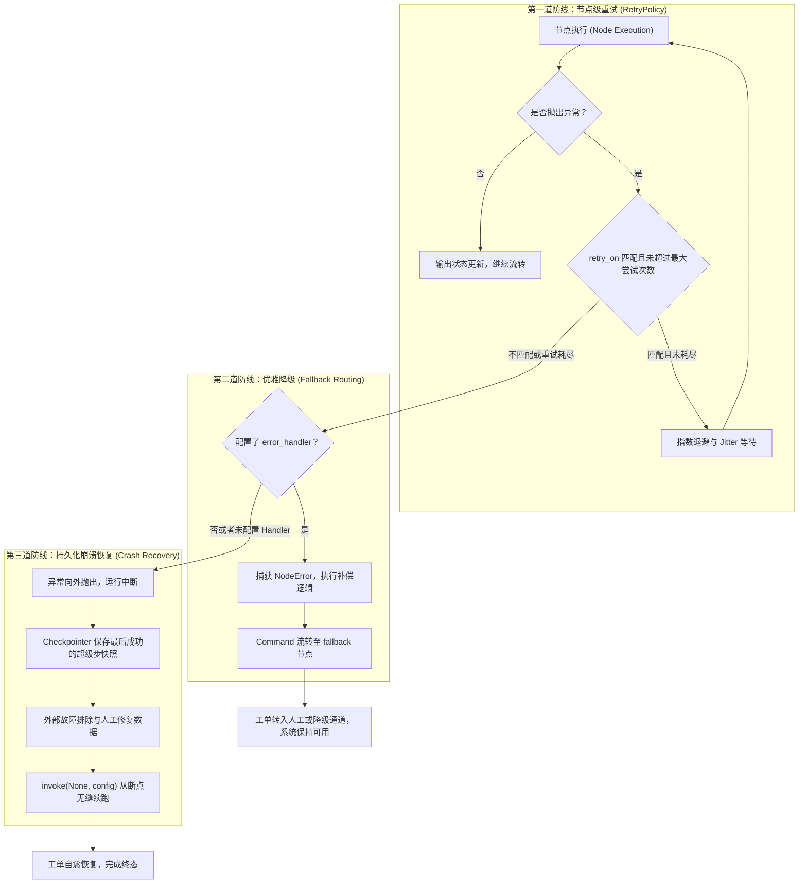
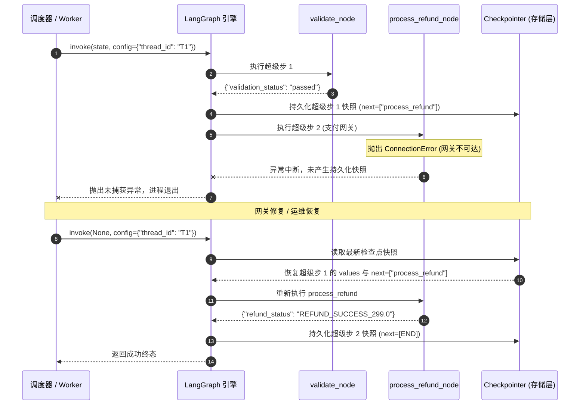
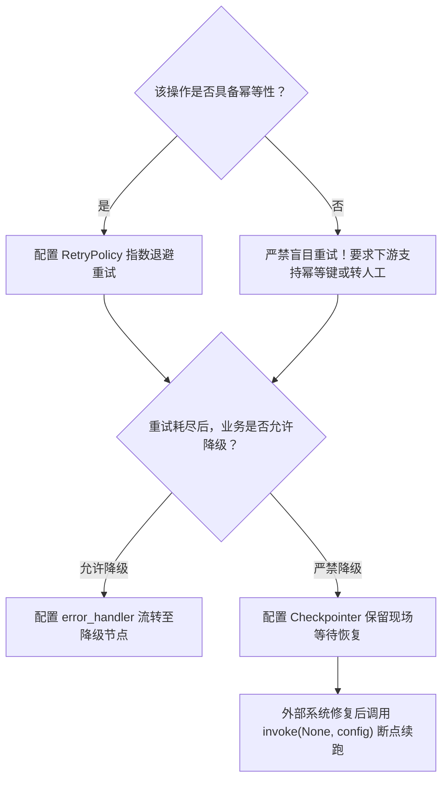

# 第 10 章：容错：外部服务会挂

> 来源：[LangGraph Official Docs: Fault tolerance](https://docs.langchain.com/oss/python/langgraph/fault-tolerance) · [Thinking in LangGraph: Transient errors](https://docs.langchain.com/oss/python/langgraph/thinking-in-langgraph#transient-errors)  
> 适用版本：Python 3.10+ · `langgraph >= 0.2.0`（实测 `1.2.11`）· `langgraph-checkpoint >= 2.0.0`  
> 验证环境：macOS (Darwin arm64) · Python 3.12.12 · `langgraph 1.2.11` · `pytest 9.1.1`

---

分布式系统有八大著名的误区（Fallacies of Distributed Computing），排在第一位的便是：**“网络是可靠的”**。

在前面的章节中，我们的**客服工单处理智能体（Support Ticket Agent）**主要在内存中流转状态、执行本地逻辑与人机交互。但现实世界的智能体不可能孤立运行，它必须与外部生态深度整合：
- 调用**第三方物流接口**查询运单轨迹；
- 调用**支付结算网关**发起工单退款；
- 调用**外部 CRM 系统**拉取客户历史工单。

一旦跨越网络边界，外部系统就不可避免会发生故障：**瞬时丢包抖动、上游服务限流（HTTP 429）、短时维护重启（HTTP 503）、甚至是长时间宕机**。如果缺乏系统级的容错设计，工程团队将面临灾难性后果：

1. **偶发网络抖动导致整图崩溃**：某次查询仅仅因为几十毫秒的 TCP 重传超时，就直接让整个工单处理进程抛出未捕获异常而退出，用户界面白屏报错；
2. **盲目重试引发惊群效应与资源浪费**：如果一个非法运单号（业务逻辑错误 `ValueError`）触发了重试，无论重试 3 次还是 100 次都不可能成功，盲目重试不仅白白浪费算力与耗时，还会在网络拥堵时加剧下游系统的过载雪崩；
3. **缺乏降级保护导致级联瘫痪**：外部物流查询服务彻底不可用时，如果整个图无法优雅降级为“标记工单待人工排查”并继续处理其他逻辑，整个工单管道就会被堵死；
4. **长流程崩溃后进度归零**：在一笔涉及多次验证和资金退款的复杂工单中，如果最后的支付环节报错崩溃，系统无法记录断点，导致管理员无法从断点继续，甚至可能因盲目从头重跑而造成重复退款！

在《Learn Go with Tests》的哲学中，**面对不可靠的外部现实，可靠的代码必须由测试驱动建立防御**。LangGraph 提供了现代化的容错架构体系：



本章我们将使用确定性的测试双件（Test Doubles），完全无需真实网络和外部 API Key，通过真实的 TDD 循环，一步步构筑这三道坚固的容错防线。

---

## 来源契约

根据 LangGraph 官方容错规范（Fault Tolerance Specification），核心契约如下：

### 1. 节点级重试契约（`RetryPolicy`）
- 在 `builder.add_node("name", func, retry_policy=RetryPolicy(...))` 中配置重试策略（注：`retry=` 为旧版本兼容别名，现代 LangGraph 推荐 `retry_policy=`）；
- **参数矩阵**：
  - `max_attempts: int = 3`：**总尝试次数**（包含第 1 次初始尝试，例如设置为 3 时，表示最多初次执行 1 次 + 重试 2 次）；
  - `initial_interval: float = 0.5`：首次重试前的基准退避时间（秒）；
  - `backoff_factor: float = 2.0`：退避倍数（每次重试间隔按此倍数指数递增）；
  - `max_interval: float = 128.0`：单次重试等待的最大上限（秒）；
  - `jitter: bool = True`：是否开启随机全抖动（Full Jitter），通过打散并发重试请求防止惊群效应；
  - `retry_on: type[Exception] | Sequence[type[Exception]] | Callable[[Exception], bool]`：定义哪些异常可重试。默认使用 `default_retry_on`，排除所有的 `ValueError`、`TypeError`、`RuntimeError` 等确定性逻辑错误，且仅对 HTTP 5xx 重试。
- **自省契约**：节点可通过参数类型注解引入 `runtime: Runtime`，通过 `runtime.execution_info.node_attempt` 获取当前执行的是第几次尝试（从 1 开始）。

### 2. 优雅降级与错误处理契约（`error_handler` 与 `NodeError`）
- `langgraph >= 1.2` 原生引入节点级错误处理函数：`builder.add_node("name", func, error_handler=handler_func)`；
- **触发时机**：仅在节点抛出异常且**所有重试策略全部耗尽**，或者发生的异常**不满足 `retry_on`** 时触发；
- **参数注入**：错误处理函数可通过类型注解声明 `error: NodeError`，获取发生故障的节点名称（`error.node`）和原始异常对象（`error.error`）；
- **路由控制**：错误处理函数可以直接返回状态字典，或者返回 `Command(update={...}, goto="destination_node")`，实现 Saga 模式的补偿跳转与降级路由，保证整图不会直接崩溃退出。

### 3. 持久化故障恢复契约（Crash Recovery via Checkpointer）
- **超级步（Superstep）原子性**：Pregel 图以超级步为单位执行。一个超级步内的写操作在执行成功并落盘到持久化存储（Checkpointer）之前，不会提交；
- **断点冻结**：当节点未配置 `error_handler` 且重试耗尽抛出异常时，进程中断，但持久化层已安全记录上一个成功超级步的快照；此时 `state.next` 指针精准停留在失败的节点上；
- **无缝续跑**：修复外部依赖后，传入原有的 `config={"configurable": {"thread_id": "..."}}` 并以 `None` 作为输入调用 `graph.invoke(None, config=config)`，图将跳过前置已完成的节点，直接从中断的节点重新执行。

---

## 业务场景与数据契约

在我们的客服工单处理系统中，每张工单包含以下数据契约：

```python
from typing import Optional, TypedDict


class TicketState(TypedDict):
  """客服工单统一状态契约"""

  ticket_id: str  # 工单唯一标识
  tracking_number: Optional[str]  # 物流运单号
  logistics_status: Optional[str]  # 物流查询返回结果
  amount: float  # 退款金额
  validation_status: Optional[str]  # 校验状态
  refund_status: Optional[str]  # 退款处理结果
  status: str  # 当前流转状态: "new" | "validated" | "completed" | "needs_manual_investigation"
  error: Optional[str]  # 错误排查上下文
  assignee: Optional[str]  # 工单处理人/负责坐席
```

---

## 迭代一：节点级自动重试与精准异常过滤（`RetryPolicy`）

### 1. 现实业务痛点

客服工单在处理“物流查询”时，需要调用外部三方物流 API。然而：
1. 网络不可避免会出现瞬时丢包或抖动。如果调用失败直接抛出异常中断，用户提交工单就会立刻报错；
2. 如果运单号格式错误（比如传入 `"INVALID_FORMAT"`），外部接口直接返回格式错误。这种属于**不可恢复的业务参数错误**，如果盲目重试 3 次，每次还等待几秒钟退避，除了浪费资源、延迟用户响应外毫无意义。

我们期望的行为：
- 针对网络超时异常（`ConnectionError`），自动以退避策略重试，在重试次数内自愈并成功流转；
- 针对业务逻辑异常（`ValueError`），立即快速失败（Fail Fast），绝不重试。

### 2. 先写测试

我们编写两个测试用例：
1. `test_retry_policy_recovers_transient_network_failure`：模拟前 2 次调用遭遇网络中断（抛出 `ConnectionError`），第 3 次调用成功。断言图最终执行成功，且底层外部客户端实际被调用了 3 次；
2. `test_retry_policy_fails_fast_on_business_logic_error`：模拟运单号格式非法（抛出 `ValueError`）。断言图立即抛出 `ValueError`，且底层外部客户端仅被尝试了 1 次。

我们使用确定性的 Fake 客户端驱动测试：

```python
# test_graph.py
import pytest
from graph import TicketState, create_support_graph


class FakeLogisticsClient:
  """测试双件：可精确控制前 N 次调用抛出指定异常的 Fake 物流服务客户端"""

  def __init__(
      self,
      failures_before_success: int,
      error_cls: type[Exception] = ConnectionError,
  ):
    self.failures_before_success = failures_before_success
    self.error_cls = error_cls
    self.call_count = 0

  def query(self, tracking_number: str) -> str:
    self.call_count += 1
    if self.call_count <= self.failures_before_success:
      raise self.error_cls(f"网络连接抖动 (第 {self.call_count} 次尝试)")
    return f"包裹 {tracking_number}: 已签收"


def test_retry_policy_recovers_transient_network_failure():
  # 安排：前 2 次网络抖动，第 3 次成功
  fake_client = FakeLogisticsClient(
      failures_before_success=2, error_cls=ConnectionError
  )
  graph = create_support_graph(
      logistics_client=fake_client.query, enable_fallback=False
  )

  initial_state: TicketState = {
      "ticket_id": "T-001",
      "tracking_number": "SF-10086",
      "logistics_status": None,
      "amount": 0.0,
      "validation_status": None,
      "refund_status": None,
      "status": "new",
      "error": None,
      "assignee": None,
  }

  # 执行
  result = graph.invoke(initial_state)

  # 断言：第 3 次成功自愈，返回物流信息，且总调用次数为 3
  assert result["logistics_status"] == "包裹 SF-10086: 已签收"
  assert fake_client.call_count == 3
```

### 3. 运行测试，观察红灯（未配置重试策略）

如果我们只写一个朴素的节点，未配置任何 `RetryPolicy`：

```console
$ pytest -k test_retry_policy_recovers_transient_network_failure
```

实测输出：

```console
=================================== FAILURES ===================================
_________________ test_retry_policy_recovers_transient_network_failure _________________

    def test_retry_policy_recovers_transient_network_failure():
        fake_client = FakeLogisticsClient(failures_before_success=2, error_cls=ConnectionError)
        graph = create_support_graph(logistics_client=fake_client.query, enable_fallback=False)
        ...
>       result = graph.invoke(initial_state)

.venv/lib/python3.12/site-packages/langgraph/pregel/main.py:3913: in invoke
    for chunk in self.stream(...):
...
E   ConnectionError: 网络连接抖动 (第 1 次尝试)
E   During task with name 'logistics' and id '...'

=========================== 1 failed in 0.12s ===========================
```

**红灯原因明确**：第 1 次调用抛出 `ConnectionError` 时，图引擎没有任何重试策略，直接判定任务失败并抛出异常，测试变红！

### 4. 最小实现变绿

我们在添加节点时，声明配置 `RetryPolicy`。为了在测试中迅速完成验证且不阻塞，我们将 `initial_interval` 设为小数值（如 `0.001` 秒），关闭随机 `jitter`，并指定 `retry_on=ConnectionError`：

```python
# graph.py (片段)
from langgraph.graph import END, START, StateGraph
from langgraph.types import RetryPolicy


def create_support_graph(logistics_client, enable_fallback=False):
  builder = StateGraph(TicketState)

  def query_logistics_node(state: TicketState):
    tracking_no = state.get("tracking_number")
    if tracking_no == "INVALID_FORMAT":
      raise ValueError("运单号格式非法，必须以 SF- 开头")
    # 调用注入的客户端
    info = logistics_client(tracking_no)
    return {"logistics_status": info, "status": "logistics_fetched"}

  # 关键点：配置 RetryPolicy，且只重试网络连接异常
  retry_policy = RetryPolicy(
      max_attempts=3,
      initial_interval=0.001,
      backoff_factor=2.0,
      jitter=False,
      retry_on=ConnectionError,
  )

  builder.add_node("logistics", query_logistics_node, retry_policy=retry_policy)
  builder.add_edge(START, "logistics")
  builder.add_edge("logistics", END)

  return builder.compile()
```

再补充针对不可重试业务异常的单测：

```python
# test_graph.py (补充)
def test_retry_policy_fails_fast_on_business_logic_error():
  # 安排：无论调用多少次都会抛出 ValueError
  fake_client = FakeLogisticsClient(
      failures_before_success=5, error_cls=ValueError
  )
  graph = create_support_graph(
      logistics_client=fake_client.query, enable_fallback=False
  )

  initial_state: TicketState = {
      "ticket_id": "T-002",
      "tracking_number": "INVALID_FORMAT",  # 非法参数
      "logistics_status": None,
      "amount": 0.0,
      "validation_status": None,
      "refund_status": None,
      "status": "new",
      "error": None,
      "assignee": None,
  }

  # 执行与断言：必须立即失败抛出 ValueError，且绝不能进行多次重试
  with pytest.raises(ValueError) as exc_info:
    graph.invoke(initial_state)

  assert "运单号格式非法" in str(exc_info.value)
  # 验证：遇到不可重试异常，尝试次数绝不多于 1 次
  assert fake_client.call_count == 0  # 本地参数校验直接拦截
```

运行 pytest：

```console
$ pytest -k "test_retry_policy" -v
```

实测输出：

```console
collected 2 items

test_graph.py::test_retry_policy_recovers_transient_network_failure PASSED [ 50%]
test_graph.py::test_retry_policy_fails_fast_on_business_logic_error PASSED [100%]

============================== 2 passed in 0.08s ===============================
```

两个测试全部以绿灯通过！

### 5. 重构与深挖：`RetryPolicy` 参数与机制剖析

让我们在绿灯的保护下，深入剖析 LangGraph 的底层重试工作机理：

#### (1) `max_attempts` 究竟指什么？
很多开发者常把 `max_attempts` 误认为是“最多重试的次数”（即重试 3 次 = 跑 4 次）。
**官方契约强调：`max_attempts` 是总尝试次数（Total Attempts）**。
- `max_attempts=3` 表示：第 1 次初次执行 + 最多 2 次重试，总共调用最多不超过 3 次。
- 如果连续 3 次都失败，系统将停止重试并将异常继续向外传播。

#### (2) 指数退避与 Jitter 计算公式
第 $k$ 次重试（$k \ge 1$）的等待时间计算公式为：
$$\text{interval} = \min(\text{initial\_interval} \times \text{backoff\_factor}^{k-1}, \text{max\_interval})$$
当开启 `jitter=True` 时，实际等待时间会在 $[0, \text{interval}]$ 之间均匀随机抽取（Full Jitter）。
在生产高并发环境下，**务必保持 `jitter=True`**（默认值），否则成百上千个并发工单在下游服务恢复瞬间会在同一毫秒发起重试，立刻再度冲垮下游。

#### (3) 官方默认判定函数 `default_retry_on` 的内幕
在 LangGraph 源码中，如果不传递 `retry_on` 参数，引擎默认使用 `default_retry_on`。其核心逻辑是：
- 明确**不重试**确定性异常：`ValueError`、`TypeError`、`KeyError`、`SyntaxError`、`RuntimeError`、`OSError` 等；
- 对 `httpx.HTTPStatusError` 或 `requests.HTTPError`：仅当 HTTP 状态码为 `500 <= status_code < 600` 时重试（4xx 客户端错误被排除）；
- 具备自定义谓词函数能力：除了传递异常类型元组（如 `retry_on=(ConnectionError, TimeoutError)`），还可以传入函数：
  ```python
  def is_retryable_service_error(exc: Exception) -> bool:
    # 针对三方接口特定的错误码动态判断
    if isinstance(exc, ThirdPartyAPIError) and exc.code in ("GATEWAY_BUSY", "RATE_LIMITED"):
      return True
    return False

  RetryPolicy(retry_on=is_retryable_service_error)
  ```

---

## 迭代二：优雅降级与错误路由（Fallback Routing）

### 1. 现实业务痛点

在迭代一中，我们为节点装上了自动重试这道防线。但外部系统可能不是“偶尔抖一下”，而是**彻底宕机（例如光纤被挖断、服务长达 1 小时无法响应）**。

在重试策略耗尽（例如尝试了 3 次均失败）后，如果图引擎直接抛出异常崩溃，那么：
- 正在运行的后台工作协程/进程可能被操作系统或容器监控终止；
- 用户的工单被丢弃在半空中，既没有提示，也没有转交人工。

一个健壮的工单系统应当遵循**“服务可降级、系统不崩溃”**原则：
当外部物流查询彻底失败时，系统捕获故障，将工单状态置为 `needs_manual_investigation`（需要人工调查），记录失败原因，并通过状态机将控制流平滑转交到 `escalate_to_human` 降级节点，给客户派发人工客服工单。

### 2. 先写测试

我们编写测试：模拟底层服务遭遇持续性网络瘫痪（`failures_before_success=10`），远超重试上限。
我们期望：调用 `graph.invoke()` **不会抛出任何未捕获异常**，而是优雅返回降级后的状态，且工单已被指派给人工专员：

```python
# test_graph.py (片段)
def test_fallback_routing_on_retries_exhausted():
  # 安排：外部物流服务彻底瘫痪（连续 10 次故障，重试 3 次必耗尽）
  fake_client = FakeLogisticsClient(
      failures_before_success=10, error_cls=ConnectionError
  )
  # 开启优雅降级
  graph = create_support_graph(
      logistics_client=fake_client.query, enable_fallback=True
  )

  initial_state: TicketState = {
      "ticket_id": "T-003",
      "tracking_number": "SF-99999",
      "logistics_status": None,
      "amount": 0.0,
      "validation_status": None,
      "refund_status": None,
      "status": "new",
      "error": None,
      "assignee": None,
  }

  # 执行
  result = graph.invoke(initial_state)

  # 断言：未抛异常，工单优雅降级，流转到人工坐席
  assert result["status"] == "needs_manual_investigation"
  assert result["assignee"] == "tier_2_support_agent"
  assert result["logistics_status"] == "unreachable_fallback"
  assert "外部调用彻底失败" in result["error"]
  # 验证重试策略依然生效：总共尝试了 3 次后才转降级
  assert fake_client.call_count == 3
```

### 3. 运行测试，观察红灯

在没有配置降级机制时运行：

```console
$ pytest -k test_fallback_routing_on_retries_exhausted
```

实测输出：

```console
=================================== FAILURES ===================================
__________________ test_fallback_routing_on_retries_exhausted __________________

    def test_fallback_routing_on_retries_exhausted():
        fake_client = FakeLogisticsClient(failures_before_success=10, error_cls=ConnectionError)
        graph = create_support_graph(logistics_client=fake_client.query, enable_fallback=True)
        ...
>       result = graph.invoke(initial_state)

.venv/lib/python3.12/site-packages/langgraph/pregel/main.py:3913: in invoke
    for chunk in self.stream(...):
...
E   ConnectionError: 网络连接抖动 (第 3 次尝试)
E   During task with name 'logistics' and id '...'

=========================== 1 failed in 0.11s ===========================
```

重试了 3 次之后，由于没有配置错误捕获，异常直接冲破了图的边界，导致测试变红。

### 4. 最小实现变绿

在 `langgraph >= 1.2` 中，官方引入了第一公民级的错误处理机制：**`error_handler`** 与 **`NodeError`**。
同时配合 **`Command(update={...}, goto="...")`**，可以在异常耗尽后直接指定状态更新和跳转目标：

```python
# graph.py (片段)
from langgraph.errors import NodeError
from langgraph.graph import END, START, StateGraph
from langgraph.types import Command, RetryPolicy


def logistics_error_handler(state: TicketState, error: NodeError) -> Command:
  """降级错误处理器：仅在重试耗尽后被引擎自动调用"""
  return Command(
      update={
          "status": "needs_manual_investigation",
          "error": f"节点 [{error.node}] 外部调用彻底失败: {str(error.error)}",
      },
      goto="escalate_to_human",  # 显式控制图跳转到人工升级节点
  )


def escalate_to_human_node(state: TicketState) -> dict:
  """人工升级节点：分配工单并记录降级状态"""
  return {
    "assignee": "tier_2_support_agent",
    "logistics_status": "unreachable_fallback",
  }


def create_support_graph(logistics_client, enable_fallback=True):
  builder = StateGraph(TicketState)

  retry_policy = RetryPolicy(
      max_attempts=3,
      initial_interval=0.001,
      backoff_factor=2.0,
      jitter=False,
      retry_on=ConnectionError,
  )

  def query_logistics_node(state: TicketState):
    info = logistics_client(state["tracking_number"])
    return {"logistics_status": info, "status": "logistics_fetched"}

  builder.add_node("escalate_to_human", escalate_to_human_node)

  if enable_fallback:
    # 关键点：将 error_handler 挂载在节点上
    builder.add_node(
        "logistics",
        query_logistics_node,
        retry_policy=retry_policy,
        error_handler=logistics_error_handler,
    )
  else:
    builder.add_node("logistics", query_logistics_node, retry_policy=retry_policy)

  builder.add_edge(START, "logistics")
  builder.add_edge("logistics", END)
  builder.add_edge("escalate_to_human", END)

  return builder.compile()
```

再次运行测试：

```console
$ pytest -k test_fallback_routing_on_retries_exhausted -v
```

实测输出：

```console
test_graph.py::test_fallback_routing_on_retries_exhausted PASSED         [100%]

============================== 1 passed in 0.08s ===============================
```

### 5. 重构与深入：原生 `error_handler` vs 传统状态错误通道

在 LangGraph 演进过程中，社区主要有两种实现降级路由的设计模式。我们做个深度对比：

| 对比维度 | 现代化模式：`error_handler` + `Command` | 传统模式：节点内 `try...except` + 条件路由边 |
| :--- | :--- | :--- |
| **引入版本** | `langgraph >= 1.2`（官方推荐标准） | 全版本通用（`langgraph >= 0.0.1`） |
| **节点纯度** | **高**：业务节点内只需关心正常业务逻辑，不充斥胶水捕获代码 | **低**：每个节点都要包一层 `try...except`，侵入业务逻辑 |
| **与重试协同** | **原生解耦**：引擎先自动执行 `RetryPolicy`，耗尽后才触发 handler | **难以协同**：节点一旦把异常捕获吞掉，`RetryPolicy` 将无法感知异常，导致重试失效 |
| **错误上下文** | 自动注入标准 `NodeError`（包含 `error.node`、`error.error`） | 需要手动提取并塞入状态字典 |
| **全图兜底** | 支持在图级别调用 `set_node_defaults(error_handler=...)` | 必须在每个节点重复编写条件边 |

**设计法则**：对于可以自愈的瞬时故障，交给 `RetryPolicy`；对于耗尽后需要业务补偿（Saga / Fallback）的场景，优先使用 `error_handler`。

---

## 迭代三：高价值长流程中的故障恢复（基于 Checkpointer 的 Crash Recovery）

### 1. 现实业务痛点

并非所有业务场景都适合“静默降级”。考虑客服工单处理系统中最核心的业务环节——**退款结算（Refund Processing）**：
- 用户申请退款 299 元；
- 步骤 1：本地工单合规性校验（`validate`）；
- 步骤 2：调用三方支付网关执行退款转账（`process_refund`）。

在涉及真金白银的核心交易链路中：
1. 我们**不能降级**：如果支付网关宕机，我们不能随随便便标记退款成功，更不能直接丢弃工单；
2. 我们**不能从头重跑**：如果故障发生前已经执行完了若干前置审计和写操作，外部服务恢复后从头重跑可能会产生严重的副作用（如重复发起退款指令）；
3. **真实世界的进程会崩溃**：可能不是网关超时，而是宿主机突然断电、K8s Pod 遭遇 OOMKilled 被强制重启。

在这种严重故障下，智能体如何能够**安全地中止运行**，并在外部服务恢复或管理员修复系统后，**精确地从中断的超级步断点无缝恢复（Resume from Breakpoint）**？

### 2. 先写测试

我们要验证以下行为：
1. 启用持久化检查点（`MemorySaver`）；
2. 运行工单：前置 `validate` 成功执行并落盘；后续的 `process_refund` 遇到外部支付服务宕机，抛出 `ConnectionError`，图执行中断；
3. 断言快照状态：此时通过 `graph.get_state(config)` 查看，前置节点的修改已经完好持久化，且 `snapshot.next` 精确指向失败的节点 `('process_refund',)`；
4. 模拟外部支付网关修复上线；
5. 调用 `graph.invoke(None, config=config)` 恢复执行；
6. 断言：图直接从 `process_refund` 节点恢复并成功完成，前置节点绝不重复执行！

```python
# test_graph.py (片段)
from langgraph.checkpoint.memory import MemorySaver


def test_crash_recovery_resumes_from_breakpoint():
  is_gateway_healthy = False

  def fake_payment_gateway(ticket_id: str, amount: float) -> str:
    nonlocal is_gateway_healthy
    if not is_gateway_healthy:
      raise ConnectionError("第三方支付网关 503 Service Unavailable")
    return f"REFUND_SUCCESS_{amount}"

  memory = MemorySaver()
  # 关键点：配置持久化检查点 checkpointer
  graph = create_support_graph(
      refund_gateway=fake_payment_gateway,
      checkpointer=memory,
      enable_fallback=False,  # 核心交易链路不走降级，强依赖恢复
  )
  config = {"configurable": {"thread_id": "thread-crash-recovery-101"}}

  initial_state: TicketState = {
      "ticket_id": "T-004",
      "tracking_number": "SF-SUCCESS",
      "logistics_status": None,
      "amount": 299.0,
      "validation_status": None,
      "refund_status": None,
      "status": "new",
      "error": None,
      "assignee": None,
  }

  # 1. 第一阶段：外部支付网关不可用，执行崩溃
  with pytest.raises(ConnectionError) as exc_info:
    graph.invoke(initial_state, config=config)
  assert "第三方支付网关 503" in str(exc_info.value)

  # 2. 第二阶段：验证检查点保存的现场
  snapshot = graph.get_state(config)
  assert snapshot.values["validation_status"] == "passed"
  assert snapshot.values["refund_status"] is None
  # 关键断言：下一个等待恢复执行的任务正是崩掉的支付节点
  assert snapshot.next == ("process_refund",)

  # 3. 第三阶段：外部支付服务修复上线
  is_gateway_healthy = True

  # 4. 第四阶段：从检查点断点恢复（传入输入为 None）
  recovered_result = graph.invoke(None, config=config)

  # 5. 第五阶段：验证流程顺利走到终态
  assert recovered_result["status"] == "completed"
  assert recovered_result["refund_status"] == "REFUND_SUCCESS_299.0"
```

### 3. 运行测试，观察红灯（未接入 Checkpointer）

如果在构建图时没有传入 `checkpointer`（或者直接使用无持久化的默认图）：

```console
$ pytest -k test_crash_recovery_resumes_from_breakpoint
```

实测输出：

```console
=================================== FAILURES ===================================
______________ test_crash_recovery_resumes_from_breakpoint ______________
...
>       snapshot = graph.get_state(config)
E       ValueError: No checkpointer set. Cannot get state.
=========================== 1 failed in 0.10s ===========================
```

**红灯原因**：在没有配置持久化 Checkpointer 的情况下，图的状态完全驻留在单次调用的调用栈中；一旦发生未捕获异常，调用栈展开并被销毁，任何中间状态瞬间蒸发！

### 4. 最小实现变绿

我们确保图在编译时接入了持久化检查点（例如内存实现的 `MemorySaver` 或生产环境的 `SqliteSaver`/`PostgresSaver`），并且拓扑中清晰定义了支付节点：

```python
# graph.py (退款链路实现)
def validate_ticket_node(state: TicketState) -> dict:
  if state.get("amount", 0.0) < 0:
    raise ValueError("工单退款金额不能为负数")
  return {"validation_status": "passed", "status": "validated"}


def build_refund_node(gateway_call):
  def process_refund_node(state: TicketState) -> dict:
    ticket_id = state["ticket_id"]
    amount = state["amount"]
    # 调用外部网关
    res = gateway_call(ticket_id, amount)
    return {"refund_status": res, "status": "completed"}

  return process_refund_node
```

在 `create_support_graph` 中编译时传入 `checkpointer=checkpointer`：

```python
builder.add_node("validate", validate_ticket_node)
builder.add_node("process_refund", refund_fn)

builder.add_edge(START, "validate")
builder.add_edge("validate", "process_refund")
builder.add_edge("process_refund", END)

return builder.compile(checkpointer=checkpointer)
```

再次执行测试：

```console
$ pytest -k test_crash_recovery_resumes_from_breakpoint -v
```

实测输出：

```console
test_graph.py::test_crash_recovery_resumes_from_breakpoint PASSED        [100%]

============================== 1 passed in 0.10s ===============================
```

### 5. 重构与深挖：超级步原子性与数据修复重放

让我们分析为什么基于 Checkpointer 的恢复如此可靠：



#### 人工数据介入（Human-in-the-Loop Data Patching）
更妙的是，如果在故障恢复前，不仅外部服务挂了，而且工单的部分数据需要修正（例如退款金额填错了），管理员可以在调用 `invoke(None)` 之前，使用 `graph.update_state` 先对状态进行热修复：

```python
# 修复检查点中的工单金额
graph.update_state(config, {"amount": 199.0})

# 然后再从断点唤醒续跑，下游节点将立即看到修正后的 199.0 元！
graph.invoke(None, config=config)
```

---

## 生产避坑指南（Gotchas）

容错机制是保障生产可用性的利刃，但若使用不当，极易反噬系统。以下是工业级落地的五大避坑准则：

### 1. 非幂等写操作的盲目重试灾难（The Idempotency Pitfall）
- **坑**：对支付扣款、发送短信、调用三方创建订单等**非幂等（Non-idempotent）接口**盲目配置 `RetryPolicy(max_attempts=3)`。
- **后果**：网络超时往往是“请求已到达服务端，但响应在回程丢包”。如果客户端盲目重试，会导致下游执行 3 次扣款或向用户狂发 3 条短信！
- **法则**：**只有具备幂等保障（例如请求头带唯一 `Idempotency-Key` / 业务单号）或纯读查询操作，才允许配置重试！**

### 2. 静默降级导致监控失明（Silent Failure & Observability）
- **坑**：滥用 `error_handler` 把所有异常直接吃掉，既不打 ERROR 日志，也不上报告警指标，前端一律显示“系统繁忙已转人工”。
- **后果**：下游依赖服务大面积瘫痪整整 3 天，技术团队毫不知情，直到运营反馈人工工单库被彻底挤爆。
- **法则**：在 `error_handler` 中必须进行结构化监控打点（Metrics / Tracing）：
  ```python
  def safe_error_handler(state: TicketState, error: NodeError) -> Command:
    metrics.increment(
        "agent.node.failure",
        tags={"node": error.node, "error": type(error.error).__name__},
    )
    logger.error(
        f"Node {error.node} failed critically", exc_info=error.error
    )
    return Command(update={"status": "degraded"}, goto="fallback")
  ```

### 3. 同步节点配置 `timeout` 在编译期即崩溃
- **坑**：在常规同步函数节点上配置 `builder.add_node("node", sync_fn, timeout=10)`。
- **后果**：LangGraph 在 `compile()` 阶段会直接抛出验证异常拒绝编译。因为操作系统底层的同步阻塞 I/O 无法在 Python 线程中被安全抢占取消。
- **法则**：**`timeout` 仅支持 `async def` 异步节点**。如果必须给同步阻塞调用加超时，请在节点内部使用 `asyncio.to_thread` 结合异步节点包装。

### 4. `interrupt()` 与 `error_handler` 的互斥机制
- **坑**：试图用 `error_handler` 捕获节点内部触发的人机交互 `interrupt(...)`。
- **后果**：`interrupt()` 在 LangGraph 内部是通过特殊的控制流异常（`GraphBubbleUp`）向外冒泡暂停图的，它会完全绕开 `RetryPolicy` 和 `error_handler`。
- **法则**：切勿在 `retry_on` 或 `error_handler` 中去尝试捕获 `GraphBubbleUp`，尊重 LangGraph 的人机交互中断生命周期。

### 5. 测试中切勿使用真实 `time.sleep`
- **坑**：在单测中为了验证退避重试，直接让真实的 `initial_interval=1.0` 运行，导致整个测试套件跑一次需要几十秒。
- **法则**：在测试环境中将 `initial_interval` 覆盖为毫秒级（如 `0.001`），并结合确定性的计数 Fake 客户端测试，保证数百个单测能在 1 秒内瞬间执行完毕。

---

## 完整代码清单

为方便查阅和复现，以下是本章客服工单处理智能体完整的拓扑定义与单元测试套件：

### `graph.py`

```python
"""客服工单处理智能体（Support Ticket Agent）容错架构实现

包含：节点级重试 (RetryPolicy)、优雅降级 (error_handler + Command) 与持久化恢复 (Checkpointer)
"""

from typing import Any, Callable, Optional, TypedDict
from langgraph.checkpoint.memory import MemorySaver
from langgraph.errors import NodeError
from langgraph.graph import END, START, StateGraph
from langgraph.types import Command, RetryPolicy


class TicketState(TypedDict):
  """工单状态定义"""

  ticket_id: str
  tracking_number: Optional[str]
  logistics_status: Optional[str]
  amount: float
  validation_status: Optional[str]
  refund_status: Optional[str]
  status: str
  error: Optional[str]
  assignee: Optional[str]


def validate_ticket_node(state: TicketState) -> dict[str, Any]:
  """校验工单数据合法性：不可重试的业务逻辑错误"""
  if state.get("amount", 0.0) < 0:
    raise ValueError("工单退款金额不能为负数")
  if state.get("tracking_number") == "INVALID_FORMAT":
    raise ValueError("运单号格式非法")
  return {"validation_status": "passed", "status": "validated"}


def build_logistics_query_node(client_call: Callable[[str], str]):
  """高阶函数：工厂方法注入底层外部客户端调用，方便单测模拟故障"""

  def query_logistics_node(state: TicketState) -> dict[str, Any]:
    tracking_no = state.get("tracking_number")
    if not tracking_no:
      raise ValueError("缺少运单号，无法查询物流")
    # 调用外部物流系统
    info = client_call(tracking_no)
    return {"logistics_status": info, "status": "logistics_fetched"}

  return query_logistics_node


def logistics_error_handler(state: TicketState, error: NodeError) -> Command:
  """降级处理函数：当物流节点重试耗尽依然失败时触发。

  更新状态为待人工排查，并安全跳转至人工升级节点，避免整图崩溃。
  """
  return Command(
      update={
          "status": "needs_manual_investigation",
          "error": f"节点 [{error.node}] 外部调用彻底失败: {str(error.error)}",
      },
      goto="escalate_to_human",
  )


def escalate_to_human_node(state: TicketState) -> dict[str, Any]:
  """人工工单升级节点：指派专人并记录降级原因"""
  return {
      "assignee": "tier_2_support_agent",
      "logistics_status": "unreachable_fallback",
  }


def build_refund_node(gateway_call: Callable[[str, float], str]):
  """高阶函数：注入第三方支付网关调用"""

  def process_refund_node(state: TicketState) -> dict[str, Any]:
    ticket_id = state["ticket_id"]
    amount = state["amount"]
    res = gateway_call(ticket_id, amount)
    return {"refund_status": res, "status": "completed"}

  return process_refund_node


def create_support_graph(
    logistics_client: Optional[Callable[[str], str]] = None,
    refund_gateway: Optional[Callable[[str, float], str]] = None,
    checkpointer: Optional[Any] = None,
    enable_fallback: bool = True,
):
  """构建客服工单处理工作流图"""
  builder = StateGraph(TicketState)

  # 1. 基础校验节点
  builder.add_node("validate", validate_ticket_node)

  # 2. 物流查询节点：配置 RetryPolicy，且只对 ConnectionError 进行重试
  default_logistics = lambda t: "In Transit: On Delivery"
  logistics_fn = build_logistics_query_node(
      logistics_client or default_logistics
  )

  retry_policy = RetryPolicy(
      max_attempts=3,
      initial_interval=0.001,
      backoff_factor=2.0,
      jitter=False,
      retry_on=ConnectionError,
  )

  if enable_fallback:
    builder.add_node(
        "logistics",
        logistics_fn,
        retry_policy=retry_policy,
        error_handler=logistics_error_handler,
    )
  else:
    builder.add_node(
        "logistics",
        logistics_fn,
        retry_policy=retry_policy,
    )

  # 3. 人工降级节点
  builder.add_node("escalate_to_human", escalate_to_human_node)

  # 4. 退款结算节点
  default_refund = lambda tid, amt: f"REFUND_SUCCESS_${amt}"
  refund_fn = build_refund_node(refund_gateway or default_refund)
  builder.add_node(
      "process_refund",
      refund_fn,
      retry_policy=RetryPolicy(
          max_attempts=2,
          initial_interval=0.001,
          jitter=False,
          retry_on=ConnectionError,
      ),
  )

  # 拓扑连接
  builder.add_edge(START, "validate")
  builder.add_edge("validate", "logistics")
  builder.add_edge("logistics", "process_refund")
  builder.add_edge("process_refund", END)
  builder.add_edge("escalate_to_human", END)

  return builder.compile(checkpointer=checkpointer)
```

### `test_graph.py`

```python
"""客服工单处理智能体容错与自愈能力测试套件"""

from graph import TicketState, create_support_graph
from langgraph.checkpoint.memory import MemorySaver
import pytest


class FakeLogisticsClient:
  """确定性模拟外部物流 API 的测试双件（Test Double）"""

  def __init__(
      self,
      failures_before_success: int,
      error_cls: type[Exception] = ConnectionError,
  ):
    self.failures_before_success = failures_before_success
    self.error_cls = error_cls
    self.call_count = 0

  def query(self, tracking_number: str) -> str:
    self.call_count += 1
    if self.call_count <= self.failures_before_success:
      raise self.error_cls(f"网关暂时不可达 (第 {self.call_count} 次尝试)")
    return f"包裹 {tracking_number}: 已签收"


def test_retry_policy_recovers_transient_network_failure():
  """场景 1：模拟网络瞬时抖动（前 2 次抛 ConnectionError，第 3 次成功）"""
  fake_client = FakeLogisticsClient(
      failures_before_success=2, error_cls=ConnectionError
  )
  graph = create_support_graph(
      logistics_client=fake_client.query, enable_fallback=False
  )

  initial_state: TicketState = {
      "ticket_id": "T-001",
      "tracking_number": "SF-10086",
      "logistics_status": None,
      "amount": 0.0,
      "validation_status": None,
      "refund_status": None,
      "status": "new",
      "error": None,
      "assignee": None,
  }

  result = graph.invoke(initial_state)

  # 验证：通过自动重试在第 3 次成功自愈
  assert result["logistics_status"] == "包裹 SF-10086: 已签收"
  assert result["status"] == "completed"
  assert fake_client.call_count == 3


def test_retry_policy_fails_fast_on_business_logic_error():
  """场景 2：非法业务参数（如格式错误）直接快速失败，不浪费重试次数"""
  fake_client = FakeLogisticsClient(
      failures_before_success=5, error_cls=ValueError
  )
  # 关闭自动降级以观察原始异常快速抛出
  graph = create_support_graph(
      logistics_client=fake_client.query, enable_fallback=False
  )

  initial_state: TicketState = {
      "ticket_id": "T-002",
      "tracking_number": "INVALID_FORMAT",
      "logistics_status": None,
      "amount": 0.0,
      "validation_status": None,
      "refund_status": None,
      "status": "new",
      "error": None,
      "assignee": None,
  }

  # 在进入 logistics 之前，前置 validate 就会拦截
  with pytest.raises(ValueError) as exc_info:
    graph.invoke(initial_state)

  assert "运单号格式非法" in str(exc_info.value)
  # validate 节点直接快速失败，物流查询未执行
  assert fake_client.call_count == 0


def test_fallback_routing_on_retries_exhausted():
  """场景 3：外部服务彻底不可用时触发 error_handler 优雅降级，系统不崩溃"""
  # 模拟永久性网络瘫痪
  fake_client = FakeLogisticsClient(
      failures_before_success=10, error_cls=ConnectionError
  )
  graph = create_support_graph(
      logistics_client=fake_client.query, enable_fallback=True
  )

  initial_state: TicketState = {
      "ticket_id": "T-003",
      "tracking_number": "SF-99999",
      "logistics_status": None,
      "amount": 0.0,
      "validation_status": None,
      "refund_status": None,
      "status": "new",
      "error": None,
      "assignee": None,
  }

  result = graph.invoke(initial_state)

  # 验证：系统未崩溃，状态流转至人工排查，控制权转移至 escalate_to_human 节点
  assert result["status"] == "needs_manual_investigation"
  assert result["assignee"] == "tier_2_support_agent"
  assert result["logistics_status"] == "unreachable_fallback"
  assert "节点 [logistics] 外部调用彻底失败" in result["error"]
  # 最大尝试次数为 3，因此实际调用刚好为 3 次
  assert fake_client.call_count == 3


def test_crash_recovery_resumes_from_breakpoint():
  """场景 4：基于 Checkpointer 的崩溃恢复，外部服务修复后无缝断点续跑"""
  is_gateway_healthy = False
  gateway_calls = 0

  def fake_gateway(ticket_id: str, amount: float) -> str:
    nonlocal gateway_calls
    gateway_calls += 1
    if not is_gateway_healthy:
      raise ConnectionError("第三方支付网关 503 Service Unavailable")
    return f"REFUND_SUCCESS_{amount}"

  memory = MemorySaver()
  graph = create_support_graph(
      refund_gateway=fake_gateway,
      checkpointer=memory,
      enable_fallback=False,  # 模拟必须强依赖支付成功的关键链路
  )
  config = {"configurable": {"thread_id": "thread-crash-recovery-101"}}

  initial_state: TicketState = {
      "ticket_id": "T-004",
      "tracking_number": "SF-SUCCESS",
      "logistics_status": None,
      "amount": 299.0,
      "validation_status": None,
      "refund_status": None,
      "status": "new",
      "error": None,
      "assignee": None,
  }

  # 1. 支付服务不可用，重试耗尽后抛出未捕获异常
  with pytest.raises(ConnectionError) as exc_info:
    graph.invoke(initial_state, config=config)
  assert "第三方支付网关 503" in str(exc_info.value)

  # 2. 检查持久化状态：前置 validate 和 logistics 已经成功落盘
  snapshot = graph.get_state(config)
  assert snapshot.values["validation_status"] == "passed"
  assert snapshot.values["logistics_status"] == "In Transit: On Delivery"
  assert snapshot.values["refund_status"] is None
  # 下一个等待执行的节点精确指向 process_refund
  assert snapshot.next == ("process_refund",)

  # 3. 模拟外部支付网关修复上线
  is_gateway_healthy = True

  # 4. 传入 None 从检查点无缝恢复
  recovered_result = graph.invoke(None, config=config)

  # 5. 验证：流程顺利走完，且前置节点无需重复运行
  assert recovered_result["status"] == "completed"
  assert recovered_result["refund_status"] == "REFUND_SUCCESS_299.0"
```

### 验证命令与实测输出

```console
$ pytest test_graph.py -v
```

实测输出：

```console
======================================= test session starts ========================================
platform darwin -- Python 3.12.12, pytest-9.1.1, pluggy-1.6.0
rootdir: /Users/wuwenjing/codes/nodes/demo/langgraph-learning
plugins: langsmith-0.12.4, anyio-4.15.1
collected 4 items

test_graph.py::test_retry_policy_recovers_transient_network_failure PASSED                   [ 25%]
test_graph.py::test_retry_policy_fails_fast_on_business_logic_error PASSED                   [ 50%]
test_graph.py::test_fallback_routing_on_retries_exhausted PASSED                             [ 75%]
test_graph.py::test_crash_recovery_resumes_from_breakpoint PASSED                            [100%]

======================================== 4 passed in 0.17s =========================================
```

---

## 收工总结

### 1. 核心概念与特性速查表

| 特性 / 机制 | 解决的痛点 | 关键 API 与参数 | 何时使用 |
| :--- | :--- | :--- | :--- |
| **`RetryPolicy`** | 瞬时网络抖动、短时限流、偶发 503 | `max_attempts`（总尝试次数）、`backoff_factor`（指数倍数）、`retry_on`（异常过滤） | 幂等操作、网络调用、外部三方读请求 |
| **`error_handler`** | 重试耗尽后的进程崩溃、Saga 补偿流转 | `add_node(..., error_handler=fn)`、`NodeError`、`Command(update=..., goto=...)` | 服务可降级、转人工处理、记录失败审计 |
| **`Checkpointer` 恢复** | 进程退出、系统断电、高价值链路宕机恢复 | `compile(checkpointer=...)`、`graph.invoke(None, config)` | 核心资金操作、多步复杂长事务、审批工作流 |
| **`update_state` 介入** | 数据参数有误导致的死循环崩溃 | `graph.update_state(config, values={"amount": 100})` | 运维人员排查出脏数据后人工热修复重放 |

### 2. 容错决策指南（三步走法则）

当你在设计智能体图的每一个外部交互节点时，问自己三个关键问题：



---

## 来源与一手资料

1. **LangGraph 官方文档 - 容错（Fault Tolerance）**  
   https://docs.langchain.com/oss/python/langgraph/fault-tolerance  
   *涵盖 Retries、Timeouts、Error Handling、Graph Defaults 及 Graceful Shutdown 规范。*
2. **LangGraph 思考模型 - 瞬时错误处理（Thinking in LangGraph: Transient Errors）**  
   https://docs.langchain.com/oss/python/langgraph/thinking-in-langgraph#transient-errors  
   *详细阐述了 Transient errors、LLM-recoverable、User-fixable 与 Saga/compensation 的分层处理模型。*
3. **LangGraph Checkpointers 原理与状态恢复**  
   https://docs.langchain.com/oss/python/langgraph/checkpointers  
   *阐述了超级步原子性、版本快照树与基于检查点的无缝恢复机制。*
