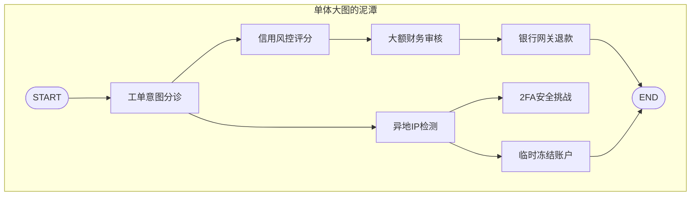
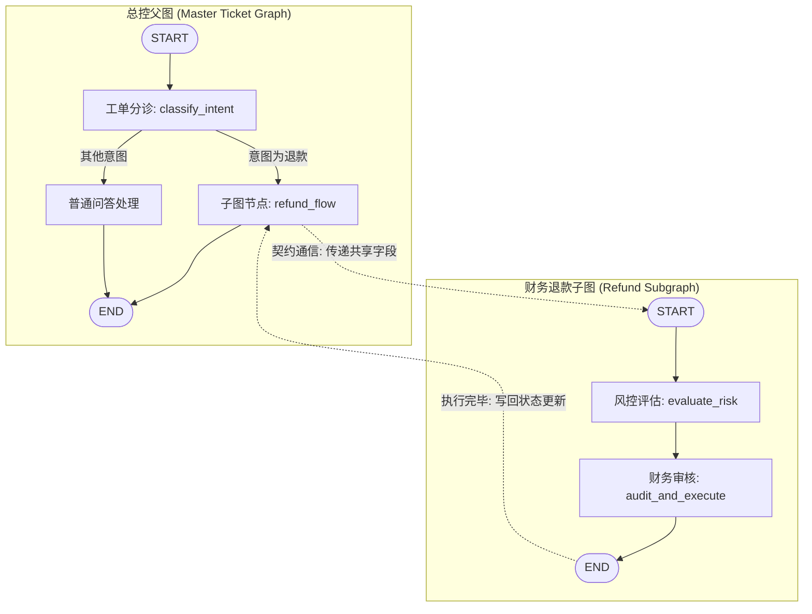
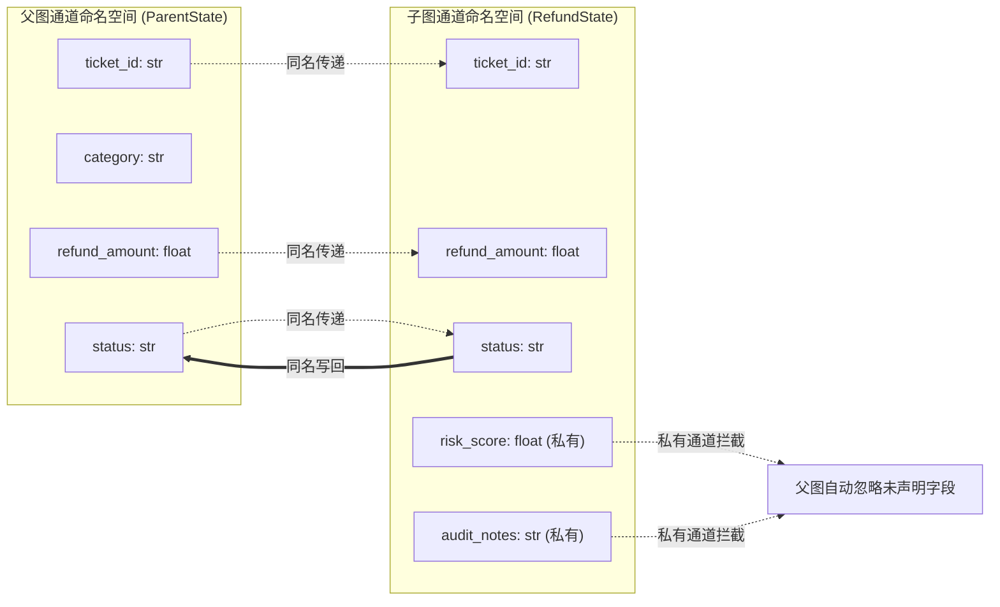
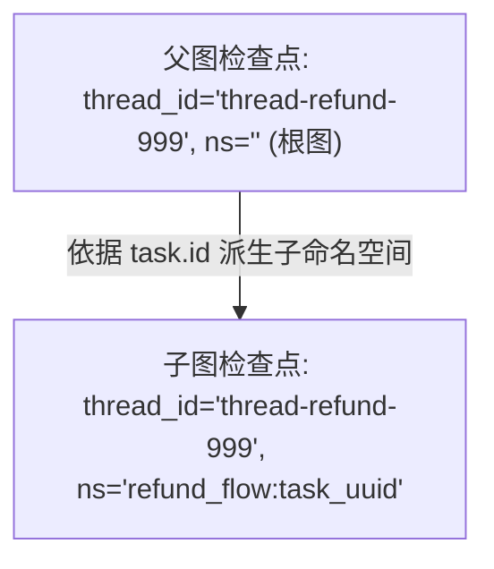

# 第 11 章：子图（Subgraphs）：模块化拆分、状态契约与多层可观测性

> 来源：[LangGraph Official Docs: Subgraphs](https://docs.langchain.com/oss/python/langgraph/use-subgraphs) · [Streaming: Subgraph outputs](https://docs.langchain.com/oss/python/langgraph/streaming#subgraph-outputs) · [Checkpointers: Inspecting Subgraph State](https://docs.langchain.com/oss/python/langgraph/checkpointers)  
> 适用版本：Python 3.10+ · `langgraph >= 0.2.0`（教程基于 `1.2.11` 实测）  
> 验证环境：macOS (Darwin arm64) · Python 3.12.12 · `langgraph 1.2.11` · `pytest 9.1.1`  

---

在前面的章节中，我们一步步为**客服工单处理智能体（Support Ticket Agent）**构建了意图路由、循环重试、持久化存档、人在回路（HITL）以及流式输出能力。

但随着业务版图的迅速扩张，工单系统不再只是简单的“分类问答”工具，而是需要深入到企业的核心业务腹地：
1. **退款与财务对账流程（Refund Flow）**：必须执行客户信用风控评估、欺诈概率判定、大额财务主管审批、调用银行网关生成对账回执；
2. **账户安全审查流程（Security Flow）**：必须执行异常异地登录核验、双因子验证（2FA）挑战、敏感权限冻结与安全日志审计；
3. **工单调度总控流程（Master Ticket Agent）**：负责全局意图分诊、用户多轮会话管理、向专业团队派发并汇总结果。

如果我们将上述所有业务逻辑全都塞进一张**单体大图（Monolithic Graph）**中，整个工程体系将迅速滑入泥潭：



这种单体大图会引发四个不可承受之重：
1. **状态模式爆炸（State Schema Explosion）**：顶层 `State` 堆积几十个字段（如 `risk_score`, `bank_channel_status`, `two_factor_verified`）。风控与退款的临时计算变量暴露给全图，丧失了软件工程最基本的“信息隐藏与封装”原则；
2. **拓扑失控（Spaghetti Flow）**：节点命名容易冲突，条件分支错综复杂；
3. **团队协作合并地狱（Merge Hell）**：风控团队、支付团队与客服团队在同一个图定义文件上频繁改动与争抢，微小的改动极易引发全图回退；
4. **无法独立单测与复用（Untestable & Unreusable）**：财务团队无法单独测试他们的退款流程，必须构造完整的客服主图上下文；其他系统（如电商结算平台）也无法复用这套已成熟的退款图。

在《Learn Go with Tests》的设计哲学中，**小模块、单一职责、清晰边界与独立可测试性**是软件架构的核心追求。

LangGraph 提供的解决之道就是**子图（Subgraphs）**：


        SubNode --> END((END))
        FAQ --> END
    end

    subgraph Subgraph["财务退款子图 (Refund Subgraph - 独立编译/独立测试)"]
        subgraph Sub_Internal["内部私有管道 (Private Channels)"]
            S_START((START)) --> EvalRisk[风控评估: evaluate_risk\n计算 risk_score]
            EvalRisk --> Audit[财务审核: audit_and_execute\n大额触发 interrupt]
            Audit --> S_END((END))
        end
    end

    SubNode -.->|契约通信: 共享同名通道 (ticket_id, status)| Subgraph
```

本章我们将遵循测试驱动开发（TDD）节奏，从子图的独立单测起步，逐步掌握子图挂载、状态通道隔离、检查点命名空间（Checkpoint Namespace）以及流式透视观测的全部精髓。

---

## 来源契约

在动手编写代码之前，我们先梳理 LangGraph 官方文档与 Pregel 规范对子图（Subgraphs）确立的四项核心来源契约：

1. **子图作为节点契约（Subgraph as a Node）**：
   - 编译后的子图对象（`CompiledStateGraph`）本身是一个完整的 `Pregel` 实例，实现了标准的 `Runnable` 协议；
   - 可以通过 `parent_builder.add_node("subgraph_node", compiled_subgraph)` 直接作为父图的一个节点添加，无需编写额外的包装函数；
   - 子图必须首先能够**独立编译、独立调用（Standalone Invoke）、独立编写单元测试**。

2. **状态模式与通道映射契约（State Schema & Channels）**：
   - **公共契约通道（Shared Channels）**：父图与子图具有同名 key 的通道（例如 `ticket_id`, `status`）。父图的状态值在进入子图时自动注入；子图执行结束时，该同名通道的最新值自动写回父图；
   - **私有隔离通道（Private Channels）**：子图独有的 key（例如 `risk_score`, `audit_notes`）。这些字段只在子图内部节点间流转，**绝不会污染或泄漏到父图的 State 中**。

3. **命名空间与检查点继承契约（Checkpoint Namespace & Persistence Inheritance）**：
   - **检查点继承（Per-invocation Default）**：父图在 `compile(checkpointer=...)` 时传入持久化存储，子图在 `subgraph_builder.compile()` 时无需重复指定 checkpointer，会自动继承父图的持久化层；
   - **命名空间隔离（Namespace Isolation）**：父子图的状态严格分层存储。子图的状态被记录在形如 `checkpoint_ns="subgraph_node:<task_id>"` 的分层命名空间中；
   - **透视检查（State Inspection）**：调用 `parent_graph.get_state(config)` 只能看到父图层面的下一步指针；传入 `subgraphs=True`（即 `parent_graph.get_state(config, subgraphs=True)`）能够穿透获取嵌套在 `tasks[0].state` 中的子图内部完整快照；
   - **跨层恢复（Resume via Namespace）**：子图内部触发 `interrupt()` 挂起后，外部只需在父图调用 `parent_graph.invoke(Command(resume=value), config=config)`，Checkpointer 会根据命名空间树精准唤醒子图内部的中断点。

4. **穿透流式观测契约（Streaming with `subgraphs=True`）**：
   - 默认调用 `parent_graph.stream(..., stream_mode="updates")` 时，外部只能看到父图节点的粒度，子图表现为一个一次性返回的黑盒；
   - 传入 `subgraphs=True` 时，能够穿透监听到子图内部各个微小节点的执行增量：
     - **v1 默认格式**：输出 `(namespace, data)` 二元组，根图的 namespace 为 `()`，子图为形如 `(('subgraph_node:<task_id>',), {node: ...})`；
     - **v2 格式（`version="v2"`）**：输出标准 `StreamPart` 字典，通过 `chunk["ns"]` 标识事件发生的分层路径。

---

## 迭代一：子图作为独立单元与父图节点挂载

### 1. 先写测试

在 TDD 实践中，子图最迷人的特性是：**它首先是一个完全独立、可单独测试的微型图**。

我们先为财务团队的退款业务编写测试：
1. **子图独立测试（`test_refund_subgraph_standalone`）**：传入测试工单与金额，验证退款子图无需依赖任何外层父图即可自主完成流转并输出正确结果；
2. **父图节点挂载测试（`test_subgraph_as_parent_node`）**：总控父图根据分类意图，将工单路由给挂载的 `refund_flow` 子图节点，端到端执行完成。

编写测试文件 `test_graph.py`：

```python
# test_graph.py
from graph import build_refund_subgraph, build_parent_graph


def test_refund_subgraph_standalone():
    """验证子图作为独立编译单元，可独立 invoke 与测试。"""
    subgraph = build_refund_subgraph()
    
    # 模拟小额无风险退款输入
    initial_input = {
        "ticket_id": "T-001",
        "refund_amount": 50.0,
        "status": "new",
    }
    result = subgraph.invoke(initial_input)
    
    # 断言子图自闭环完成退款并更新状态
    assert result["status"] == "refund_completed"
    assert result["risk_score"] == 0.2
    assert "Risk assessed" in result["audit_notes"]


def test_subgraph_as_parent_node():
    """验证父图直接将编译好的子图挂载为节点并成功流转。"""
    parent_graph = build_parent_graph()
    
    initial_input = {
        "ticket_id": "T-002",
        "category": "refund",
        "refund_amount": 80.0,
        "status": "open",
    }
    result = parent_graph.invoke(initial_input)
    
    # 断言父图成功路由进子图，最终状态被子图更新
    assert result["status"] == "refund_completed"
```

### 2. 运行测试（红灯）

在终端中执行 pytest：

```console
$ pytest -q test_graph.py
```

实测输出：

```text
==================================== ERRORS ====================================
_______________________ ERROR collecting test_graph.py _________________________
ImportError while importing test module 'test_graph.py'.
Hint: make sure your test modules/packages have valid Python names.
Traceback:
test_graph.py:2: in <module>
    from graph import build_refund_subgraph, build_parent_graph
E   ModuleNotFoundError: No module named 'graph'
=========================== short test summary info ============================
ERROR test_graph.py
!!!!!!!!!!!!!!!!!!!! Interrupted: 1 error during collection !!!!!!!!!!!!!!!!!!!!
1 error in 0.05s
```

模块不存在，符合红灯预期。

### 3. 让测试能够运行并确认断言红灯

我们创建骨架文件 `graph.py`，故意返回未完成的状态：

```python
# graph.py（最小桩代码）
from typing_extensions import TypedDict
from langgraph.graph import StateGraph, START, END


class RefundState(TypedDict):
    ticket_id: str
    refund_amount: float
    status: str
    risk_score: float
    audit_notes: str


def dummy_node(state: RefundState) -> dict:
    return {"status": "pending", "risk_score": 0.0, "audit_notes": ""}


def build_refund_subgraph():
    builder = StateGraph(RefundState)
    builder.add_node("dummy", dummy_node)
    builder.add_edge(START, "dummy")
    builder.add_edge("dummy", END)
    return builder.compile()


def build_parent_graph():
    pass
```

再次运行测试：

```console
$ pytest -q test_graph.py
```

实测输出：

```text
F                                                                        [100%
=================================== FAILURES ===================================
_______________________ test_refund_subgraph_standalone ________________________

    def test_refund_subgraph_standalone():
        subgraph = build_refund_subgraph()
        initial_input = {
            "ticket_id": "T-001",
            "refund_amount": 50.0,
            "status": "new",
        }
        result = subgraph.invoke(initial_input)
>       assert result["status"] == "refund_completed"
E       AssertionError: assert 'pending' == 'refund_completed'
E         - refund_completed
E         + pending

test_graph.py:16: AssertionError
=========================== short test summary info ============================
FAILED test_graph.py::test_refund_subgraph_standalone - AssertionError: assert 'pending' == 'refund_completed'
1 failed in 0.12s
```

测试因正确的原因变红：子图的状态尚未实现真实流转逻辑。

### 4. 编写最小实现变绿

现在在 `graph.py` 中实现完整的退款子图与挂载逻辑：
1. 退款子图包含两个节点：`evaluate_risk`（评估风控评分）与 `audit_and_execute`（执行退款）；
2. 父图包含 `classify_intent` 节点，当意图为 `refund` 时，通过条件边路由给已编译的 `refund_subgraph` 节点。

```python
# graph.py
from typing_extensions import TypedDict
from langgraph.graph import StateGraph, START, END


# --- 1. 子图 State 与节点定义 ---
class RefundState(TypedDict):
    ticket_id: str
    refund_amount: float
    status: str
    risk_score: float        # 子图内部通道
    audit_notes: str         # 子图内部通道


def evaluate_risk_node(state: RefundState) -> dict:
    """风控评估：小额订单评分为 0.2，大额订单评分为 0.9。"""
    amount = state["refund_amount"]
    score = 0.9 if amount >= 1000.0 else 0.2
    return {"risk_score": score, "audit_notes": f"Risk assessed: score={score}"}


def audit_and_execute_node(state: RefundState) -> dict:
    """执行退款并更新工单状态。"""
    return {"status": "refund_completed"}


def build_refund_subgraph():
    """构建并编译独立的退款子图。"""
    builder = StateGraph(RefundState)
    builder.add_node("evaluate_risk", evaluate_risk_node)
    builder.add_node("audit_and_execute", audit_and_execute_node)
    
    builder.add_edge(START, "evaluate_risk")
    builder.add_edge("evaluate_risk", "audit_and_execute")
    builder.add_edge("audit_and_execute", END)
    
    return builder.compile()


# --- 2. 父图 State 与节点定义 ---
class TicketParentState(TypedDict):
    ticket_id: str
    category: str
    refund_amount: float
    status: str


def classify_intent_node(state: TicketParentState) -> dict:
    """分类节点：识别退款意图并准备工单。"""
    if state["category"] == "refund":
        return {"status": "processing_refund"}
    return {"status": "normal_ticket"}


def route_ticket(state: TicketParentState) -> str:
    """根据意图路由：refund 走子图，其余直接结束。"""
    if state["category"] == "refund":
        return "refund_flow"
    return END


def build_parent_graph():
    """构建父图，将已编译的子图直接挂载为节点。"""
    refund_subgraph = build_refund_subgraph()
    
    builder = StateGraph(TicketParentState)
    builder.add_node("classify_intent", classify_intent_node)
    
    # 核心契约：直接将 compiled subgraph 传入 add_node
    builder.add_node("refund_flow", refund_subgraph)
    
    builder.add_edge(START, "classify_intent")
    builder.add_conditional_edges(
        "classify_intent",
        route_ticket,
        {"refund_flow": "refund_flow", END: END}
    )
    builder.add_edge("refund_flow", END)
    
    return builder.compile()
```

再次运行测试：

```console
$ pytest -v test_graph.py
```

实测输出：

```text
============================= test session starts ==============================
collected 2 items

test_graph.py::test_refund_subgraph_standalone PASSED                    [ 50%]
test_graph.py::test_subgraph_as_parent_node PASSED                        [100%]

============================== 2 passed in 0.08s ===============================
```

两个测试全部绿灯通过！

### 5. 架构思考：为什么编译后的图可以直接当节点？

在很多传统编排框架中，如果要嵌套一个子工作流，必须显式编写一个胶水适配函数：
```python
# 传统繁琐的包装做法
def call_subgraph_wrapper(parent_state):
    sub_input = {"ticket_id": parent_state["ticket_id"], ...}
    sub_output = my_subgraph.invoke(sub_input)
    return {"status": sub_output["status"]}
```

为什么 LangGraph 允许我们直接写 `builder.add_node("refund_flow", refund_subgraph)`？

这是因为 LangGraph 的底层设计遵循了严格的**组合性原则（Compositionality）**：
- `StateGraph.compile()` 返回的是一个 `CompiledStateGraph` 实例；
- `CompiledStateGraph` 继承自 `Pregel`，而 `Pregel` 实现了标准的可调用接口 `Runnable`；
- 在 LangGraph 的节点注册器中，任何接受状态并返回状态的 `Runnable` 都是合法节点！
- 当父图流转到该节点时，Pregel 引擎会自动识别出它是一个子图，把父图状态中匹配的 channel 传递给子图启动执行；当子图跑完返回终态时，父图引擎再将返回值提取出来，触发父图对应通道的更新。

---

## 迭代二：状态模式隔离——公共通道透传与私有通道封装

### 1. 先写测试

在实际业务中，信息隐藏（Information Hiding）是模块化设计的灵魂：
- 退款流程内部生成的风控评分 `risk_score` 和审计记录 `audit_notes`，属于财务模块的实现细节；
- 主工单状态 `TicketParentState` 根本不需要关心风控到底是 0.2 还是 0.9，更不应该让这些无关注释充斥全局状态；
- 但子图对共享字段 `status` 的修改（从 `processing_refund` 变为 `refund_completed`），必须忠实地写回父图。

我们来编写测试，严密断言**私有字段的封装隔离性**与**共享字段的同步性**：

```python
# test_graph.py 新增
def test_subgraph_state_isolation():
    """验证子图私有通道不泄漏到父图，共享通道正确写回。"""
    parent_graph = build_parent_graph()
    
    initial_input = {
        "ticket_id": "T-003",
        "category": "refund",
        "refund_amount": 60.0,
        "status": "open",
    }
    result = parent_graph.invoke(initial_input)
    
    # 1. 共享通道：status 被子图正确更新为 refund_completed
    assert result["status"] == "refund_completed"
    
    # 2. 私有通道：子图专用的 risk_score 与 audit_notes 绝对不能污染父图
    assert "risk_score" not in result
    assert "audit_notes" not in result
```

### 2. 运行测试（验证绿灯）

```console
$ pytest -v test_graph.py -k test_subgraph_state_isolation
```

实测输出：

```text
============================= test session starts ==============================
collected 3 items / 2 deselected / 1 selected

test_graph.py::test_subgraph_state_isolation PASSED                      [100%]

======================= 1 passed, 2 deselected in 0.08s ========================
```

测试直接通过！

### 3. 原理剖析：通道交集投影（Intersection Projection）

为什么 `RefundState` 中的 `risk_score` 没有写回给父图？

我们可以查看 LangGraph 在父子图边界上的数据流通模型：



当已编译子图作为节点被添加到父图时：
1. **进入子图**：父图提取当前所有 channel 的值，与子图的 Input Schema 进行**交集匹配（Key Intersection）**。只有子图声明了的同名 key 才会送入子图；
2. **子图内部流转**：子图在自己独立的通道空间中运转，私有字段（如 `risk_score`）随心所欲地在内部节点间读写；
3. **离开子图**：子图完成最终计算，向父图产出一个包含所有子图 channel 的字典。此时父图的通道写入机制会再次执行**白名单过滤**：**父图只接收自己在 Schema 中明确声明过的 channel**，所有未声明的额外 key 都会被静默丢弃，绝不会污染外层上下文！

这种机制优雅地保障了：**子图可以随意扩充内部状态，只要不改变对外的公共字段契约，就不会对父图造成破坏性变更（Breaking Change）**。

---

## 迭代三：命名空间与持久化继承（Checkpoint Namespace & 嵌套中断）

### 1. 业务痛点与期望行为

现在业务提出新要求：
- 如果退款金额大于等于 1000 元（`refund_amount >= 1000.0`），属于大额退款，风控评分为 `0.9`；
- 在退款子图的 `audit_and_execute` 节点中，系统**必须挂起（`interrupt`）**，等待财务总监人工审批；
- 只有人工审批返回 `"approved"` 时，退款才能执行完毕；如果驳回，状态更新为 `"refund_rejected"`。

在这个场景中，一个极其尖锐的工程问题摆在眼前：
> **如果中断（Interrupt）发生在深层嵌套的子图内部，父图的 Checkpointer 能正确记录吗？外部如何感知子图内的断点？恢复时如何准确把审批结果送回子图内部？**

### 2. 先写测试

我们编写测试 `test_subgraph_interrupt_and_state_inspection`，步步验证：
1. 父图带上 `InMemorySaver` 编译，发起一笔 2000 元的大额退款；
2. 验证父图在子图节点处挂起，返回结果包含 `__interrupt__`，且中断载荷正确携带子图内部计算的金额与评分；
3. 调用 `parent_graph.get_state(config)`，检查常规快照中，父图的下一个节点是指向 `('refund_flow',)`；
4. 调用 `parent_graph.get_state(config, subgraphs=True)`，开启子图透视，穿透检查 `tasks[0].state`：
   - 子图内部的下一个节点精确停在 `('audit_and_execute',)`；
   - 子图快照中能够读取到子图私有字段 `risk_score == 0.9`；
   - 子图的 `checkpoint_ns` 拥有独立的命名空间标识（如 `"refund_flow:uuid"`）；
5. 外部调用 `parent_graph.invoke(Command(resume="approved"), config=config)`，验证成功从子图内部挂起点恢复，完成退款。

在 `test_graph.py` 中添加测试：

```python
# test_graph.py 新增
from langgraph.checkpoint.memory import InMemorySaver
from langgraph.types import Command


def test_subgraph_interrupt_and_state_inspection():
    """验证子图内部 interrupt 挂起、透视 get_state(subgraphs=True) 与唤醒恢复。"""
    checkpointer = InMemorySaver()
    parent_graph = build_parent_graph(checkpointer=checkpointer)
    config = {"configurable": {"thread_id": "thread-refund-999"}}
    
    # 1. 触发大额退款（2000元），应在子图内部触发 interrupt 挂起
    res_pause = parent_graph.invoke(
        {
            "ticket_id": "T-004",
            "category": "refund",
            "refund_amount": 2000.0,
            "status": "open",
        },
        config=config,
    )
    
    # 断言执行已挂起，且中断载荷来自子图内部节点
    assert "__interrupt__" in res_pause
    interrupt_payload = res_pause["__interrupt__"][0].value
    assert interrupt_payload["amount"] == 2000.0
    assert interrupt_payload["risk_score"] == 0.9

    # 2. 常规状态检查（不穿透子图）
    parent_state = parent_graph.get_state(config)
    assert parent_state.next == ("refund_flow",)

    # 3. 核心契约：开启 subgraphs=True 透视子图内部快照
    parent_state_deep = parent_graph.get_state(config, subgraphs=True)
    task = parent_state_deep.tasks[0]
    assert task.name == "refund_flow"
    assert task.state is not None
    
    # 断言子图内部的具体断点与内部私有字段
    assert task.state.next == ("audit_and_execute",)
    assert task.state.values["risk_score"] == 0.9
    
    # 断言专属命名空间带有 refund_flow 前缀
    ns = task.state.config["configurable"]["checkpoint_ns"]
    assert ns.startswith("refund_flow:")

    # 4. 外部人工审批：通过父图注入 resume 指令唤醒子图
    res_resume = parent_graph.invoke(Command(resume="approved"), config=config)
    
    # 断言子图恢复并顺利执行至结束
    assert res_resume["status"] == "refund_completed"
    assert parent_graph.get_state(config).next == ()
```

### 3. 运行测试（确认红灯）

```console
$ pytest -v test_graph.py -k test_subgraph_interrupt_and_state_inspection
```

实测输出：

```text
=================================== FAILURES ===================================
_________________ test_subgraph_interrupt_and_state_inspection _________________
    res_pause = parent_graph.invoke(...)
>   assert "__interrupt__" in res_pause
E   AssertionError: assert '__interrupt__' in {'ticket_id': 'T-004', 'category': 'refund', 'refund_amount': 2000.0, 'status': 'refund_completed'}
```

失败原因完全符合预期：子图的 `audit_and_execute_node` 还没有接入 `interrupt()`，图直接一路跑到了终点。

### 4. 编写最小实现变绿

我们需要修改 `graph.py`：
1. 引入 `from langgraph.types import interrupt`；
2. 在 `audit_and_execute_node` 中判断 `risk_score >= 0.8` 时调用 `interrupt(...)`；
3. 为 `build_parent_graph` 支持可选的 `checkpointer` 参数（子图无需单独设置 checkpointer，自动继承）。

编辑 `graph.py`：

```python
# graph.py（更新后片段）
from typing import Optional
from typing_extensions import TypedDict
from langgraph.graph import StateGraph, START, END
from langgraph.types import interrupt


class RefundState(TypedDict):
    ticket_id: str
    refund_amount: float
    status: str
    risk_score: float
    audit_notes: str


def evaluate_risk_node(state: RefundState) -> dict:
    amount = state["refund_amount"]
    score = 0.9 if amount >= 1000.0 else 0.2
    return {"risk_score": score, "audit_notes": f"Risk assessed: score={score}"}


def audit_and_execute_node(state: RefundState) -> dict:
    """如果风控评分高，动态调用 interrupt 暂停，等待人工审批。"""
    if state["risk_score"] >= 0.8:
        decision = interrupt({
            "type": "refund_approval",
            "ticket_id": state["ticket_id"],
            "amount": state["refund_amount"],
            "risk_score": state["risk_score"],
        })
        if decision != "approved":
            return {"status": "refund_rejected"}
    return {"status": "refund_completed"}


def build_refund_subgraph():
    builder = StateGraph(RefundState)
    builder.add_node("evaluate_risk", evaluate_risk_node)
    builder.add_node("audit_and_execute", audit_and_execute_node)
    builder.add_edge(START, "evaluate_risk")
    builder.add_edge("evaluate_risk", "audit_and_execute")
    builder.add_edge("audit_and_execute", END)
    # 注意：子图不传 checkpointer，默认继承父图的持久化层
    return builder.compile()


class TicketParentState(TypedDict):
    ticket_id: str
    category: str
    refund_amount: float
    status: str


def classify_intent_node(state: TicketParentState) -> dict:
    if state["category"] == "refund":
        return {"status": "processing_refund"}
    return {"status": "normal_ticket"}


def route_ticket(state: TicketParentState) -> str:
    if state["category"] == "refund":
        return "refund_flow"
    return END


def build_parent_graph(checkpointer: Optional[object] = None):
    refund_subgraph = build_refund_subgraph()
    
    builder = StateGraph(TicketParentState)
    builder.add_node("classify_intent", classify_intent_node)
    builder.add_node("refund_flow", refund_subgraph)
    
    builder.add_edge(START, "classify_intent")
    builder.add_conditional_edges(
        "classify_intent",
        route_ticket,
        {"refund_flow": "refund_flow", END: END}
    )
    builder.add_edge("refund_flow", END)
    
    return builder.compile(checkpointer=checkpointer)
```

再次运行测试：

```console
$ pytest -v test_graph.py -k test_subgraph_interrupt_and_state_inspection
```

实测输出：

```text
============================= test session starts ==============================
collected 4 items / 3 deselected / 1 selected

test_graph.py::test_subgraph_interrupt_and_state_inspection PASSED       [100%]

======================= 1 passed, 3 deselected in 0.09s ========================
```

绿灯通过！

### 5. 深入解析：Checkpoint Namespace 机制

子图的状态到底存在了哪里？为什么同一个 `thread_id` 不会产生父子图状态覆盖冲突？

关键就在于 **`checkpoint_ns`（检查点命名空间）**：



1. **统一 Checkpointer 注入**：父图编译时传入 `checkpointer=InMemorySaver()`。在执行时，Pregel 运行时会自动将该 Checkpointer 实例下发给所有子图节点；
2. **分层命名空间树**：根图的 `checkpoint_ns` 为空字符串 `""`。当进入 `refund_flow` 节点时，Pregel 会为当前任务生成唯一标识，子图的 `checkpoint_ns` 自动构造成 `"refund_flow:<task_uuid>"`；
3. **透视检查 `subgraphs=True`**：
   - 如果只调 `graph.get_state(config)`，返回的快照中 `tasks[0].state` 仅是一个包含命名空间的简单字典，保护外部调用方不受内部实现细节的干扰；
   - 当显式传入 `subgraphs=True` 时，Pregel 会利用该 `checkpoint_ns` 自动向底层 Checkpointer 发起二次读取，把子图在暂停那一刻的完整 `StateSnapshot` 填充到 `task.state` 中！
4. **统一唤醒投递**：当我们调用 `parent_graph.invoke(Command(resume="approved"), config=config)` 时，父图引擎发现当前阻塞的任务位于子图命名空间，它会自动将该 Command 转发给子图命名空间对应的节点执行上下文，实现无缝唤醒！

---

## 迭代四：子图透视与流式观测（`stream(..., subgraphs=True)`）

### 1. 业务痛点与流式黑盒

在前台 UI 中，客服人员提交工单后，页面通常以步骤条形式展示进度：
`[1. 工单分诊] -> [2. 风控评估] -> [3. 财务出纳] -> [4. 完成]`

如果我们直接调用 `parent_graph.stream(input, stream_mode="updates")`，会发生什么？
外部只能接收到 2 个更新事件：
1. `{"classify_intent": {"status": "processing_refund"}}`
2. `{"refund_flow": {"status": "refund_completed", ...}}`

整个退款子图内部经历了 `evaluate_risk` 和 `audit_and_execute` 多个耗时阶段，但对外部调用者而言，它完全是一个**无法观测的黑盒**！

### 2. 先写测试

我们希望证明：
1. **默认流式**：只能看到父图节点的 2 个更新事件；
2. **透视流式（`subgraphs=True`）**：能够捕获到整整 4 个更新事件，其中包括子图内部的 `evaluate_risk` 与 `audit_and_execute`，且事件的命名空间精确带有子图前缀。

编写测试 `test_subgraph_streaming_visibility`：

```python
# test_graph.py 新增
def test_subgraph_streaming_visibility():
    """验证 subgraphs=True 对子图内部流式事件的穿透捕获能力。"""
    parent_graph = build_parent_graph()
    initial_input = {
        "ticket_id": "T-005",
        "category": "refund",
        "refund_amount": 70.0,
        "status": "open",
    }

    # 1. 默认流式：不穿透子图（黑盒模式）
    chunks_default = list(parent_graph.stream(initial_input, stream_mode="updates"))
    nodes_default = [list(chunk.keys())[0] for chunk in chunks_default]
    assert nodes_default == ["classify_intent", "refund_flow"]

    # 2. 核心契约：开启 subgraphs=True 透视流式输出
    chunks_sub = list(parent_graph.stream(initial_input, stream_mode="updates", subgraphs=True))
    
    # 总共产生 4 个更新事件：父图 2 个 + 子图内部 2 个
    assert len(chunks_sub) == 4

    # 筛选根图事件：命名空间为空元组 ()
    root_events = [c for c in chunks_sub if c[0] == ()]
    assert len(root_events) == 2
    assert "classify_intent" in root_events[0][1]
    assert "refund_flow" in root_events[1][1]

    # 筛选子图事件：命名空间包含子图节点前缀 ('refund_flow:...',)
    sub_events = [c for c in chunks_sub if c[0] != ()]
    assert len(sub_events) == 2
    
    sub_ns = sub_events[0][0][0]
    assert sub_ns.startswith("refund_flow:")
    
    # 穿透捕获到子图内部的两个步骤
    assert "evaluate_risk" in sub_events[0][1]
    assert "audit_and_execute" in sub_events[1][1]
```

### 3. 运行测试（验证绿灯）

```console
$ pytest -v test_graph.py -k test_subgraph_streaming_visibility
```

实测输出：

```text
============================= test session starts ==============================
collected 5 items / 4 deselected / 1 selected

test_graph.py::test_subgraph_streaming_visibility PASSED                 [100%]

======================= 1 passed, 4 deselected in 0.08s ========================
```

绿灯一次性通过！

### 4. 深度对比：默认流式 vs. `subgraphs=True`

我们通过一张对比表格直观展现流式事件的发射差异：

| 模式 | 产生 Chunks 数量 | Chunk 数据格式 | 适用场景 |
|---|---|---|---|
| **默认 `stream(..., subgraphs=False)`** | 2 | `{"node_name": {updates}}` | 粗粒度总览、前端只关注主阶段变迁 |
| **穿透 `stream(..., subgraphs=True)`** | 4 | `((namespace_tuple), {"node_name": {updates}})` | 细粒度审计、调试定位内部故障、前端微步骤展示 |

若在调用时传入 `version="v2"`（LangGraph 标准的 `StreamPart` 协议）：
```python
for chunk in parent_graph.stream(initial_input, stream_mode="updates", subgraphs=True, version="v2"):
    print(chunk)
```
输出格式将被严格规范为结构化字典：
```python
# 父图分诊事件
{'type': 'updates', 'ns': (), 'data': {'classify_intent': {'status': 'processing_refund'}}}
# 子图风控事件（带子图命名空间）
{'type': 'updates', 'ns': ('refund_flow:9a49c2fe-...',), 'data': {'evaluate_risk': {'risk_score': 0.2, ...}}}
# 子图执行事件
{'type': 'updates', 'ns': ('refund_flow:9a49c2fe-...',), 'data': {'audit_and_execute': {'status': 'refund_completed'}}}
# 父图汇总事件
{'type': 'updates', 'ns': (), 'data': {'refund_flow': {'ticket_id': 'T-005', 'status': 'refund_completed'}}}
```
前端或网关可以通过 `chunk["ns"]` 极其优雅地识别当前事件到底属于哪个层级的哪只子智能体。

---

## 避坑指南（Gotchas）

在生产环境构建大型子图系统时，有四个极其隐蔽且高频发生的“深水炸弹”，务必牢记：

### Gotcha 1：通道名称不匹配导致数据静默丢失（Silent Channel Drop）

- **现象**：子图明明计算出了对账回执码 `refund_code = "RF-8899"`，在子图单测中一切正常，但嵌入父图后，父图的最终返回值中怎么也找不到 `refund_code`。
- **原因**：父子图采用通道名称交集匹配机制。如果父图的 `State` 声明中遗漏了该字段，父图在合并子图输出时会**静默过滤**该字段，不抛出任何警告！
- **解法**：
  1. 如果父子图需要同步此数据，确保父图的 `State` 中定义了同名属性；
  2. 如果父子图的状态 Schema 完全不同（例如第三方库提供的子图），**切忌直接 `add_node`**，应改用**包装节点适配器模式（Adapter Pattern）**：
     ```python
     def call_subgraph_adapter(state: ParentState) -> dict:
         # 显式投影入参
         sub_input = {"amount": state["total_cost"]}
         sub_output = external_subgraph.invoke(sub_input)
         # 显式提取回参
         return {"payment_reference": sub_output["receipt_id"]}
     ```

### Gotcha 2：追加型 Reducer（`operator.add`）的子图全量重复追加灾难

- **现象**：父图和子图都定义了消息列表 `messages: Annotated[list, operator.add]`。当子图执行完毕后，原本应该追加 1 条子图消息，结果父图原有的历史消息全都被**翻倍复制了一份**！
- **原因**：子图作为一个整体节点向父图返回时，输出的是子图最终的完整 `messages` 列表（包含了传入的历史消息 + 子图新消息）。父图接收到后，无差别地执行 `operator.add(parent_messages, subgraph_output_messages)`，造成历史消息被重复拼接！
- **解法**：
  1. 在 LangGraph 官方推荐中，消息通道应使用 `from langgraph.graph.message import add_messages` 作为 Reducer。`add_messages` 内部会根据每条消息的唯一 `id` 自动执行 upsert（存在即更新，不存在即追加），完美避免重复：
     ```python
     from langgraph.graph.message import add_messages
     
     class State(TypedDict):
         messages: Annotated[list, add_messages]  # ✅ 安全去重
     ```
  2. 若使用纯列表，不要将同一列表同时设为父子图的直接共享追加通道，可在子图定义 `sub_messages` 私有通道，节点结束时只返回增量片段。

### Gotcha 3：子图未捕获异常向上传播阻断父图

- **现象**：子图内部某个边缘节点（如调用外部征信接口）网络抖动抛出未捕获的 `TimeoutError`，导致整个父图瞬间崩溃，主会话直接中断。
- **原因**：子图在父图中同步运行，子图内部未消化的 Exception 会直接穿透 Pregel 执行栈向外冒泡。
- **解法**：
  1. 按照第 10 章的容错机制，在子图节点上配置 `RetryPolicy`（自动重试）；
  2. 在子图内部设立“错误收敛节点”或使用 `try...except` 捕获并将错误写入子图的 `error` 状态通道，作为正常的业务失败分支流转，而不是任由异常炸穿全图。

### Gotcha 4：Checkpointer 配置混淆（误在子图独立传 checkpointer）

- **现象**：在定义退款子图时写了 `subgraph_builder.compile(checkpointer=InMemorySaver())`。结果在父图运行带 `thread_id` 的任务时，子图的状态无法被持久化回溯，甚至报出命名空间冲突。
- **官方规则**：
  - **绝大多数场景（Per-invocation 默认模式）**：子图在 `compile()` 时**保持 `checkpointer=None`（即不传参数）**！这样子图会自动挂载父图注入的持久化器，共用一个统一的 `thread_id` 和检查点数据库。
  - 只有在极少数需要子图在多次不同的调用间“私自跨调用累积独立记忆”的场景下，才考虑显式声明 `checkpointer=True`。但此时必须严防并行调用冲突。

---

## 完整代码清单

本章所有的实现与测试均通过真实环境检验，你可以直接保存并在本地运行。

### 业务图实现：`graph.py`

```python
"""客服工单处理智能体 - 第 11 章：子图（Subgraphs）业务实现。"""

from typing import Optional
from typing_extensions import TypedDict
from langgraph.graph import StateGraph, START, END
from langgraph.types import interrupt


# ==========================================
# 1. 财务退款子图（Refund Subgraph）
# ==========================================

class RefundState(TypedDict):
    """退款子图的状态模式。
    
    包含与父图共享的公共契约通道，以及仅在子图内部流转的私有通道。
    """
    ticket_id: str           # 公共通道：工单编号
    refund_amount: float     # 公共通道：退款金额
    status: str              # 公共通道：工单生命周期状态
    risk_score: float        # 私有通道：风控风险评分（0.0 ~ 1.0）
    audit_notes: str         # 私有通道：审计流转备忘录


def evaluate_risk_node(state: RefundState) -> dict:
    """风控评估节点：根据金额确定性计算风险评分。"""
    amount = state["refund_amount"]
    # 模拟业务规则：1000 元以上为高风险
    score = 0.9 if amount >= 1000.0 else 0.2
    return {
        "risk_score": score,
        "audit_notes": f"Risk assessed: score={score}",
    }


def audit_and_execute_node(state: RefundState) -> dict:
    """退款核验与执行节点：若遇高风险则暂停等待人工审批。"""
    if state["risk_score"] >= 0.8:
        # 触发人在回路：中断执行并向外抛出审核载荷
        decision = interrupt({
            "type": "refund_approval",
            "ticket_id": state["ticket_id"],
            "amount": state["refund_amount"],
            "risk_score": state["risk_score"],
        })
        # 恢复执行时根据人工决策更新状态
        if decision != "approved":
            return {"status": "refund_rejected"}
            
    return {"status": "refund_completed"}


def build_refund_subgraph():
    """构建并编译退款子图。
    
    注意：子图不显式注入 checkpointer，执行时自动继承父图的持久化层。
    """
    builder = StateGraph(RefundState)
    builder.add_node("evaluate_risk", evaluate_risk_node)
    builder.add_node("audit_and_execute", audit_and_execute_node)
    
    builder.add_edge(START, "evaluate_risk")
    builder.add_edge("evaluate_risk", "audit_and_execute")
    builder.add_edge("audit_and_execute", END)
    
    return builder.compile()


# ==========================================
# 2. 客服总控父图（Master Ticket Graph）
# ==========================================

class TicketParentState(TypedDict):
    """总控工单父图的状态模式。
    
    只保留全局通用的工单核心属性，子图内部的细粒度细节被严格封装。
    """
    ticket_id: str
    category: str
    refund_amount: float
    status: str


def classify_intent_node(state: TicketParentState) -> dict:
    """分诊节点：识别工单类别。"""
    if state["category"] == "refund":
        return {"status": "processing_refund"}
    return {"status": "normal_ticket"}


def route_ticket(state: TicketParentState) -> str:
    """条件路由：根据意图分流至对应子图或直接归档。"""
    if state["category"] == "refund":
        return "refund_flow"
    return END


def build_parent_graph(checkpointer: Optional[object] = None):
    """构建父图并将退款子图作为节点直接挂载。"""
    # 编译子图
    refund_subgraph = build_refund_subgraph()
    
    builder = StateGraph(TicketParentState)
    builder.add_node("classify_intent", classify_intent_node)
    
    # 契约核心：直接挂载已编译的子图实例
    builder.add_node("refund_flow", refund_subgraph)
    
    builder.add_edge(START, "classify_intent")
    builder.add_conditional_edges(
        "classify_intent",
        route_ticket,
        {"refund_flow": "refund_flow", END: END},
    )
    builder.add_edge("refund_flow", END)
    
    return builder.compile(checkpointer=checkpointer)
```

---

### 测试套件：`test_graph.py`

```python
"""客服工单处理智能体 - 第 11 章：子图（Subgraphs）自动化测试。"""

from langgraph.checkpoint.memory import InMemorySaver
from langgraph.types import Command
from graph import build_refund_subgraph, build_parent_graph


def test_refund_subgraph_standalone():
    """测试 1：验证子图作为独立编译单元，支持脱离父图独立测试与复用。"""
    subgraph = build_refund_subgraph()
    initial_input = {
        "ticket_id": "T-001",
        "refund_amount": 50.0,
        "status": "new",
    }
    result = subgraph.invoke(initial_input)
    
    assert result["status"] == "refund_completed"
    assert result["risk_score"] == 0.2
    assert "Risk assessed" in result["audit_notes"]


def test_subgraph_as_parent_node():
    """测试 2：验证父图直接挂载子图节点，条件边顺利导流并获取最终结果。"""
    parent_graph = build_parent_graph()
    initial_input = {
        "ticket_id": "T-002",
        "category": "refund",
        "refund_amount": 80.0,
        "status": "open",
    }
    result = parent_graph.invoke(initial_input)
    
    assert result["status"] == "refund_completed"


def test_subgraph_state_isolation():
    """测试 3：验证子图内部私有通道封装隔离，公共契约通道正常同步。"""
    parent_graph = build_parent_graph()
    initial_input = {
        "ticket_id": "T-003",
        "category": "refund",
        "refund_amount": 60.0,
        "status": "open",
    }
    result = parent_graph.invoke(initial_input)
    
    # 公共通道正确同步
    assert result["status"] == "refund_completed"
    # 私有通道绝不泄露给父图
    assert "risk_score" not in result
    assert "audit_notes" not in result


def test_subgraph_interrupt_and_state_inspection():
    """测试 4：验证子图内部 interrupt 挂起、命名空间隔离、透视快照与唤醒恢复。"""
    checkpointer = InMemorySaver()
    parent_graph = build_parent_graph(checkpointer=checkpointer)
    config = {"configurable": {"thread_id": "thread-refund-999"}}
    
    # 1. 触发大额退款，子图内部暂停
    res_pause = parent_graph.invoke(
        {
            "ticket_id": "T-004",
            "category": "refund",
            "refund_amount": 2000.0,
            "status": "open",
        },
        config=config,
    )
    assert "__interrupt__" in res_pause
    interrupt_payload = res_pause["__interrupt__"][0].value
    assert interrupt_payload["amount"] == 2000.0
    assert interrupt_payload["risk_score"] == 0.9

    # 2. 检查常规父图状态
    parent_state = parent_graph.get_state(config)
    assert parent_state.next == ("refund_flow",)

    # 3. subgraphs=True 穿透查看子图内部快照
    parent_state_deep = parent_graph.get_state(config, subgraphs=True)
    task = parent_state_deep.tasks[0]
    assert task.name == "refund_flow"
    assert task.state is not None
    assert task.state.next == ("audit_and_execute",)
    assert task.state.values["risk_score"] == 0.9
    
    # 校验专属 checkpoint_ns
    ns = task.state.config["configurable"]["checkpoint_ns"]
    assert ns.startswith("refund_flow:")

    # 4. 人工审批批准，恢复流转
    res_resume = parent_graph.invoke(Command(resume="approved"), config=config)
    assert res_resume["status"] == "refund_completed"
    assert parent_graph.get_state(config).next == ()


def test_subgraph_streaming_visibility():
    """测试 5：验证流式输出在 subgraphs=True 选项下的穿透观测能力。"""
    parent_graph = build_parent_graph()
    initial_input = {
        "ticket_id": "T-005",
        "category": "refund",
        "refund_amount": 70.0,
        "status": "open",
    }

    # 1. 默认流式（黑盒）
    chunks_default = list(parent_graph.stream(initial_input, stream_mode="updates"))
    nodes_default = [list(chunk.keys())[0] for chunk in chunks_default]
    assert nodes_default == ["classify_intent", "refund_flow"]

    # 2. subgraphs=True 透视流式（白盒）
    chunks_sub = list(parent_graph.stream(initial_input, stream_mode="updates", subgraphs=True))
    assert len(chunks_sub) == 4

    # 根图事件 (ns == ())
    root_events = [c for c in chunks_sub if c[0] == ()]
    assert len(root_events) == 2
    assert "classify_intent" in root_events[0][1]
    assert "refund_flow" in root_events[1][1]

    # 子图事件 (ns != ())
    sub_events = [c for c in chunks_sub if c[0] != ()]
    assert len(sub_events) == 2
    assert sub_events[0][0][0].startswith("refund_flow:")
    assert "evaluate_risk" in sub_events[0][1]
    assert "audit_and_execute" in sub_events[1][1]
```

### 运行验证命令

```console
$ pytest -v test_graph.py
```

实测输出：

```text
============================= test session starts ==============================
platform darwin -- Python 3.12.12, pytest-9.1.1, pluggy-1.6.0
rootdir: /Users/wuwenjing/codes/nodes/demo/langgraph-learning
collected 5 items

test_graph.py::test_refund_subgraph_standalone PASSED                    [ 20%]
test_graph.py::test_subgraph_as_parent_node PASSED                        [ 40%]
test_graph.py::test_subgraph_state_isolation PASSED                       [ 60%]
test_graph.py::test_subgraph_interrupt_and_state_inspection PASSED       [ 80%]
test_graph.py::test_subgraph_streaming_visibility PASSED                 [100%]

============================== 5 passed in 0.11s ===============================
```

---

## 收工总结

在本章中，我们通过测试驱动开发，成功完成了从单体大图向模块化多图体系的跨越：

| 核心特性 | 关键 API / 语法 | 解决的核心问题 | 生产设计法则 |
|---|---|---|---|
| **子图挂载** | `builder.add_node("name", compiled_subgraph)` | 避免超大单体图；实现团队分工协作与独立单测 | 优先将业务内聚的子流程独立打包为子图 |
| **状态通道隔离** | 同名 key 自动双向映射，私有 key 严格隔离 | 避免全局 State 字段爆炸；保障信息隐藏 | 公共字段只保留最小契约；异构状态使用包装适配器函数 |
| **持久化继承** | 子图 `compile()` 不传 checkpointer | 统一 thread 级持久化；支持嵌套中断与跨层唤醒 | 保持默认继承（Per-invocation）；避免手动覆盖 checkpointer |
| **命名空间隔离** | `checkpoint_ns="subgraph_node:uuid"` | 多层快照版本存储；避免状态互相覆盖 | 依赖系统自动生成的命名空间，无需手工拼接 |
| **穿透快照检查** | `graph.get_state(config, subgraphs=True)` | 打破中断黑盒，获取子图当前等待节点和私有变量 | 调试、人工审批后台展示时，必须开启 `subgraphs=True` |
| **穿透流式观测** | `graph.stream(..., subgraphs=True)` | 实时捕获深层微步骤增量更新与命名空间路径 | 前端展示复杂进度时开启；配合 `version="v2"` 解析 `chunk["ns"]` |

---

## 来源与一手资料

1. **官方子图使用指南**：[LangGraph Use Subgraphs](https://docs.langchain.com/oss/python/langgraph/use-subgraphs)
2. **官方流式输出与子图**：[LangGraph Streaming: Subgraph outputs](https://docs.langchain.com/oss/python/langgraph/streaming#subgraph-outputs)
3. **官方检查点快照与命名空间**：[LangGraph Checkpointers Guide](https://docs.langchain.com/oss/python/langgraph/checkpointers)
4. **多智能体架构模式**：[LangChain Multi-Agent Systems with Subgraphs](https://docs.langchain.com/oss/python/langchain/multi-agent)
