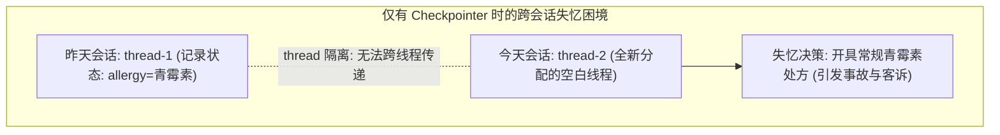
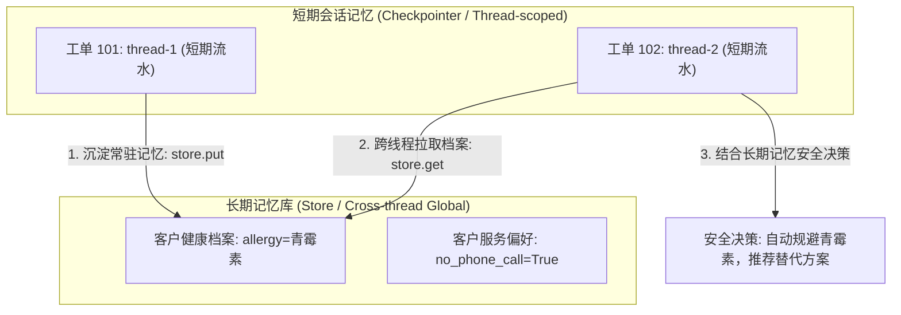

# 第 12 章：长期记忆 Store：跨线程记忆沉淀、命名空间管理与节点依赖注入

> 来源：[LangGraph Official Docs: Persistence](https://docs.langchain.com/oss/python/langgraph/persistence) · [Stores](https://docs.langchain.com/oss/python/langgraph/stores) · [Memory storage](https://docs.langchain.com/oss/python/langchain/long-term-memory#memory-storage)  
> 适用版本：Python 3.10+ · `langgraph >= 0.2.0`（教程基于 `0.6.11` 实测）  
> 验证环境：macOS (Darwin arm64) · Python 3.12.12 · `langgraph 0.6.11` · `pytest 9.1.1`  

---

在[第 06 章：持久化](./../06-persistence/README.md)中，我们引入了 `Checkpointer`，通过 `thread_id` 成功为**客服工单处理智能体（Support Ticket Agent）**赋予了多轮对话记忆。

但随着工单系统的上线，客服运营团队很快反馈了一个极其棘手的事故：

- **昨天（工单 101，`thread-1`）**：客户张先生在咨询退款与用药建议时，郑重叮嘱客服：“我有严重的**青霉素过敏史**，任何用药方案千万不能开青霉素！”智能体在会话中成功识别并记录了这一信息；
- **今天（工单 102，`thread-2`）**：张先生因咽喉肿痛发炎，在企业 App 上新开了一张工单求助；
- **事故爆发**：由于是新的工单，系统分配了全新的 `thread_id="thread-2"`。智能体竟然完全**“失忆”**，若无其事地向张先生开具了常规的阿莫西林处方（青霉素类药物）！张先生愤怒投诉：“我昨天刚跟你们强调过严重过敏，你们差点要了我的命！”



为什么会这样？

因为 **`Checkpointer` 的作用域是单个线程（Thread-scoped）**！它的使命是管理单一对话会话在 super-step 边界上的快照、时间旅行与断点恢复。换了一个 `thread_id`，Checkpointer 就会将其视为完全不相干的空白线程。

一个真正成熟的智能体，不仅需要能够跟进当前会话的“短期记忆（Working Memory）”，更必须拥有能够跨越时间、跨越所有会话流转的**全局长期记忆（Cross-thread Long-term Memory）**。

LangGraph 专门为此设计了核心原语——**`Store`**：



通过本章，我们将遵循测试驱动开发（TDD）节奏，掌握跨线程记忆持久化、层级命名空间管理、节点自动依赖注入与多维画像检索。

---

## 来源契约

在编写测试前，我们先梳理 LangGraph 官方规范关于 Store 的四项核心来源契约：

1. **`Store vs Checkpointer` 架构分工契约**：
   - **`Checkpointer`（会话级）**：作用域为单个线程（Thread-scoped）。由 `thread_id` 索引，负责每轮对话图状态（State）的自动存盘、故障恢复与人在回路断点。会话结束或 `thread_id` 变更后即物理隔离；
   - **`Store`（全局跨线程级）**：作用域为跨线程（Cross-thread）。独立于 `thread_id` 存在，按层级**命名空间（Namespace）**组织键值对，用于沉淀用户画像、偏好设置、组织规则与经验教训。
2. **`Store` API 与数据结构契约**：
   - **开发与测试组件**：`from langgraph.store.memory import InMemoryStore`；
   - **命名空间（Namespace）**：必须是字符串元组（`tuple[str, ...]`），例如 `("customers", customer_id, "profile")`，类似层级文件目录；
   - **键与值（Key & Value）**：Key 为字符串，Value 必须是字典对象（`dict[str, Any]`）；
   - **写入操作**：`store.put(namespace, key, value)`，写入或覆盖指定命名空间下的条目；
   - **读取操作**：`store.get(namespace, key)`，返回 `Optional[Item]`。若存在，返回的 `Item` 对象包含 `key`, `value`, `namespace`, `created_at`, `updated_at` 等属性；
   - **前缀检索操作**：`store.search(namespace_prefix, filter=..., limit=...)`，传入元组前缀可跨层级模糊搜索（例如传入 `("customers", customer_id)` 即可检索该客户名下所有的 profile、preferences、history 条目），返回 `list[Item]`。
3. **图编译集成契约（Compile Contract）**：
   - 在图构建阶段统一注册：`builder.compile(checkpointer=checkpointer, store=store)`。
4. **节点签名与依赖注入契约（Dependency Injection Contract）**：
   - 节点签名只要声明了关键字参数 `store: BaseStore`（即 `def my_node(state: State, *, store: BaseStore)`），LangGraph 运行时会在执行该节点时通过参数自省，自动将编译时传入的 store 实例注入进来，无需开发者手动透传；
   - **关键边界**：如果节点声明了 `store` 参数，但图编译时未配置 `store`（即 `store=None`），LangGraph 运行时将给该形参静默传入 `None`，而不是抛出异常。

---

## 迭代一：跨工单“失忆症”与 Store 最小实现

### 1. 先写测试

我们首先写一个测试来重现现实痛点：张先生昨天在工单 101（`thread-1`）中明确提出自己对青霉素过敏；今天换了一张新工单 102（`thread-2`）。

如果我们**仅仅依赖 Checkpointer**，测试将证明新工单根本无法获知昨天的过敏信息，从而发生误诊与断言失败。

编写测试：

```python
# test_graph.py
import pytest
from langgraph.checkpoint.memory import MemorySaver
from graph import build_support_agent


def test_cross_thread_memory_loss_with_only_checkpointer():
    """验证红灯场景：只配置 Checkpointer 时，新工单线程由于 thread_id 变更而丢失历史过敏信息。"""
    cp = MemorySaver()
    # 故意不传入 store，仅提供 checkpointer
    agent = build_support_agent(checkpointer=cp, store=None)

    # 1. 昨天的工单 (thread-1): 登记过敏信息
    agent.invoke(
        {
            "customer_id": "cust-001",
            "ticket_id": "t-101",
            "message": "我有青霉素过敏史，用药请注意",
            "alerts": [],
            "response": "",
            "memories": [],
        },
        config={"configurable": {"thread_id": "thread-1"}},
    )

    # 2. 今天的工单 (thread-2): 客户发炎需要开药，期望智能体能够规避青霉素
    res = agent.invoke(
        {
            "customer_id": "cust-001",
            "ticket_id": "t-102",
            "message": "喉咙发炎需要开药",
            "alerts": [],
            "response": "",
            "memories": [],
        },
        config={"configurable": {"thread_id": "thread-2"}},
    )

    # 核心断言：我们期望系统具备跨会话记忆并开具安全替代方案
    assert "已为您开具非青霉素类替代消炎方案" in res["response"]
```

### 2. 运行测试（确认断言红灯）

编写最基础的 `graph.py`，节点只从 `state` 本身获取数据：

```python
# graph.py (仅使用短期状态的最初版本)
from typing import TypedDict, Annotated, List, Dict, Any, Optional
import operator
from langgraph.graph import StateGraph, START, END
from langgraph.store.base import BaseStore


class TicketState(TypedDict):
    customer_id: str
    ticket_id: str
    message: str
    alerts: Annotated[List[str], operator.add]
    response: str
    memories: List[Dict[str, Any]]


def triage_node(state: TicketState, *, store: Optional[BaseStore] = None):
    msg = state["message"]
    alerts = []
    if "青霉素过敏" in msg:
        alerts.append("【禁忌】青霉素过敏")
        return {"alerts": alerts, "response": "已记录过敏信息"}

    # 检查当前状态字典中是否包含过敏警报
    if any("青霉素" in a for a in state.get("alerts", [])):
        return {"response": "已为您开具非青霉素类替代消炎方案（红霉素类）。"}

    return {"response": "已为您开具常规消炎处方（阿莫西林）。"}


def build_support_agent(checkpointer=None, store=None):
    builder = StateGraph(TicketState)
    builder.add_node("triage", triage_node)
    builder.add_edge(START, "triage")
    builder.add_edge("triage", END)
    return builder.compile(checkpointer=checkpointer, store=store)
```

在终端运行测试：

```console
$ pytest -v -k test_cross_thread_memory_loss_with_only_checkpointer
============================= test session starts ==============================
platform darwin -- Python 3.12.12, pytest-9.1.1, pluggy-1.6.0
collected 1 item

test_graph.py::test_cross_thread_memory_loss_with_only_checkpointer FAILED [100%]

=================================== FAILURES ===================================
_________________ test_cross_thread_memory_loss_with_only_checkpointer __________________

    def test_cross_thread_memory_loss_with_only_checkpointer():
        ...
        res = agent.invoke(
            {
                "customer_id": "cust-001",
                "ticket_id": "t-102",
                "message": "喉咙发炎需要开药",
                "alerts": [],
                "response": "",
                "memories": [],
            },
            config={"configurable": {"thread_id": "thread-2"}},
        )

>       assert "已为您开具非青霉素类替代消炎方案" in res["response"]
E       AssertionError: assert '已为您开具非青霉素类替代消炎方案' in '已为您开具常规消炎处方（阿莫西林）。'

============================== 1 failed in 0.25s ===============================
```

### 3. 为什么红灯？

测试准确暴露了现实缺陷：
在 `thread-1` 中，`alerts` 确实记录了过敏信息并保存在 `thread-1` 的 Checkpoint 中；但当切换到 `thread-2` 时，由于 `thread_id` 变更，Checkpointer 读取到的是该新线程的初始空状态，`alerts` 列表为空，智能体完全不知道昨天发生过什么，直接开出了常规的阿莫西林处方！

### 4. 最小实现变绿：引入 Store 沉淀长期记忆

要解决跨线程失忆，我们需要：
1. **注入 Store 实例**：使用 `InMemoryStore`，并通过 `builder.compile(checkpointer=..., store=store)` 注册；
2. **规范命名空间**：将客户健康档案存储于 `("customers", customer_id, "profile")`；
3. **在节点中读写 Store**：
   - 节点 `load_customer_memory`：工单受理前，通过 `store.get(namespace, "health")` 读取常驻禁忌档案，注入当前工单状态；
   - 节点 `process_ticket`：识别客户消息中的健康禁忌，通过 `store.put(namespace, "health", {"allergy": ...})` 沉淀到长期记忆。

修改 `graph.py`：

```python
# graph.py
from typing import TypedDict, Annotated, List, Dict, Any, Optional
import operator
from langgraph.graph import StateGraph, START, END
from langgraph.store.base import BaseStore


class TicketState(TypedDict):
    customer_id: str
    ticket_id: str
    message: str
    alerts: Annotated[List[str], operator.add]
    response: str
    memories: List[Dict[str, Any]]


def customer_profile_ns(customer_id: str) -> tuple[str, ...]:
    """构建客户长期健康档案命名空间。"""
    return ("customers", customer_id, "profile")


def load_customer_memory(state: TicketState, *, store: Optional[BaseStore] = None):
    """前置节点：从 Store 读取长期常驻记忆，注入当前工单。"""
    if store is None:
        return {}

    cust_id = state["customer_id"]
    ns = customer_profile_ns(cust_id)
    # 通过 store.get 精准读取该用户的健康档案条目
    item = store.get(ns, "health")

    alerts = []
    if item and "allergy" in item.value:
        allergy = item.value["allergy"]
        alerts.append(f"【常驻禁忌】客户对 {allergy} 严重过敏，必须规避！")

    return {"alerts": alerts}


def process_ticket(state: TicketState, *, store: Optional[BaseStore] = None):
    """业务处理节点：识别记忆沉淀，并结合禁忌做出安全处置。"""
    cust_id = state["customer_id"]
    msg = state["message"]
    alerts = state.get("alerts") or []

    # 1. 动态沉淀：若用户表达了过敏史，通过 store.put 写入全局长期存储
    if store is not None and "过敏" in msg:
        allergen = "青霉素" if "青霉素" in msg else "某种药物"
        store.put(
            customer_profile_ns(cust_id),
            "health",
            {"allergy": allergen},
        )
        return {"response": f"已将您的【{allergen}】过敏史归档至长期医疗档案。"}

    # 2. 业务决策：根据已注入的常驻警报生成安全回复
    if any("青霉素" in a for a in alerts):
        return {"response": "已为您开具非青霉素类替代消炎方案（红霉素类），用药安全已核验。"}

    return {"response": "已为您开具常规消炎处方（阿莫西林）。"}


def build_support_agent(checkpointer=None, store=None):
    builder = StateGraph(TicketState)
    builder.add_node("load_memory", load_customer_memory)
    builder.add_node("process_ticket", process_ticket)
    builder.add_edge(START, "load_memory")
    builder.add_edge("load_memory", "process_ticket")
    builder.add_edge("process_ticket", END)
    return builder.compile(checkpointer=checkpointer, store=store)
```

在 `test_graph.py` 中增加挂载 Store 的单元测试：

```python
# test_graph.py (追加绿灯测试)
from langgraph.store.memory import InMemoryStore


def test_store_retains_cross_thread_customer_profile():
    """验证绿灯场景：注入 Store 后，无论 thread_id 如何变更，长期记忆均稳定生效。"""
    cp = MemorySaver()
    store = InMemoryStore()
    agent = build_support_agent(checkpointer=cp, store=store)

    # 1. 昨天在工单 201 (thread-1) 中登记过敏
    r1 = agent.invoke(
        {
            "customer_id": "cust-002",
            "ticket_id": "t-201",
            "message": "医生您好，我对青霉素过敏，用药务必注意",
            "alerts": [],
            "response": "",
            "memories": [],
        },
        config={"configurable": {"thread_id": "thread-1"}},
    )
    assert "长期医疗档案" in r1["response"]

    # 验证底层 store 确实已按命名空间写入数据
    stored_item = store.get(("customers", "cust-002", "profile"), "health")
    assert stored_item is not None
    assert stored_item.value == {"allergy": "青霉素"}
    assert stored_item.key == "health"

    # 2. 今天在全新工单 202 (thread-2) 中求助发炎
    r2 = agent.invoke(
        {
            "customer_id": "cust-002",
            "ticket_id": "t-202",
            "message": "我喉咙发炎需要开药",
            "alerts": [],
            "response": "",
            "memories": [],
        },
        config={"configurable": {"thread_id": "thread-2"}},
    )

    # 验证业务生效：成功跨会话识别并规避了青霉素！
    assert "已为您开具非青霉素类替代消炎方案" in r2["response"]
    assert any("青霉素" in a for a in r2["alerts"])
```

运行 pytest：

```console
$ pytest -v -k test_store_retains_cross_thread_customer_profile
============================= test session starts ==============================
platform darwin -- Python 3.12.12, pytest-9.1.1, pluggy-1.6.0
collected 2 items / 1 deselected / 1 selected

test_graph.py::test_store_retains_cross_thread_customer_profile PASSED   [100%]

======================= 1 passed, 1 deselected in 0.22s ========================
```

测试变绿！

### 5. 重构与设计思考：为什么不要让客户端每次传参？

有些初学者可能会问：“为什么不直接让调用方在 `agent.invoke({"customer_id": "...", "allergy": "青霉素", ...})` 中每次都把历史偏好传进来？”

这在软件工程中是典型的**职责泄漏反模式**：
1. **违背信息封装**：如果外部客户端必须知道用户的所有历史禁忌才能调用智能体，那么系统存储用户画像的责任就转移到了前端、小程序或第三方调用方身上；
2. **多终端体验割裂**：用户在 Web 端刚说完过敏，在微信端发新工单如果前端漏传了字段，智能体就会再次开错药；
3. **安全合规风险**：医疗过敏、金融征信等敏感画像应当在服务端受控的受限存储中闭环管理，而不是每次在不受信任的客户端网络请求中来回传递。

通过 `store.get()`，智能体在图的入口节点完成了“自给自足”的记忆装载，图的输入契约保持极度简洁。

---

## 迭代二：利用 `store.search` 聚合客户多维画像

### 1. 需求升级：从单条 Profile 到客户全景画像（Customer 360）

在真实业务场景中，客户的长期记忆不仅包含静态健康档案（`profile`），还包含：
1. **服务沟通偏好（`preferences`）**：例如“白天会议多，请勿电话联系，仅限在线文字工单”；
2. **历史补偿记录（`history`）**：例如“上一单曾因物流延误补偿 50 元代金券”；
3. **用户等级与标签（`tags`）**：例如“黑金 VIP 客户”。

如果图节点只能死板地调用 `store.get(ns, key)`，我们就得硬编码调用 `store.get(..., "health")`、`store.get(..., "service_pref")`、`store.get(..., "history")`…… 一旦新增记忆维度，老代码全都要修改。

LangGraph 的 `store.search(namespace_prefix, ...)` 提供了**前缀模糊搜索**能力：
只要传入 `namespace_prefix=("customers", customer_id)`，即可一次性扫描该客户名下所有的子目录与条目，将其聚合为统一的多维画像！

### 2. 先写测试

编写测试用例，验证在不同会话中分别沉淀过敏档案与渠道偏好后，后续新会话能通过 `store.search` 自动拉取全景记忆：

```python
# test_graph.py (追加多维画像检索测试)
def test_store_search_aggregates_multiple_namespaces():
    """验证多维画像场景：利用 store.search 前缀检索聚合多命名空间数据。"""
    cp = MemorySaver()
    store = InMemoryStore()
    agent = build_support_agent(checkpointer=cp, store=store)

    # 1. 在会话 1 沉淀过敏档案
    agent.invoke(
        {
            "customer_id": "cust-003",
            "ticket_id": "t-301",
            "message": "我有青霉素过敏史",
            "alerts": [],
            "response": "",
            "memories": [],
        },
        config={"configurable": {"thread_id": "thread-s1"}},
    )

    # 2. 在会话 2 沉淀服务偏好
    agent.invoke(
        {
            "customer_id": "cust-003",
            "ticket_id": "t-302",
            "message": "白天工作忙，后续请不要打电话沟通",
            "alerts": [],
            "response": "",
            "memories": [],
        },
        config={"configurable": {"thread_id": "thread-s2"}},
    )

    # 3. 在会话 3 发起普通咨询，验证 search 能聚合 profile 与 preferences 两个命名空间
    r3 = agent.invoke(
        {
            "customer_id": "cust-003",
            "ticket_id": "t-303",
            "message": "查看工单进展",
            "alerts": [],
            "response": "",
            "memories": [],
        },
        config={"configurable": {"thread_id": "thread-s3"}},
    )

    # 断言：已跨命名空间聚合出两条长期记忆
    assert len(r3["memories"]) == 2
    namespaces = [m["namespace"] for m in r3["memories"]]
    assert ("customers", "cust-003", "profile") in namespaces
    assert ("customers", "cust-003", "preferences") in namespaces
    # 断言：文字沟通偏好已在警报中生效
    assert any("禁止电话外呼" in a for a in r3["alerts"])
    assert any("严重过敏" in a for a in r3["alerts"])
```

### 3. 运行测试（确认红灯）

由于目前 `load_customer_memory` 仅写死了读取 `profile` 命名空间，运行新测试：

```console
$ pytest -v -k test_store_search_aggregates_multiple_namespaces
============================= test session starts ==============================
...
test_graph.py::test_store_search_aggregates_multiple_namespaces FAILED   [100%]

=================================== FAILURES ===================================
_________________ test_store_search_aggregates_multiple_namespaces ______________
>       assert len(r3["memories"]) == 2
E       AssertionError: assert 0 == 2

============================== 1 failed in 0.24s ===============================
```

测试按预期变红！

### 4. 最小实现变绿：升级为 `store.search` 前缀扫描

修改 `graph.py` 中的命名空间定义与读取逻辑，使用 `store.search` 实现前缀检索与条目解析：

```python
# graph.py (迭代二完整升级)
from typing import TypedDict, Annotated, List, Dict, Any, Optional
import operator
from langgraph.graph import StateGraph, START, END
from langgraph.store.base import BaseStore


class TicketState(TypedDict):
    customer_id: str
    ticket_id: str
    message: str
    alerts: Annotated[List[str], operator.add]
    response: str
    memories: List[Dict[str, Any]]


def customer_profile_ns(customer_id: str) -> tuple[str, ...]:
    return ("customers", customer_id, "profile")


def customer_pref_ns(customer_id: str) -> tuple[str, ...]:
    return ("customers", customer_id, "preferences")


def load_customer_memory(state: TicketState, *, store: Optional[BaseStore] = None):
    """使用 store.search 前缀检索该客户名下所有命名空间条目。"""
    if store is None:
        return {"alerts": ["【系统提示】未挂载长期记忆 Store，处于纯无状态模式。"]}

    cust_id = state["customer_id"]
    # 前缀检索：匹配所有形如 ('customers', cust_id, ...) 的命名空间
    items = store.search(("customers", cust_id))

    alerts = []
    memories = []

    for item in items:
        memories.append({
            "namespace": item.namespace,
            "key": item.key,
            "value": item.value,
        })
        # 1. 健康档案分类处理
        if item.key == "health" and "allergy" in item.value:
            allergy = item.value["allergy"]
            alerts.append(f"【常驻禁忌】客户对 {allergy} 严重过敏，必须规避！")
        # 2. 服务偏好分类处理
        elif item.key == "service_pref" and item.value.get("no_phone_call"):
            alerts.append("【服务偏好】客户要求仅限文字沟通，禁止电话外呼！")

    return {"alerts": alerts, "memories": memories}


def process_ticket(state: TicketState, *, store: Optional[BaseStore] = None):
    """业务处理节点：支持根据消息内容分别沉淀不同维度的记忆。"""
    cust_id = state["customer_id"]
    msg = state["message"]
    alerts = state.get("alerts") or []

    if store is not None:
        if "过敏" in msg:
            allergen = "青霉素" if "青霉素" in msg else "某种药物"
            store.put(
                customer_profile_ns(cust_id),
                "health",
                {"allergy": allergen},
            )
            return {"response": f"已将您的【{allergen}】过敏史归档至长期医疗档案。"}

        if "不要打电话" in msg:
            store.put(
                customer_pref_ns(cust_id),
                "service_pref",
                {"no_phone_call": True},
            )
            return {"response": "已为您更新服务偏好：未来所有工单沟通将仅使用在线文字，不再外呼电话。"}

    # 业务决策
    if any("青霉素" in a for a in alerts):
        return {"response": "已为您开具非青霉素类替代消炎方案（红霉素类），用药安全已核验。"}

    if any("禁止电话外呼" in a for a in alerts):
        return {"response": "工单已办结，详细回执已通过文字工单发送，未发起外呼。"}

    return {"response": "已为您开具常规消炎处方（阿莫西林）。"}


def build_support_agent(checkpointer=None, store=None):
    builder = StateGraph(TicketState)
    builder.add_node("load_memory", load_customer_memory)
    builder.add_node("process_ticket", process_ticket)
    builder.add_edge(START, "load_memory")
    builder.add_edge("load_memory", "process_ticket")
    builder.add_edge("process_ticket", END)
    return builder.compile(checkpointer=checkpointer, store=store)
```

运行 pytest 全量测试：

```console
$ pytest -v
============================= test session starts ==============================
platform darwin -- Python 3.12.12, pytest-9.1.1, pluggy-1.6.0
collected 2 items

test_graph.py::test_store_retains_cross_thread_customer_profile PASSED   [ 50%]
test_graph.py::test_store_search_aggregates_multiple_namespaces PASSED   [100%]

============================== 2 passed in 0.23s ===============================
```

测试全部通过！

---

## 深入剖析：Checkpointer 与 Store 的协作架构

在很多初学者的直觉中，常常分不清何时该用 Checkpointer，何时该用 Store。下表清晰梳理了两者的协作分工：

| 维度 | `Checkpointer` (短期会话状态) | `Store` (跨会话长期记忆) |
|---|---|---|
| **核心定位** | 对话执行引擎的“快照相机” | 业务领域知识的“常驻图书馆” |
| **隔离边界** | **线程级（Thread-scoped）**，由 `thread_id` 物理隔离 | **全局跨线程（Cross-thread）**，跨越所有 `thread_id` |
| **存储单元** | 整张图的状态快照（`Checkpoint`，包含 Channels 状态） | 扁平/层级的独立文档条目（`Item`：Key-Value） |
| **生命周期** | 会话进行期间活跃；会话结束后一般作为只读历史归档 | 长期持久化，贯穿用户的整个生命周期 |
| **更新触发机制** | 框架在每个 super-step 边界**自动序列化保存** | 节点内部通过 `store.put()`、`store.search()` **显式主动调用** |
| **检索能力** | 仅支持按 `thread_id` + checkpoint_id 顺序回溯（时间旅行） | 支持按命名空间前缀（`namespace_prefix`）与字段（`filter`）检索 |
| **典型存储内容** | 消息会话历史（`messages`）、当前步骤待办、临时计算变量 | 用户长期禁忌与偏好、用户画像标签、历史客诉总结、企业知识库 |

### 1. 命名空间（Namespace）分层设计指南

Store 中的命名空间必须是字符串元组 `tuple[str, ...]`。它的设计就像设计操作系统的目录树一样，遵循自左向右、**从宏观到微观**的层级收敛原则：

```
("customers", customer_id, "profile")      <- 用户基础健康/身份档案
("customers", customer_id, "preferences")  <- 用户交互偏好 (联系方式/语言等)
("customers", customer_id, "history")      <- 历史工单沉淀教训
("tenants", tenant_id, "compliance_rules") <- 多租户机构级合规策略
("agents", agent_id, "learned_skills")     <- 智能体自我反思沉淀的通用技能
```

**为什么这种分层至关重要？**  
因为 `store.search()` 的前缀匹配是左前缀对齐的：
- 查询指定客户的全部记忆：`store.search(("customers", customer_id))`；
- 查询特定客户的所有偏好：`store.search(("customers", customer_id, "preferences"))`；
- 统计所有客户的画像：`store.search(("customers",))`。

### 2. 节点参数注入的工作原理

LangGraph 为什么能神奇地把 `store` 传递给 `def load_customer_memory(state, *, store)`？

它的底层原理是 Python 标准库的 `inspect.signature` 反射机制：
1. 图在执行每个节点前，Pregel 运行时会检查该节点函数的形参列表；
2. 如果形参中声明了形如 `store` 的参数，并且图编译时通过 `compile(store=...)` 注册了实例，运行时就会自动将该实例注入；
3. 如果形参声明了 `store`，但图编译时**没有**传入 `store`，LangGraph 会将 `None` 注入进去。这就是为什么我们在节点中推荐写 `store: Optional[BaseStore] = None` 并做判空防御。

---

## 避坑指南（Gotchas）

### 1. 忘记在 compile 传 store 导致的静默 `None` 崩溃

这是新手最常踩的深坑：

```python
# ❌ 错误示范：定义了节点参数，但 compile 漏了 store
def my_node(state: State, *, store: BaseStore):
    # 运行时不会报错说“缺少 store”，而是 store 变成了 None！
    # 下一行直接抛出 AttributeError: 'NoneType' object has no attribute 'get'
    profile = store.get(("users", "123"), "info")
    ...

builder = StateGraph(State)
builder.add_node("step", my_node)
# 💥 忘记传 store=store！
graph = builder.compile(checkpointer=checkpointer)
```

**防坑规范**：
- 节点函数形参标注为 `store: Optional[BaseStore] = None`；
- 节点内部优先进行判空防御：`if store is None: return ...`；
- 单元测试中务必编写一条未提供 store 时的降级用例。

### 2. Namespace 误传为纯字符串

```python
# ❌ 错误示范：将命名空间写成了带斜杠的单字符串
store.put("customers/cust-001/profile", "health", {"allergy": "青霉素"})

# 这会导致整个 "customers/cust-001/profile" 被当成一个单独的字符串标示，
# 后续如果用 store.search(("customers", "cust-001")) 将完全搜不出任何结果！

# ✅ 正确规范：必须显式传入字符串元组
store.put(("customers", "cust-001", "profile"), "health", {"allergy": "青霉素"})
```

### 3. 多节点并发写入的覆盖冲突

Store 默认采用 **Last-Write-Wins（最后写入胜出）** 策略：
如果两个并发分支节点（例如使用了第 05 章的并行 fan-out）在同一个 super-step 中同时向 `("customers", "001", "profile")` 的同一个 key `"health"` 执行 `put`，后写入的会直接无情覆盖先写入的数据。

**防坑规范**：
- 细化 Key 的粒度，不同的业务事实使用不同的 Key（例如 `"health_allergy"` 与 `"health_blood_type"`）；
- 若需维护列表累加，使用前先 `get()` 出原列表追加后再 `put()`，或者引入带时间戳的复合唯一 Key（如 `uuid4()`）。

### 4. 异步节点中的异步 API 混淆

在异步图（使用 `async def` 节点和 `graph.ainvoke()`）中：
- 写入必须使用 `await store.aput(...)`；
- 读取必须使用 `await store.aget(...)`；
- 检索必须使用 `await store.asearch(...)`。

如果在异步协程中调用同步的 `store.put()`，在生产接入 PostgresStore 等数据库后端时可能会阻塞甚至锁死整个异步事件循环（Event Loop）。

---

## 完整代码清单

为方便你直接本地运行与验证，下面给出完整的代码清单。你可以将其保存到你的项目目录下：

### 1. `graph.py`

```python
# graph.py
from typing import TypedDict, Annotated, List, Dict, Any, Optional
import operator
from langgraph.graph import StateGraph, START, END
from langgraph.store.base import BaseStore


class TicketState(TypedDict):
    """客服工单统一状态契约。"""
    customer_id: str
    ticket_id: str
    message: str
    alerts: Annotated[List[str], operator.add]
    response: str
    memories: List[Dict[str, Any]]


def customer_profile_ns(customer_id: str) -> tuple[str, ...]:
    """构建客户长期健康档案命名空间。"""
    return ("customers", customer_id, "profile")


def customer_pref_ns(customer_id: str) -> tuple[str, ...]:
    """构建客户长期偏好档案命名空间。"""
    return ("customers", customer_id, "preferences")


def load_customer_memory(state: TicketState, *, store: Optional[BaseStore] = None):
    """前置记忆装载节点：通过 store.search 聚合客户多维常驻档案。"""
    if store is None:
        return {"alerts": ["【系统提示】未挂载长期记忆 Store，处于纯无状态模式。"]}

    cust_id = state["customer_id"]
    # 前缀检索：聚合该客户名下的所有多级命名空间条目
    items = store.search(("customers", cust_id))

    alerts = []
    memories = []

    for item in items:
        memories.append({
            "namespace": item.namespace,
            "key": item.key,
            "value": item.value,
        })
        # 1. 解析过敏禁忌
        if item.key == "health" and "allergy" in item.value:
            allergy = item.value["allergy"]
            alerts.append(f"【常驻禁忌】客户对 {allergy} 严重过敏，必须规避！")
        # 2. 解析服务偏好
        elif item.key == "service_pref" and item.value.get("no_phone_call"):
            alerts.append("【服务偏好】客户要求仅限文字沟通，禁止电话外呼！")

    return {"alerts": alerts, "memories": memories}


def process_ticket(state: TicketState, *, store: Optional[BaseStore] = None):
    """业务处理节点：识别记忆沉淀，并结合禁忌做出安全处置。"""
    cust_id = state["customer_id"]
    msg = state["message"]
    alerts = state.get("alerts") or []

    # 1. 动态沉淀长期记忆
    if store is not None:
        if "过敏" in msg:
            allergen = "青霉素" if "青霉素" in msg else "某种药物"
            store.put(
                customer_profile_ns(cust_id),
                "health",
                {"allergy": allergen},
            )
            return {"response": f"已将您的【{allergen}】过敏史归档至长期医疗档案。"}

        if "不要打电话" in msg:
            store.put(
                customer_pref_ns(cust_id),
                "service_pref",
                {"no_phone_call": True},
            )
            return {"response": "已为您更新服务偏好：未来所有工单沟通将仅使用在线文字，不再外呼电话。"}

    # 2. 结合长期记忆制定处方与方案
    if any("青霉素" in a for a in alerts):
        return {"response": "已为您开具非青霉素类替代消炎方案（红霉素类），用药安全已核验。"}

    if any("禁止电话外呼" in a for a in alerts):
        return {"response": "工单已办结，详细回执已通过文字工单发送，未发起外呼。"}

    return {"response": "已为您开具常规消炎处方（阿莫西林）。"}


def build_support_agent(checkpointer=None, store=None):
    """编译并装配客服工单智能体，支持注入 checkpointer 与 store。"""
    builder = StateGraph(TicketState)
    builder.add_node("load_memory", load_customer_memory)
    builder.add_node("process_ticket", process_ticket)
    builder.add_edge(START, "load_memory")
    builder.add_edge("load_memory", "process_ticket")
    builder.add_edge("process_ticket", END)
    return builder.compile(checkpointer=checkpointer, store=store)
```

### 2. `test_graph.py`

```python
# test_graph.py
import pytest
from langgraph.checkpoint.memory import MemorySaver
from langgraph.store.memory import InMemoryStore
from graph import build_support_agent


def test_cross_thread_memory_loss_with_only_checkpointer():
    """验证对照场景：只配置 Checkpointer 时，新工单线程无法跨 thread 记住上一次的过敏信息。"""
    cp = MemorySaver()
    agent = build_support_agent(checkpointer=cp, store=None)

    # 昨天的工单 (thread-1)
    agent.invoke(
        {
            "customer_id": "cust-001",
            "ticket_id": "t-101",
            "message": "我有青霉素过敏史",
            "alerts": [],
            "response": "",
            "memories": [],
        },
        config={"configurable": {"thread_id": "thread-1"}},
    )

    # 今天的工单 (thread-2): 全新 thread_id，由于没有 store，智能体失忆开出常规阿莫西林
    res = agent.invoke(
        {
            "customer_id": "cust-001",
            "ticket_id": "t-102",
            "message": "喉咙发炎需要开药",
            "alerts": [],
            "response": "",
            "memories": [],
        },
        config={"configurable": {"thread_id": "thread-2"}},
    )

    assert "常规消炎处方（阿莫西林）" in res["response"]
    assert not any("青霉素" in a for a in res["alerts"])


def test_store_retains_cross_thread_customer_profile():
    """验证绿灯场景：挂载 Store 后，智能体实现真正的跨线程长期记忆保持。"""
    cp = MemorySaver()
    store = InMemoryStore()
    agent = build_support_agent(checkpointer=cp, store=store)

    # 工单 1 (thread-1): 客户登记青霉素过敏
    r1 = agent.invoke(
        {
            "customer_id": "cust-002",
            "ticket_id": "t-201",
            "message": "医生您好，我对青霉素过敏，用药务必注意",
            "alerts": [],
            "response": "",
            "memories": [],
        },
        config={"configurable": {"thread_id": "thread-1"}},
    )
    assert "长期医疗档案" in r1["response"]

    # 验证底层 store 确实落库
    item = store.get(("customers", "cust-002", "profile"), "health")
    assert item is not None
    assert item.value == {"allergy": "青霉素"}

    # 工单 2 (thread-2): 隔天换了新工单 thread，智能体自动从 store 读取长期记忆并规避
    r2 = agent.invoke(
        {
            "customer_id": "cust-002",
            "ticket_id": "t-202",
            "message": "我感冒发炎了，请开消炎药",
            "alerts": [],
            "response": "",
            "memories": [],
        },
        config={"configurable": {"thread_id": "thread-2"}},
    )

    # 验证业务生效
    assert "已为您开具非青霉素类替代消炎方案" in r2["response"]
    assert any("严重过敏" in a for a in r2["alerts"])


def test_store_search_aggregates_multiple_namespaces():
    """验证多维度画像场景：利用 store.search 前缀检索聚合多命名空间数据。"""
    cp = MemorySaver()
    store = InMemoryStore()
    agent = build_support_agent(checkpointer=cp, store=store)

    # 在会话 1 沉淀过敏档案
    agent.invoke(
        {
            "customer_id": "cust-003",
            "ticket_id": "t-301",
            "message": "青霉素过敏",
            "alerts": [],
            "response": "",
            "memories": [],
        },
        config={"configurable": {"thread_id": "thread-s1"}},
    )

    # 在会话 2 沉淀服务偏好
    agent.invoke(
        {
            "customer_id": "cust-003",
            "ticket_id": "t-302",
            "message": "上班开会多，后续请不要打电话沟通",
            "alerts": [],
            "response": "",
            "memories": [],
        },
        config={"configurable": {"thread_id": "thread-s2"}},
    )

    # 在会话 3 验证 search 能够一次性将 profile 与 preferences 全部聚合
    r3 = agent.invoke(
        {
            "customer_id": "cust-003",
            "ticket_id": "t-303",
            "message": "查看工单进展",
            "alerts": [],
            "response": "",
            "memories": [],
        },
        config={"configurable": {"thread_id": "thread-s3"}},
    )

    assert len(r3["memories"]) == 2
    namespaces = [m["namespace"] for m in r3["memories"]]
    assert ("customers", "cust-003", "profile") in namespaces
    assert ("customers", "cust-003", "preferences") in namespaces
    assert any("禁止电话外呼" in a for a in r3["alerts"])
    assert any("严重过敏" in a for a in r3["alerts"])
```

### 3. 运行验证命令与输出

激活虚拟环境后运行测试套件：

```console
$ pytest -v test_graph.py
============================= test session starts ==============================
platform darwin -- Python 3.12.12, pytest-9.1.1, pluggy-1.6.0
cachedir: .pytest_cache
rootdir: /Users/wuwenjing/codes/nodes/demo/langgraph-learning
collected 3 items

test_graph.py::test_cross_thread_memory_loss_with_only_checkpointer PASSED [ 33%]
test_graph.py::test_store_retains_cross_thread_customer_profile PASSED     [ 66%]
test_graph.py::test_store_search_aggregates_multiple_namespaces PASSED     [100%]

============================== 3 passed in 0.21s ===============================
```

---

## 收工总结

在本章中，我们通过真实的医疗客服工单场景，彻底攻克了智能体“跨会话失忆”的顽疾，并建立了清晰的记忆双层架构认知：

- **概念升维**：`Checkpointer` 解决的是**“这次聊到哪了”**（单个线程短程恢复），而 `Store` 解决的是**“你到底是谁、有哪些习惯与教训”**（全局长程跨越）；
- **命名空间工程学**：命名空间必须使用元组（`tuple`）构建层次树，通过前缀检索 `store.search(namespace_prefix)` 可以极其优雅地实现客户 360 度多维画像聚合，避免代码硬编码；
- **非侵入式依赖注入**：在节点函数中声明 `store: BaseStore`，由 LangGraph 运行时完成容器注入，使业务节点无需依赖全局变量即可安全读写记忆；
- **面向生产演进**：开发和测试阶段使用 `InMemoryStore`，生产环境可以无缝切换为 PostgresStore 或带向量检索的语义 Store，上层图逻辑与节点代码完全无感。

---

## 来源与一手参考资料

- **LangGraph Persistence Guide**: [https://docs.langchain.com/oss/python/langgraph/persistence](https://docs.langchain.com/oss/python/langgraph/persistence)
- **LangGraph Stores API Reference**: [https://docs.langchain.com/oss/python/langgraph/stores](https://docs.langchain.com/oss/python/langgraph/stores)
- **Long-term Memory Concepts**: [https://docs.langchain.com/oss/python/langchain/long-term-memory](https://docs.langchain.com/oss/python/langchain/long-term-memory)
