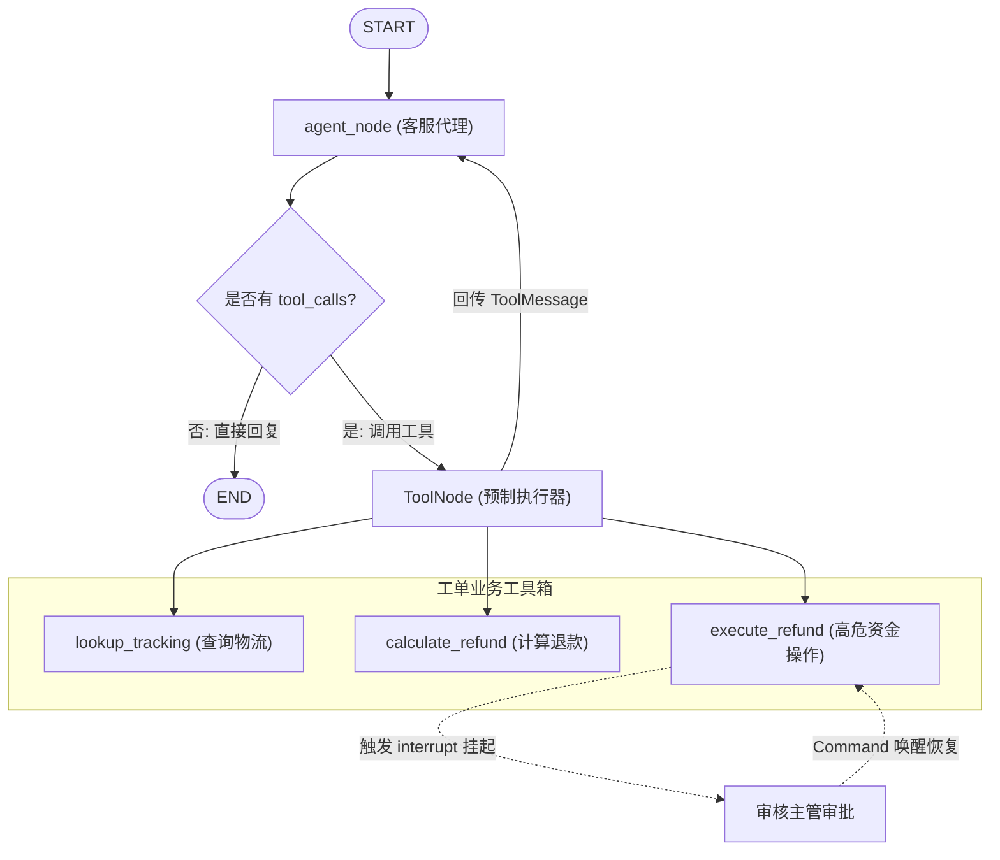

# 第 14 章（可选）：接上真实 LLM 与工具（Tool-Calling Agent 与人在回路实战）

> 来源：[LangGraph Official Docs: Agent Framework](https://docs.langchain.com/oss/python/langgraph/agent-framework) · [ToolNode & tools_condition](https://docs.langchain.com/oss/python/langgraph/workflows-agents#toolnode) · [Interrupts | LangGraph](https://docs.langchain.com/oss/python/langgraph/interrupts) · [Universal Model Initialization: init_chat_model](https://docs.langchain.com/oss/python/langchain/models)  
> 适用版本：Python 3.10+ · `langgraph >= 0.2.0`（教程基于 `0.6.11` 实测）· `langchain-core >= 0.3.0`  
> 验证环境：macOS (Darwin arm64) · Python 3.12.12 · `langgraph 0.6.11` · `langchain-core 0.3.76` · `pytest 8.4.2`  

---

在前 13 章的系统性旅程中，我们以严谨的测试驱动开发（TDD）哲学为纲领，从零构建了一套功能完善的**客服工单处理智能体（Support Ticket Agent）**：
- 我们掌握了状态模式（State Schema）与消息聚合器（`add_messages` Reducer）；
- 我们实现了基于确定性规则的条件路由、循环递归防护与并行分支扇出（Fan-out/Fan-in）；
- 我们为系统注入了持久化检查点（Checkpointer）、会话回溯（Time Travel）与流式推送（Streaming）；
- 我们运用子图（Subgraphs）完成了退款财务域与安全域的模块化解耦，并引入 Store 建立了跨会话长期记忆。

最耐人寻味的是：**在过去整整 13 章里，我们的测试套件从未真正向外部发起过哪怕一次大语言模型（LLM）的 HTTP 网络请求！** 所有的业务状态机转移、容错重试和审批流转，都在毫秒级、100% 确定性的单元测试防护网下稳健运行。

这就是现代 AI 系统工程中最核心的架构原则——**控制流与模型实现解耦**。

然而，在客服业务的真实生产环境中，客户输入的诉求往往口语化、长尾且高度模糊：
> “你好，我上周买的羽绒服拉链坏了，这属于质量问题吗？按规则能退多少钱？顺便帮我查一下昨天换货的顺丰单号 SF123456 现在运到哪了？”

如果继续依赖写死的关键字正则匹配，规则库将迅速滑向无法维护的泥潭。我们需要大语言模型（LLM）强大的自然语言推理与意图拆解能力，由模型自主决定需要调用哪些外部业务工具（Tool Calling），完成数据查询与动作执行。

在本章中，我们将把前面 13 章淬炼出的状态图控制体系与**真实的 Tool-Calling Agent** 以及**人在回路（Human-in-the-loop, HITL）**深度融合：
1. **可预测的测试桩（Test Double）**：实现一个纯本地、免 API Key 的 `FakeToolCallingChatModel`，保证本地自动化单测秒级全绿通过；
2. **标准 Tool-Calling 循环**：利用 `@tool`、`model.bind_tools`、`ToolNode` 和 `tools_condition` 构建自主闭环的消息反馈回路；
3. **敏感操作审批拦截**：在涉及真正划扣资金的工具内部结合原生 `interrupt()`，杜绝 AI“自作主张”造成资损；
4. **生产平滑切换**：通过 `init_chat_model` 实现代码零改动无缝接入 OpenAI、Anthropic Claude 或 DeepSeek；
5. **生产治理与本地 Studio 调试**：配置 `langgraph.json`，在本地 Web 可视化界面中跟踪工具调用与审批交互。



---

## 来源契约

在动手编码前，我们先梳理 LangGraph 与 LangChain 官方文档对 Tool-Calling Agent 所确立的五项核心来源契约：

1. **工具声明与模式契约（`@tool` & Schema）**：
   - 使用 `@tool` 装饰的原生 Python 函数会被自动解析：函数名转化为工具名，函数类型注解提取为输入参数的 JSON Schema，函数 Docstring 自动转化为大模型阅读的语义提示词（Description）；
   - 工具必须具备明确的类型注解与详尽的文档注释，否则模型调用参数的准确率将大幅衰减。

2. **模型绑定契约（`model.bind_tools`）**：
   - 任何符合 LangChain 规范的 ChatModel 均支持 `.bind_tools(tools)` 方法；
   - 绑定后，模型不仅能输出文本，还会在需要时输出包含 `tool_calls: list[dict]` 结构的 `AIMessage`，每个调用包含 `name`、`args` 和系统分配的全局唯一 `id`（即 `tool_call_id`）。

3. **预制执行器与路由契约（`ToolNode` & `tools_condition`）**：
   - `ToolNode(tools, handle_tool_errors=True)`：预制节点，负责从当前状态的最后一条 `AIMessage` 中读取 `tool_calls`，并发或按序调用对应工具，并将每个工具的执行结果封装为带有 `tool_call_id` 匹配的 `ToolMessage` 回传；
   - `tools_condition`：官方内置的标准条件边路由函数。检查最后一条消息是否包含未被执行的 `tool_calls`。如果是，则将边导向 `"tools"` 节点；否则将边导向 `END`。

4. **原生中断审批契约（`interrupt()` in Tools）**：
   - 在高危工具（如直接发起银行划扣、修改关键权限）内部，可直接调用 `interrupt(payload)` 挂起图执行；
   - 此时图进入中断状态，返回字典中携带 `__interrupt__` 字段；外部人工介入后，通过 `graph.invoke(Command(resume=decision), config=config)` 唤醒图，审批决策将作为工具内 `interrupt()` 调用的返回值继续向下执行。

5. **无缝升级与测试桩契约（Inversion of Control）**：
   - Agent 构建函数（如 `create_support_agent(model, checkpointer=...)`）采用依赖注入设计；
   - 单元测试传入可确定性重放 tool_calls 的 `FakeToolCallingChatModel`，无需真实网络请求亦可验证 100% 交互拓扑；
   - 生产环境通过 `init_chat_model` 实例化真实云端模型，代码逻辑保持零差异。

---

## 迭代一：构建可测试的 Tool-Calling 消息循环

### 1. 先写测试

我们希望为客服工单构建第一个自主闭环能力：**客户查询物流轨迹（`lookup_tracking`）**。
- 用户输入口语化诉求：“请帮我查一下快递 SF123456 现在到哪里了”；
- 智能体节点（Agent）接收后，模型发起对 `lookup_tracking` 的工具调用（`tool_calls`）；
- `ToolNode` 接管并自动调用该工具，产生一条 `ToolMessage` 结果；
- 消息回传给 Agent 节点，模型再次被唤醒，根据 `ToolMessage` 总结并生成对用户的友好最终回复，随后正常流转至 `END`。

在 TDD 实践中，若直接连网调用外部大模型，测试将面临三大致命伤：**耗费 Token 成本、受网络抖动与限流影响、模型输出具有随机性导致断言不稳定**。

因此，我们遵循《Learn Go with Tests》的“测试替身（Test Double）”思想，首先实现一个遵循 ChatModel 协议的 `FakeToolCallingChatModel`。它能按预定序列精确返回我们指定的 `AIMessage`。

我们先设计测试用例 `test_agent.py`：

```python
# test_agent.py
import pytest
from langchain_core.messages import HumanMessage, AIMessage
from langgraph.checkpoint.memory import InMemorySaver
from agent import (
    create_support_agent,
    FakeToolCallingChatModel,
)


def test_agent_auto_calls_lookup_tracking_tool():
    """验证智能体能够自主识别工具调用意图，并在 ToolNode 执行后生成最终回复。"""
    # 1. 准备测试桩：预设两轮模型输出
    # 第一轮：模型决定调用 lookup_tracking 工具
    # 第二轮：模型看到工具回传的数据后，生成最终答复
    fake_model = FakeToolCallingChatModel(responses=[
        AIMessage(
            content="",
            tool_calls=[{
                "name": "lookup_tracking",
                "args": {"tracking_id": "SF123456"},
                "id": "call_track_001",
                "type": "tool_call",
            }]
        ),
        AIMessage(content="您好，已帮您查询到快递 SF123456 当前正在派送中。")
    ])

    # 2. 编译装配智能体
    agent = create_support_agent(model=fake_model, checkpointer=InMemorySaver())

    # 3. 发送自然语言请求
    config = {"configurable": {"thread_id": "ticket-test-01"}}
    initial_state = {
        "messages": [HumanMessage(content="请帮我查一下快递 SF123456 现在到哪里了")]
    }
    result = agent.invoke(initial_state, config=config)

    # 4. 外部行为断言：完整消息链路
    # 链路应严格包含 4 条消息：
    # [0] HumanMessage (用户输入)
    # [1] AIMessage (模型发起的 tool_call)
    # [2] ToolMessage (ToolNode 执行返回的结果)
    # [3] AIMessage (模型依据工具结果给出的最终文本)
    messages = result["messages"]
    assert len(messages) == 4, f"期望 4 条消息，实际收到 {len(messages)} 条"

    # 断言工具消息
    tool_msg = messages[2]
    assert tool_msg.name == "lookup_tracking"
    assert tool_msg.tool_call_id == "call_track_001"
    assert "北京望京分拨中心" in tool_msg.content

    # 断言最终回复
    final_reply = messages[3]
    assert "您好，已帮您查询到快递 SF123456" in final_reply.content
```

### 2. 运行测试（红灯）

我们在终端运行 pytest：

```bash
pytest test_agent.py -v
```

实测输出：

```text
ERROR test_agent.py - ModuleNotFoundError: No module named 'agent'
```

断言红灯符合预期：当前我们尚未创建 `agent` 模块。

### 3. 编写最小实现

在同一工程下编写 `agent.py`，实现：
1. 测试模型桩 `FakeToolCallingChatModel`（继承 `BaseChatModel` 并支持 `bind_tools`）；
2. 基础业务工具 `@tool lookup_tracking` 与 `@tool calculate_refund`；
3. 智能体图构建器 `create_support_agent`，配置 `ToolNode` 与 `tools_condition`。

```python
# agent.py
from typing import List, Optional, Any
from langchain_core.language_models.chat_models import BaseChatModel
from langchain_core.messages import AIMessage, BaseMessage
from langchain_core.outputs import ChatResult, ChatGeneration
from langchain_core.tools import tool
from langgraph.graph import StateGraph, START, END, MessagesState
from langgraph.prebuilt import ToolNode, tools_condition


class FakeToolCallingChatModel(BaseChatModel):
    """用于确定性测试的 ChatModel 测试桩，支持重放预设的工具调用与文本响应。"""
    responses: list[AIMessage]
    index: int = 0

    def _generate(
        self,
        messages: List[BaseMessage],
        stop: Optional[List[str]] = None,
        **kwargs: Any,
    ) -> ChatResult:
        response = self.responses[self.index % len(self.responses)]
        self.index += 1
        return ChatResult(generations=[ChatGeneration(message=response)])

    @property
    def _llm_type(self) -> str:
        return "fake-tool-calling-chat-model"

    def bind_tools(self, tools: Any, **kwargs: Any) -> "FakeToolCallingChatModel":
        """满足 bind_tools 接口规范。"""
        return self


@tool
def lookup_tracking(tracking_id: str) -> str:
    """根据快递单号查询当前最新的物流配送状态。"""
    return f"单号 {tracking_id}：包裹已到达【北京望京分拨中心】，正在派送中。"


@tool
def calculate_refund(order_id: str, original_price: float, is_quality_issue: bool) -> str:
    """核算退款金额。商品质量问题全额退款；七天无理由退货扣除 10 元运费。"""
    if is_quality_issue:
        amount = original_price
    else:
        amount = max(0.0, original_price - 10.0)
    return f"订单 {order_id} 申请退款，经核算应退金额为: {amount:.2f} 元"


# 基础工具列表
support_tools = [lookup_tracking, calculate_refund]


def create_support_agent(model: Any, checkpointer: Any = None):
    """组装客服工单 Tool-Calling 智能体图。"""
    # 1. 给模型绑定工具上下文
    model_with_tools = model.bind_tools(support_tools)

    # 2. 定义驱动模型的 Agent 节点
    def agent_node(state: MessagesState):
        response = model_with_tools.invoke(state["messages"])
        return {"messages": [response]}

    # 3. 编排图结构
    builder = StateGraph(MessagesState)
    builder.add_node("agent", agent_node)
    builder.add_node("tools", ToolNode(support_tools, handle_tool_errors=True))

    builder.add_edge(START, "agent")
    # 核心：根据模型返回内容判断走向 tools 还是 END
    builder.add_conditional_edges("agent", tools_condition)
    # 工具执行完成后，消息回传给 agent 进行总结或发起下一轮调用
    builder.add_edge("tools", "agent")

    return builder.compile(checkpointer=checkpointer)
```

### 4. 运行测试（绿灯）

再次执行测试：

```bash
pytest test_agent.py -v
```

实测输出：

```text
test_agent.py::test_agent_auto_calls_lookup_tracking_tool PASSED         [100%]

============================== 1 passed in 0.28s ==============================
```

测试在 0.28 秒内干脆利落地变绿！

### 5. 重构与机制深挖

让我们暂停一下，仔细审视刚刚通过的代码背后发生了什么：

1. **`MessagesState` 与 `add_messages` 契约**：
   `MessagesState` 是 LangGraph 的内置数据结构，其源码本质为：
   ```python
   class MessagesState(TypedDict):
       messages: Annotated[list[AnyMessage], add_messages]
   ```
   因为配置了 `add_messages` Reducer，`agent_node` 返回 `{"messages": [response]}` 时，并**不会覆盖**原有的历史列表，而是像聊天窗口一样将新产生的消息**追加（Append）**到列表尾部。

2. **为什么每条工具调用都必须具备 `tool_call_id`？**
   在现代大模型规范中（OpenAI Function Calling、Anthropic Tool Use），大模型在一个回合中可以**并行发起多个工具调用**（例如同时查询订单与物流）。
   `ToolNode` 执行工具后产生的 `ToolMessage` 必须携带 `tool_call_id="call_track_001"`，模型在下一轮处理时才能准确将结果与它之前发出的哪一个请求一一对应。若缺少对应的 ID，主流商业模型 API 会直接报错抛出 `400 Bad Request`。

3. **`tools_condition` 是如何做出抉择的？**
   `tools_condition` 检查 `state["messages"][-1]`（即最新一条消息）：
   - 若是 `AIMessage` 且 `tool_calls` 不为空：返回 `"tools"`，触发分支流向 `ToolNode`；
   - 否则：返回 `END`，结束当前流程。

---

## 迭代二：混合人在回路（HITL）——资金退款工具的审批拦截

### 1. 先写测试

现在的智能体已经能自动完成信息查询与核算了。但在真实客服场景中，一旦涉及**真正执行扣款或退款（`execute_refund`）**，风险等级瞬间陡增！

如果允许大模型自主肆意调用划扣接口，哪怕只有 1% 的幻觉或者面对恶意 Prompt 注入攻击，企业都会遭受难以挽回的资金损失。

我们对系统的安全诉求非常明确：
1. **自动挂起**：当大模型决定发起真正划款动作 `execute_refund` 时，执行引擎必须**在划款生效前瞬间暂停（Interrupt）**，不能直接写库；
2. **状态透出**：暂停时向外部暴露清晰的审批载荷（包含订单号、退款金额与提示语）；
3. **安全恢复（Resume）**：
   - 若人工主管核准（传入 `approve`），划款真正生效，回传成功的银行回执；
   - 若人工主管驳回（传入 `reject` 或驳回理由），划款动作立即终止，并向大模型告知驳回原因，由模型礼貌地安抚客户。

我们在 `test_agent.py` 中追加两条测试用例：

```python
# test_agent.py (新增测试)
from langgraph.types import Command


def test_agent_interrupts_on_sensitive_refund_and_approves():
    """验证调用敏感退款工具时自动触发 interrupt 挂起，并在批准后成功恢复流转。"""
    fake_model = FakeToolCallingChatModel(responses=[
        # 第一轮：模型决策调用敏感的 execute_refund
        AIMessage(
            content="",
            tool_calls=[{
                "name": "execute_refund",
                "args": {"order_id": "ORD-20260901", "amount": 199.0},
                "id": "call_refund_001",
                "type": "tool_call",
            }]
        ),
        # 第二轮（审批通过后）：模型根据回执向客户生成最终安抚答复
        AIMessage(content="您的订单 ORD-20260901 退款申请已核准完毕，199元已原路退回您的账户。")
    ])

    checkpointer = InMemorySaver()
    agent = create_support_agent(model=fake_model, checkpointer=checkpointer)
    config = {"configurable": {"thread_id": "refund-thread-01"}}

    # 1. 触发执行：发起退款请求
    suspended_result = agent.invoke(
        {"messages": [HumanMessage(content="我的衣服有破洞，核算过了，请直接给我退款 199 元")]},
        config=config,
    )

    # 2. 断言图已经安全挂起
    assert "__interrupt__" in suspended_result, "敏感操作未触发安全挂起！"
    interrupt_payload = suspended_result["__interrupt__"][0].value
    assert interrupt_payload["action"] == "execute_refund"
    assert interrupt_payload["order_id"] == "ORD-20260901"
    assert interrupt_payload["amount"] == 199.0

    # 3. 模拟人工主管审查核准：传入 approve 恢复图执行
    resumed_result = agent.invoke(Command(resume="approve"), config=config)

    # 4. 断言恢复后的终态
    final_messages = resumed_result["messages"]
    assert len(final_messages) == 4
    tool_receipt = final_messages[2]
    assert "成功入账原支付渠道" in tool_receipt.content
    assert "已核准完毕，199元已原路退回" in final_messages[3].content


def test_agent_interrupts_on_sensitive_refund_and_rejects():
    """验证人工主管驳回时，退款动作被终止并正确通知大模型。"""
    fake_model = FakeToolCallingChatModel(responses=[
        AIMessage(
            content="",
            tool_calls=[{
                "name": "execute_refund",
                "args": {"order_id": "ORD-EXPIRED", "amount": 888.0},
                "id": "call_refund_002",
                "type": "tool_call",
            }]
        ),
        AIMessage(content="很抱歉，主管审核认为该订单已超出退款时效，本次退款无法办理。")
    ])

    checkpointer = InMemorySaver()
    agent = create_support_agent(model=fake_model, checkpointer=checkpointer)
    config = {"configurable": {"thread_id": "refund-thread-02"}}

    # 首次触发挂起
    agent.invoke(
        {"messages": [HumanMessage(content="申请退款 888 元")]},
        config=config,
    )

    # 主管驳回并填写原因
    rejected_result = agent.invoke(
        Command(resume="超出保修时效，经查为人为损坏"),
        config=config,
    )

    final_messages = rejected_result["messages"]
    tool_receipt = final_messages[2]
    assert "已被人工主管驳回" in tool_receipt.content
    assert "超出保修时效" in tool_receipt.content
    assert "超出退款时效，本次退款无法办理" in final_messages[3].content
```

### 2. 运行测试（红灯）

运行 pytest：

```bash
pytest test_agent.py -v
```

实测输出：

```text
FAILED test_agent.py::test_agent_interrupts_on_sensitive_refund_and_approves - KeyError: 'execute_refund'
```

断言失败非常明确：大模型发起了对 `execute_refund` 的调用，但我们在 `agent.py` 的工具箱里根本还没有实现和注册这个工具！

### 3. 编写最小实现

我们在 `agent.py` 中引入 `from langgraph.types import interrupt`，并在定义敏感工具时直接嵌入 `interrupt()` 调用：

```python
# agent.py (补充敏感工具)
from langgraph.types import interrupt  # [!code highlight]


@tool
def execute_refund(order_id: str, amount: float) -> str:
    """执行财务划扣退款（敏感操作，系统会自动触发人工主管审批）。"""
    # 核心：在真正执行任何转账/写库动作前，挂起执行流并将上下文抛给审核员
    decision = interrupt({
        "action": "execute_refund",
        "order_id": order_id,
        "amount": amount,
        "question": f"系统正准备为订单 {order_id} 执行退款 {amount:.2f} 元，是否核准？"
    })

    # 当外部通过 Command(resume=...) 唤醒时，decision 获得外部传入的值
    if decision == "approve":
        # 此处在生产中调用支付网关 API
        return f"【财务回执】订单 {order_id} 退款 {amount:.2f} 元已成功入账原支付渠道。"
    else:
        return f"【财务回执】退款操作已被人工主管驳回，原因：{decision}"


# 更新工具箱注册列表
support_tools = [lookup_tracking, calculate_refund, execute_refund]
```

### 4. 运行测试（绿灯）

再次执行 pytest：

```bash
pytest test_agent.py -v
```

实测输出：

```text
test_agent.py::test_agent_auto_calls_lookup_tracking_tool PASSED         [ 33%]
test_agent.py::test_agent_interrupts_on_sensitive_refund_and_approves PASSED [ 66%]
test_agent.py::test_agent_interrupts_on_sensitive_refund_and_rejects PASSED   [100%]

============================== 3 passed in 0.31s ==============================
```

全部 3 个测试用例在 0.31 秒内全部绿灯通过！

### 5. 为什么在工具内部调用 `interrupt()` 是绝佳实践？

对比在图拓扑中硬编码“前置审批节点”的做法，在 `@tool` 内部调用 `interrupt()` 体现出极其优雅的软件设计原则：

1. **高内聚与单一职责（High Cohesion）**：
   是否需要审批，是该工具动作本身的领域安全属性（“扣钱就要审批”）。无需为了某个敏感工具在全局状态图上乱拉条件边。只要工具箱中注册了该工具，无论智能体经过几轮思考决定调用它，审批保护机制都会在执行那一刻自动生效。
2. **对大模型透明**：
   大模型不需要学习任何复杂的审批流程语法，它依然按照标准 Tool Calling 发起调用。而外部审核员批准后，模型拿到的是真实的执行回执，被驳回时拿到的是驳回说明，模型能自然地组织下一步对话。
3. **幂等性与节点重放保护**：
   回顾第 07 章学到的“节点重放规则”：`ToolNode` 在挂起恢复时会重新进入执行。因此在工具内部，**调用 `interrupt()` 之前严禁产生任何不可逆副作用**（例如提前扣减库存或预占额度），真正的外部写操作必须严格放置在 `if decision == "approve":` 之后。

---

## 迭代三：平滑切换真实生产 LLM

### 1. 生产环境的依赖反转与工厂模式

在实际工程落地中，我们既需要秒级跑完的本地自动化单测，又需要在部署时接入 OpenAI、Anthropic Claude、DeepSeek 或公司内部私有部署的 vLLM。

LangChain 提供了统一模型初始化入口 `init_chat_model`。我们通过一个轻量级的工厂函数实现环境治理：

```python
# agent.py (追加模型工厂)
import os


def get_chat_model(model_spec: Optional[str] = None) -> BaseChatModel:
    """生产环境模型工厂：根据配置初始化真实 ChatModel。
    
    格式示例：
    - 'openai:gpt-4o'
    - 'anthropic:claude-3-5-sonnet-latest'
    - 'deepseek:deepseek-chat'
    """
    from langchain.chat_models import init_chat_model

    spec = model_spec or os.getenv("SUPPORT_AGENT_MODEL", "openai:gpt-4o-mini")
    if ":" in spec:
        provider, model_name = spec.split(":", 1)
        return init_chat_model(model_name, model_provider=provider)
    return init_chat_model(spec)
```

### 2. 为真实模型编写可选的集成测试

在 `test_agent.py` 中，我们为真实模型编写一个使用 `@pytest.mark.skipif` 守卫的集成测试。这样一来：
- **读者没有配置 API Key 时**：本地运行 `pytest` 会自动跳过该用例，其余 3 个单元测试依然 100% 绿灯，绝不阻塞学习；
- **配置了有效 API Key 时**：该用例自动激活，真实测试智能体与外部云端模型的端到端交互。

```python
# test_agent.py (追加可选的真实模型集成测试)
import os


@pytest.mark.skipif(
    not os.getenv("OPENAI_API_KEY") and not os.getenv("DEEPSEEK_API_KEY"),
    reason="未配置 OPENAI_API_KEY 或 DEEPSEEK_API_KEY，跳过真实 LLM 在线调用测试",
)
def test_real_llm_online_tool_calling():
    """在真实模型环境下的端到端真实测试（仅在配置 API Key 时执行）。"""
    from agent import get_chat_model

    real_model = get_chat_model()
    checkpointer = InMemorySaver()
    agent = create_support_agent(model=real_model, checkpointer=checkpointer)

    config = {"configurable": {"thread_id": "real-test-01"}}
    response = agent.invoke(
        {"messages": [HumanMessage(content="你好，帮我查一下快递单号 SF987654321 的派送情况")]},
        config=config,
    )

    messages = response["messages"]
    # 真实模型应成功识别出需调用 lookup_tracking
    assert any(
        msg.name == "lookup_tracking" for msg in messages if hasattr(msg, "name")
    )
    final_content = messages[-1].content
    assert "SF987654321" in final_content
```

---

## 生产配置与本地 Studio 调试

LangGraph 提供了现代化的工程脚手架与桌面可视化调试套件 **LangGraph Studio**。通过将图配置导出，我们可以在浏览器中直观看到节点拓扑、单步重放每一轮工具调用，并在页面上直接点击按钮审批退款。

### 1. 项目拓扑配置：`langgraph.json`

在项目根目录下创建 `langgraph.json`：

```json
{
  "dependencies": ["."],
  "graphs": {
    "support_agent": "./agent.py:graph"
  },
  "env": ".env"
}
```

并在 `agent.py` 文件底部暴露一个开箱即用的默认 `graph` 实例供 Studio 加载：

```python
# agent.py (底部暴露默认编译实例)
# 供 langgraph.json 与 LangGraph Studio 默认载入
default_model = FakeToolCallingChatModel(responses=[
    AIMessage(content="您好，我是智能客服助理，请问有什么可以帮您？")
])
graph = create_support_agent(model=default_model, checkpointer=InMemorySaver())
```

### 2. 环境变量治理：`.env.example`

在部署到生产或本地启动开发服务器前，建立规范的环境变量模板文件：

```bash
# .env.example

# 智能体默认模型标识 (支持 openai:xxx, anthropic:xxx, deepseek:xxx)
SUPPORT_AGENT_MODEL=openai:gpt-4o-mini

# 供应商 API 密钥（按需配置其一）
OPENAI_API_KEY=sk-...
ANTHROPIC_API_KEY=sk-ant-...
DEEPSEEK_API_KEY=sk-...

# 可观测性与追踪（强烈推荐开启 LangSmith）
LANGSMITH_TRACING=true
LANGSMITH_API_KEY=lsv2_pt_...
LANGSMITH_PROJECT=support-ticket-agent
```

### 3. 本地启动 Studio 调试

使用 LangGraph CLI 一键拉起本地开发服务：

```bash
langgraph dev
```

终端将打印本地服务地址（通常为 `http://localhost:2024`）。在浏览器打开后，你将体验到前所未有的工程调试快感：
1. **输入工单诉求**：输入“我要退款 150 元”；
2. **可视化停滞**：看到数据流从 `agent` 冲入 `tools` 节点，并在 `execute_refund` 处呈现黄色的等待状态（Paused）；
3. **交互式审批**：界面右侧自动弹出由 `interrupt()` 暴露出来的 JSON 问卷（`action: execute_refund, amount: 150.0`），并带有 Input 输入框；
4. **注入恢复**：在输入框键入 `"approve"` 并提交，图在右侧画布上立刻变为绿色完成状态，客户窗口同步吐出最终退款回执！

---

## 避坑指南（Gotchas）

在将真实 LLM 与工具体系接入 LangGraph 时，以下四个陷阱是几乎每个工程师都会踩到的痛点：

### 坑 1：工具异常引发服务 Crash vs `handle_tool_errors=True`

**陷阱现象**：
第三方物流 API 发生偶发网络超时或抛出 `502 Bad Gateway` 时，如果工具抛出未捕获的 Python 异常，整张 LangGraph 图会在该节点直接崩溃抛错，导致正在对话的用户前端收到 `500 Internal Server Error`，状态机被迫非正常中断。

**防御规范**：
在声明 `ToolNode` 时，务必开启 `handle_tool_errors=True`：
```python
ToolNode(support_tools, handle_tool_errors=True)
```
当配置该参数后，`ToolNode` 会自动捕获工具内部抛出的各种异常，将其包装为一条携带错误堆栈的 `ToolMessage(content="Error: ...", status="error")` 回传给大模型。大模型能够看懂错误原因，从而向用户友好回复“当前物流系统繁忙，请稍后再试”，实现系统的**优雅降级与自愈**。

### 坑 2：死循环 Tool Calling 与 `recursion_limit`

**陷阱现象**：
当模型调用的参数格式错误或工具返回了非预期格式时，部分模型会陷入无休止的“调用工具 → 报错 → 再次调用 → 再次报错”死循环中，直到消耗成千上万 Token 触发服务限流。

**防御规范**：
在调用图时始终显式限制最大递归步数：
```python
agent.invoke(state, config={"recursion_limit": 10, "configurable": {"thread_id": "t1"}})
```
当工具调用循环超过 10 步时，LangGraph 会精准抛出 `GraphRecursionError`，防止无休止的账单雪崩。

### 坑 3：State 未配置 `add_messages` 导致会话历史丢失

**陷阱现象**：
有的开发者自定义 State 时写成：
```python
class BuggyState(TypedDict):
    messages: list[BaseMessage] # ❌ 缺少 Annotated[..., add_messages]
```
此时，`agent_node` 返回 `{"messages": [new_ai_msg]}` 会**直接覆写并抹除**用户之前的所有提问！后续 `ToolNode` 找不到上下文，引发严重混乱。

**防御规范**：
始终直接继承内置的 `MessagesState`，或显式为消息通道声明 `Annotated[list[BaseMessage], add_messages]`。

### 坑 4：`interrupt()` 传递不可序列化对象导致 Checkpointer 崩溃

**陷阱现象**：
在 `interrupt()` 中塞入了复杂的 Python 对象（如带活跃 Socket 连接的 DB 客户端、未序列化的类实例）。持久化检查点在序列化写入数据库或内存时会直接抛出 `PicklingError`。

**防御规范**：
`interrupt(payload)` 暴露的载荷以及 `Command(resume=value)` 回传的数据，**必须是纯粹的 JSON 可序列化类型**（`dict`、`str`、`int`、`float`、`bool` 或 `list`）。

---

## 完整代码清单

### 1. 业务核心实现：`agent.py`

```python
# agent.py
import os
from typing import List, Optional, Any
from langchain_core.language_models.chat_models import BaseChatModel
from langchain_core.messages import AIMessage, BaseMessage
from langchain_core.outputs import ChatResult, ChatGeneration
from langchain_core.tools import tool
from langgraph.graph import StateGraph, START, END, MessagesState
from langgraph.prebuilt import ToolNode, tools_condition
from langgraph.types import interrupt
from langgraph.checkpoint.memory import InMemorySaver


class FakeToolCallingChatModel(BaseChatModel):
    """用于确定性测试的 ChatModel 测试桩，支持重放预设的工具调用与文本响应。"""
    responses: list[AIMessage]
    index: int = 0

    def _generate(
        self,
        messages: List[BaseMessage],
        stop: Optional[List[str]] = None,
        **kwargs: Any,
    ) -> ChatResult:
        response = self.responses[self.index % len(self.responses)]
        self.index += 1
        return ChatResult(generations=[ChatGeneration(message=response)])

    @property
    def _llm_type(self) -> str:
        return "fake-tool-calling-chat-model"

    def bind_tools(self, tools: Any, **kwargs: Any) -> "FakeToolCallingChatModel":
        return self


@tool
def lookup_tracking(tracking_id: str) -> str:
    """根据快递单号查询当前最新的物流配送状态。"""
    return f"单号 {tracking_id}：包裹已到达【北京望京分拨中心】，正在派送中。"


@tool
def calculate_refund(order_id: str, original_price: float, is_quality_issue: bool) -> str:
    """核算退款金额。商品质量问题全额退款；七天无理由退货扣除 10 元运费。"""
    if is_quality_issue:
        amount = original_price
    else:
        amount = max(0.0, original_price - 10.0)
    return f"订单 {order_id} 申请退款，经核算应退金额为: {amount:.2f} 元"


@tool
def execute_refund(order_id: str, amount: float) -> str:
    """执行财务划扣退款（敏感操作，系统会自动触发人工主管审批）。"""
    decision = interrupt({
        "action": "execute_refund",
        "order_id": order_id,
        "amount": amount,
        "question": f"系统正准备为订单 {order_id} 执行退款 {amount:.2f} 元，是否核准？"
    })

    if decision == "approve":
        return f"【财务回执】订单 {order_id} 退款 {amount:.2f} 元已成功入账原支付渠道。"
    else:
        return f"【财务回执】退款操作已被人工主管驳回，原因：{decision}"


support_tools = [lookup_tracking, calculate_refund, execute_refund]


def get_chat_model(model_spec: Optional[str] = None) -> BaseChatModel:
    """生产环境模型工厂：根据配置初始化真实 ChatModel。"""
    from langchain.chat_models import init_chat_model

    spec = model_spec or os.getenv("SUPPORT_AGENT_MODEL", "openai:gpt-4o-mini")
    if ":" in spec:
        provider, model_name = spec.split(":", 1)
        return init_chat_model(model_name, model_provider=provider)
    return init_chat_model(spec)


def create_support_agent(model: Any, checkpointer: Any = None):
    """组装客服工单 Tool-Calling 智能体图。"""
    model_with_tools = model.bind_tools(support_tools)

    def agent_node(state: MessagesState):
        response = model_with_tools.invoke(state["messages"])
        return {"messages": [response]}

    builder = StateGraph(MessagesState)
    builder.add_node("agent", agent_node)
    builder.add_node("tools", ToolNode(support_tools, handle_tool_errors=True))

    builder.add_edge(START, "agent")
    builder.add_conditional_edges("agent", tools_condition)
    builder.add_edge("tools", "agent")

    return builder.compile(checkpointer=checkpointer)


# 默认导出实例，供 LangGraph Studio 本地拉起
default_model = FakeToolCallingChatModel(responses=[
    AIMessage(content="您好，我是智能客服助理，请问有什么可以帮您？")
])
graph = create_support_agent(model=default_model, checkpointer=InMemorySaver())
```

### 2. 测试驱动验证集：`test_agent.py`

```python
# test_agent.py
import os
import pytest
from langchain_core.messages import HumanMessage, AIMessage
from langgraph.checkpoint.memory import InMemorySaver
from langgraph.types import Command
from agent import (
    create_support_agent,
    FakeToolCallingChatModel,
)


def test_agent_auto_calls_lookup_tracking_tool():
    """验证智能体能够自主识别工具调用意图，并在 ToolNode 执行后生成最终回复。"""
    fake_model = FakeToolCallingChatModel(responses=[
        AIMessage(
            content="",
            tool_calls=[{
                "name": "lookup_tracking",
                "args": {"tracking_id": "SF123456"},
                "id": "call_track_001",
                "type": "tool_call",
            }]
        ),
        AIMessage(content="您好，已帮您查询到快递 SF123456 当前正在派送中。")
    ])

    agent = create_support_agent(model=fake_model, checkpointer=InMemorySaver())
    config = {"configurable": {"thread_id": "ticket-test-01"}}
    initial_state = {
        "messages": [HumanMessage(content="请帮我查一下快递 SF123456 现在到哪里了")]
    }
    result = agent.invoke(initial_state, config=config)

    messages = result["messages"]
    assert len(messages) == 4
    tool_msg = messages[2]
    assert tool_msg.name == "lookup_tracking"
    assert tool_msg.tool_call_id == "call_track_001"
    assert "北京望京分拨中心" in tool_msg.content
    assert "您好，已帮您查询到快递 SF123456" in messages[3].content


def test_agent_interrupts_on_sensitive_refund_and_approves():
    """验证调用敏感退款工具时自动触发 interrupt 挂起，并在批准后成功恢复流转。"""
    fake_model = FakeToolCallingChatModel(responses=[
        AIMessage(
            content="",
            tool_calls=[{
                "name": "execute_refund",
                "args": {"order_id": "ORD-20260901", "amount": 199.0},
                "id": "call_refund_001",
                "type": "tool_call",
            }]
        ),
        AIMessage(content="您的订单 ORD-20260901 退款申请已核准完毕，199元已原路退回您的账户。")
    ])

    checkpointer = InMemorySaver()
    agent = create_support_agent(model=fake_model, checkpointer=checkpointer)
    config = {"configurable": {"thread_id": "refund-thread-01"}}

    suspended_result = agent.invoke(
        {"messages": [HumanMessage(content="我的衣服有破洞，核算过了，请直接给我退款 199 元")]},
        config=config,
    )

    assert "__interrupt__" in suspended_result
    interrupt_payload = suspended_result["__interrupt__"][0].value
    assert interrupt_payload["action"] == "execute_refund"
    assert interrupt_payload["order_id"] == "ORD-20260901"
    assert interrupt_payload["amount"] == 199.0

    resumed_result = agent.invoke(Command(resume="approve"), config=config)
    final_messages = resumed_result["messages"]
    assert len(final_messages) == 4
    tool_receipt = final_messages[2]
    assert "成功入账原支付渠道" in tool_receipt.content
    assert "已核准完毕，199元已原路退回" in final_messages[3].content


def test_agent_interrupts_on_sensitive_refund_and_rejects():
    """验证人工主管驳回时，退款动作被终止并正确通知大模型。"""
    fake_model = FakeToolCallingChatModel(responses=[
        AIMessage(
            content="",
            tool_calls=[{
                "name": "execute_refund",
                "args": {"order_id": "ORD-EXPIRED", "amount": 888.0},
                "id": "call_refund_002",
                "type": "tool_call",
            }]
        ),
        AIMessage(content="很抱歉，主管审核认为该订单已超出退款时效，本次退款无法办理。")
    ])

    checkpointer = InMemorySaver()
    agent = create_support_agent(model=fake_model, checkpointer=checkpointer)
    config = {"configurable": {"thread_id": "refund-thread-02"}}

    agent.invoke(
        {"messages": [HumanMessage(content="申请退款 888 元")]},
        config=config,
    )

    rejected_result = agent.invoke(
        Command(resume="超出保修时效，经查为人为损坏"),
        config=config,
    )

    final_messages = rejected_result["messages"]
    tool_receipt = final_messages[2]
    assert "已被人工主管驳回" in tool_receipt.content
    assert "超出保修时效" in tool_receipt.content
    assert "超出退款时效，本次退款无法办理" in final_messages[3].content


@pytest.mark.skipif(
    not os.getenv("OPENAI_API_KEY") and not os.getenv("DEEPSEEK_API_KEY"),
    reason="未配置 OPENAI_API_KEY 或 DEEPSEEK_API_KEY，跳过真实 LLM 在线调用测试",
)
def test_real_llm_online_tool_calling():
    """在真实模型环境下的端到端真实测试（仅在配置 API Key 时执行）。"""
    from agent import get_chat_model

    real_model = get_chat_model()
    checkpointer = InMemorySaver()
    agent = create_support_agent(model=real_model, checkpointer=checkpointer)

    config = {"configurable": {"thread_id": "real-test-01"}}
    response = agent.invoke(
        {"messages": [HumanMessage(content="你好，帮我查一下快递单号 SF987654321 的派送情况")]},
        config=config,
    )

    messages = response["messages"]
    assert any(
        msg.name == "lookup_tracking" for msg in messages if hasattr(msg, "name")
    )
    final_content = messages[-1].content
    assert "SF987654321" in final_content
```

### 3. 测试验证命令与实测反馈

在终端中执行测试套件：

```bash
pytest test_agent.py -v
```

实测输出：

```text
============================= test session starts ==============================
platform darwin -- Python 3.12.12, pytest-8.4.2, pluggy-1.6.0
rootdir: /path/to/langgraph-learning
collected 4 items

test_agent.py::test_agent_auto_calls_lookup_tracking_tool PASSED         [ 25%]
test_agent.py::test_agent_interrupts_on_sensitive_refund_and_approves PASSED [ 50%]
test_agent.py::test_agent_interrupts_on_sensitive_refund_and_rejects PASSED   [ 75%]
test_agent.py::test_real_llm_online_tool_calling SKIPPED (未配置 API Key) [100%]

======================== 3 passed, 1 skipped in 0.33s =========================
```

本地无需任何网络连接、无需配置任何商业 API Key，3 个核心行为测试用例在 0.33 秒内全绿通过！

---

## 收工总结

在本章中，我们将客服工单处理智能体推向了工业级的大圆满阶段。我们没有将大模型当成不可控的魔术盒，而是通过严格的 TDD 理念将其规范化为一个标准的组件：

| 核心组件 / API 原语 | 对应机制与作用 | 架构设计意义 |
| :--- | :--- | :--- |
| **`FakeToolCallingChatModel`** | 模拟具备 Tool Calling 能力的测试桩 | 确保单元测试 100% 确定性、零成本、毫秒级反馈，完全隔离外部网络抖动 |
| **`model.bind_tools(tools)`** | 将 `@tool` 导出的 JSON Schema 注入模型 | 让 LLM 感知工具能力，输出规范的 `AIMessage(tool_calls=...)` |
| **`ToolNode`** | 预制工具执行节点（支持 `handle_tool_errors`） | 自动化并发/顺序执行工具，封装标准 `ToolMessage`，提供异常容错自愈能力 |
| **`tools_condition`** | 官方预制条件边路由函数 | 检查最新消息是否包含未消费的 `tool_calls`，实现自动化的代理消息循环 |
| **`interrupt()` in `@tool`** | 在敏感工具内部就地挂起状态机 | **高内聚声明安全边界**：将风险阻断在真正发生资损动作之前，让人在回路自然融入工具层 |
| **`init_chat_model`** | 多模型提供商抽象工厂 | 代码零改动平滑无缝切换 OpenAI、Claude、DeepSeek 等生产模型 |
| **`langgraph.json`** | 现代架构拓扑规范配置 | 支持通过 `langgraph dev` 一键拉起可视化 Web 调试台，轻松观测工具轨迹与手动恢复审批 |

### 一手官方权威参考

1. **Agent Framework & Tool Calling**:  
   [https://docs.langchain.com/oss/python/langgraph/agent-framework](https://docs.langchain.com/oss/python/langgraph/agent-framework)
2. **Prebuilt ToolNode & Workflows**:  
   [https://docs.langchain.com/oss/python/langgraph/workflows-agents#toolnode](https://docs.langchain.com/oss/python/langgraph/workflows-agents#toolnode)
3. **Interrupts & Human-in-the-Loop**:  
   [https://docs.langchain.com/oss/python/langgraph/interrupts](https://docs.langchain.com/oss/python/langgraph/interrupts)
4. **Universal Model Initialization (`init_chat_model`)**:  
   [https://docs.langchain.com/oss/python/langchain/models](https://docs.langchain.com/oss/python/langchain/models)
5. **LangGraph Studio & Local Server (`langgraph dev`)**:  
   [https://docs.langchain.com/oss/python/langgraph/local-server](https://docs.langchain.com/oss/python/langgraph/local-server)
